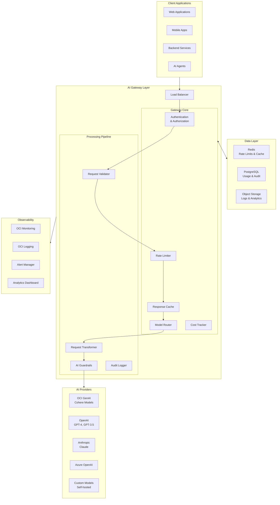

# AI Gateway Pattern

> Centralized AI gateway architecture providing unified model access, intelligent routing, rate limiting, cost tracking, and comprehensive observability for enterprise AI applications.

## Overview

The AI Gateway pattern establishes a single point of entry for all AI/LLM interactions across an organization. It abstracts away the complexity of multiple AI providers, enforces governance policies, tracks costs, and provides unified observability.

## Architecture Diagram



## Core Components

### 1. Gateway Server

The main gateway server handling all AI requests with comprehensive middleware.

```typescript
// gateway-server.ts
import express, { Request, Response, NextFunction } from 'express';
import { Redis } from 'ioredis';
import { Pool } from 'pg';

interface GatewayConfig {
  port: number;
  providers: ProviderConfig[];
  rateLimit: RateLimitConfig;
  cache: CacheConfig;
  guardrails: GuardrailsConfig;
}

interface AIRequest {
  requestId: string;
  tenantId: string;
  userId: string;
  model: string;
  provider?: string;
  messages: Message[];
  parameters: ModelParameters;
  metadata: Record<string, unknown>;
}

interface AIResponse {
  requestId: string;
  provider: string;
  model: string;
  content: string;
  usage: TokenUsage;
  latencyMs: number;
  cached: boolean;
  cost: number;
}

export class AIGateway {
  private app: express.Application;
  private redis: Redis;
  private db: Pool;
  private providers: Map<string, AIProvider>;
  private router: ModelRouter;
  private rateLimiter: RateLimiter;
  private costTracker: CostTracker;
  private cache: ResponseCache;
  private guardrails: Guardrails;

  constructor(config: GatewayConfig) {
    this.app = express();
    this.redis = new Redis(process.env.REDIS_URL!);
    this.db = new Pool({ connectionString: process.env.DATABASE_URL });

    this.initializeProviders(config.providers);
    this.router = new ModelRouter(this.providers);
    this.rateLimiter = new RateLimiter(this.redis, config.rateLimit);
    this.costTracker = new CostTracker(this.db);
    this.cache = new ResponseCache(this.redis, config.cache);
    this.guardrails = new Guardrails(config.guardrails);

    this.setupMiddleware();
    this.setupRoutes();
  }

  private setupMiddleware(): void {
    // Request parsing
    this.app.use(express.json({ limit: '10mb' }));

    // Request ID injection
    this.app.use((req: Request, res: Response, next: NextFunction) => {
      req.requestId = req.headers['x-request-id'] as string || crypto.randomUUID();
      res.setHeader('x-request-id', req.requestId);
      next();
    });

    // Authentication
    this.app.use(this.authenticate.bind(this));

    // Request logging
    this.app.use(this.logRequest.bind(this));
  }

  private setupRoutes(): void {
    // Chat completions endpoint (OpenAI compatible)
    this.app.post('/v1/chat/completions', this.handleChatCompletion.bind(this));

    // Embeddings endpoint
    this.app.post('/v1/embeddings', this.handleEmbeddings.bind(this));

    // Health check
    this.app.get('/health', (req, res) => res.json({ status: 'healthy' }));

    // Metrics endpoint
    this.app.get('/metrics', this.handleMetrics.bind(this));

    // Usage dashboard
    this.app.get('/usage/:tenantId', this.handleUsageReport.bind(this));
  }

  private async handleChatCompletion(req: Request, res: Response): Promise<void> {
    const startTime = Date.now();
    const aiRequest = this.buildAIRequest(req);

    try {
      // Step 1: Check rate limits
      const rateLimitResult = await this.rateLimiter.check(aiRequest);
      if (!rateLimitResult.allowed) {
        res.status(429).json({
          error: 'Rate limit exceeded',
          retryAfter: rateLimitResult.retryAfter,
          limits: rateLimitResult.limits,
        });
        return;
      }

      // Step 2: Check cache
      const cachedResponse = await this.cache.get(aiRequest);
      if (cachedResponse) {
        await this.trackUsage(aiRequest, cachedResponse, true);
        res.json(this.formatResponse(cachedResponse));
        return;
      }

      // Step 3: Apply guardrails to input
      const guardrailResult = await this.guardrails.checkInput(aiRequest);
      if (!guardrailResult.passed) {
        res.status(400).json({
          error: 'Request blocked by guardrails',
          reason: guardrailResult.reason,
          violations: guardrailResult.violations,
        });
        return;
      }

      // Step 4: Route to appropriate provider
      const provider = await this.router.route(aiRequest);

      // Step 5: Transform request for provider
      const transformedRequest = provider.transformRequest(aiRequest);

      // Step 6: Execute request
      const providerResponse = await provider.complete(transformedRequest);

      // Step 7: Apply output guardrails
      const outputCheck = await this.guardrails.checkOutput(providerResponse);
      if (!outputCheck.passed) {
        // Log but still return (with warning)
        providerResponse.warnings = outputCheck.warnings;
      }

      // Step 8: Build response
      const response: AIResponse = {
        requestId: aiRequest.requestId,
        provider: provider.name,
        model: providerResponse.model,
        content: providerResponse.content,
        usage: providerResponse.usage,
        latencyMs: Date.now() - startTime,
        cached: false,
        cost: this.calculateCost(provider.name, providerResponse.usage),
      };

      // Step 9: Cache response (if cacheable)
      if (this.isCacheable(aiRequest)) {
        await this.cache.set(aiRequest, response);
      }

      // Step 10: Track usage
      await this.trackUsage(aiRequest, response, false);

      res.json(this.formatResponse(response));

    } catch (error) {
      await this.handleError(req, res, error as Error, aiRequest);
    }
  }

  private async trackUsage(
    request: AIRequest,
    response: AIResponse,
    cached: boolean
  ): Promise<void> {
    await this.costTracker.track({
      requestId: request.requestId,
      tenantId: request.tenantId,
      userId: request.userId,
      provider: response.provider,
      model: response.model,
      inputTokens: response.usage.promptTokens,
      outputTokens: response.usage.completionTokens,
      cost: cached ? 0 : response.cost,
      latencyMs: response.latencyMs,
      cached,
      timestamp: new Date(),
    });
  }
}
```

### 2. Model Router

Intelligent routing based on model capabilities, cost, latency, and availability.

```typescript
// model-router.ts
interface RoutingConfig {
  strategy: 'cost' | 'latency' | 'quality' | 'balanced';
  fallbackChain: string[];
  modelMappings: ModelMapping[];
  loadBalancing: LoadBalanceConfig;
}

interface ModelMapping {
  requestedModel: string;
  providers: ProviderMapping[];
}

interface ProviderMapping {
  provider: string;
  model: string;
  priority: number;
  costPer1kTokens: number;
  avgLatencyMs: number;
  qualityScore: number;
  maxTokens: number;
  capabilities: string[];
}

interface RoutingDecision {
  provider: string;
  model: string;
  reason: string;
  alternatives: ProviderMapping[];
}

export class ModelRouter {
  private providers: Map<string, AIProvider>;
  private config: RoutingConfig;
  private healthChecker: HealthChecker;
  private metricsCollector: MetricsCollector;

  constructor(providers: Map<string, AIProvider>, config: RoutingConfig) {
    this.providers = providers;
    this.config = config;
    this.healthChecker = new HealthChecker(providers);
    this.metricsCollector = new MetricsCollector();
  }

  async route(request: AIRequest): Promise<AIProvider> {
    // Get candidate providers for requested model
    const candidates = await this.getCandidates(request);

    if (candidates.length === 0) {
      throw new NoAvailableProviderError(request.model);
    }

    // Score and rank candidates
    const rankedCandidates = await this.rankCandidates(candidates, request);

    // Select best candidate
    const selected = rankedCandidates[0];

    // Log routing decision
    await this.logRoutingDecision({
      requestId: request.requestId,
      requestedModel: request.model,
      selectedProvider: selected.provider,
      selectedModel: selected.model,
      reason: this.getRoutingReason(selected, request),
      alternatives: rankedCandidates.slice(1),
    });

    return this.providers.get(selected.provider)!;
  }

  private async getCandidates(request: AIRequest): Promise<ProviderMapping[]> {
    // If specific provider requested, use that
    if (request.provider) {
      const mapping = this.config.modelMappings
        .find(m => m.requestedModel === request.model)
        ?.providers.find(p => p.provider === request.provider);

      if (mapping && await this.isHealthy(mapping.provider)) {
        return [mapping];
      }
      throw new ProviderUnavailableError(request.provider);
    }

    // Get all providers that support the requested model
    const modelMapping = this.config.modelMappings
      .find(m => m.requestedModel === request.model);

    if (!modelMapping) {
      throw new UnsupportedModelError(request.model);
    }

    // Filter to healthy providers
    const healthyProviders = await Promise.all(
      modelMapping.providers.map(async (p) => ({
        ...p,
        healthy: await this.isHealthy(p.provider),
      }))
    );

    return healthyProviders.filter(p => p.healthy);
  }

  private async rankCandidates(
    candidates: ProviderMapping[],
    request: AIRequest
  ): Promise<ProviderMapping[]> {
    // Get real-time metrics for each candidate
    const candidatesWithMetrics = await Promise.all(
      candidates.map(async (c) => ({
        ...c,
        currentLatency: await this.metricsCollector.getP50Latency(c.provider, c.model),
        errorRate: await this.metricsCollector.getErrorRate(c.provider, c.model),
        queueDepth: await this.metricsCollector.getQueueDepth(c.provider),
      }))
    );

    // Calculate composite score based on strategy
    const scored = candidatesWithMetrics.map(c => ({
      ...c,
      score: this.calculateScore(c, request),
    }));

    // Sort by score (higher is better)
    return scored.sort((a, b) => b.score - a.score);
  }

  private calculateScore(
    candidate: ProviderMapping & { currentLatency: number; errorRate: number },
    request: AIRequest
  ): number {
    const weights = this.getStrategyWeights(this.config.strategy);

    // Normalize metrics to 0-1 scale
    const costScore = 1 - (candidate.costPer1kTokens / 0.02); // Assuming max $0.02/1k
    const latencyScore = 1 - (candidate.currentLatency / 5000); // Assuming max 5s
    const qualityScore = candidate.qualityScore;
    const reliabilityScore = 1 - candidate.errorRate;

    return (
      weights.cost * costScore +
      weights.latency * latencyScore +
      weights.quality * qualityScore +
      weights.reliability * reliabilityScore
    );
  }

  private getStrategyWeights(
    strategy: string
  ): { cost: number; latency: number; quality: number; reliability: number } {
    switch (strategy) {
      case 'cost':
        return { cost: 0.5, latency: 0.1, quality: 0.2, reliability: 0.2 };
      case 'latency':
        return { cost: 0.1, latency: 0.5, quality: 0.2, reliability: 0.2 };
      case 'quality':
        return { cost: 0.1, latency: 0.1, quality: 0.5, reliability: 0.3 };
      case 'balanced':
      default:
        return { cost: 0.25, latency: 0.25, quality: 0.25, reliability: 0.25 };
    }
  }
}
```

### 3. Rate Limiter

Multi-dimensional rate limiting with tenant, user, and model-level controls.

```typescript
// rate-limiter.ts
import { Redis } from 'ioredis';

interface RateLimitConfig {
  global: {
    requestsPerMinute: number;
    tokensPerMinute: number;
  };
  perTenant: {
    requestsPerMinute: number;
    tokensPerMinute: number;
    requestsPerDay: number;
    tokensPerDay: number;
    costPerDay: number;
  };
  perUser: {
    requestsPerMinute: number;
    tokensPerMinute: number;
  };
  perModel: {
    [model: string]: {
      requestsPerMinute: number;
      tokensPerMinute: number;
    };
  };
}

interface RateLimitResult {
  allowed: boolean;
  retryAfter?: number;
  limits: {
    dimension: string;
    current: number;
    limit: number;
    resetAt: Date;
  }[];
  warnings: string[];
}

export class RateLimiter {
  private redis: Redis;
  private config: RateLimitConfig;

  constructor(redis: Redis, config: RateLimitConfig) {
    this.redis = redis;
    this.config = config;
  }

  async check(request: AIRequest): Promise<RateLimitResult> {
    const checks = await Promise.all([
      this.checkGlobalLimits(request),
      this.checkTenantLimits(request),
      this.checkUserLimits(request),
      this.checkModelLimits(request),
    ]);

    const limits = checks.flatMap(c => c.limits);
    const allowed = checks.every(c => c.allowed);
    const warnings = checks.flatMap(c => c.warnings || []);

    // Find the soonest retry time if not allowed
    let retryAfter: number | undefined;
    if (!allowed) {
      const blockedLimits = limits.filter(l => l.current >= l.limit);
      const soonestReset = Math.min(
        ...blockedLimits.map(l => l.resetAt.getTime())
      );
      retryAfter = Math.ceil((soonestReset - Date.now()) / 1000);
    }

    return { allowed, retryAfter, limits, warnings };
  }

  private async checkTenantLimits(request: AIRequest): Promise<RateLimitResult> {
    const tenantId = request.tenantId;
    const now = Date.now();
    const minuteKey = `ratelimit:tenant:${tenantId}:minute:${Math.floor(now / 60000)}`;
    const dayKey = `ratelimit:tenant:${tenantId}:day:${Math.floor(now / 86400000)}`;

    // Use Redis pipeline for efficiency
    const pipeline = this.redis.pipeline();

    // Get current counts
    pipeline.get(minuteKey);
    pipeline.get(`${minuteKey}:tokens`);
    pipeline.get(dayKey);
    pipeline.get(`${dayKey}:tokens`);
    pipeline.get(`${dayKey}:cost`);

    const results = await pipeline.exec();

    const [
      requestsPerMinute,
      tokensPerMinute,
      requestsPerDay,
      tokensPerDay,
      costPerDay,
    ] = results!.map(r => parseInt(r[1] as string) || 0);

    const limits = [];
    let allowed = true;
    const warnings: string[] = [];

    // Check requests per minute
    if (requestsPerMinute >= this.config.perTenant.requestsPerMinute) {
      allowed = false;
    }
    limits.push({
      dimension: 'tenant_requests_per_minute',
      current: requestsPerMinute,
      limit: this.config.perTenant.requestsPerMinute,
      resetAt: new Date((Math.floor(now / 60000) + 1) * 60000),
    });

    // Check daily cost limit
    if (costPerDay >= this.config.perTenant.costPerDay * 100) { // Stored in cents
      allowed = false;
    } else if (costPerDay >= this.config.perTenant.costPerDay * 80) {
      warnings.push('Approaching daily cost limit (80% used)');
    }
    limits.push({
      dimension: 'tenant_cost_per_day',
      current: costPerDay / 100, // Convert to dollars
      limit: this.config.perTenant.costPerDay,
      resetAt: new Date((Math.floor(now / 86400000) + 1) * 86400000),
    });

    return { allowed, limits, warnings };
  }

  async increment(
    request: AIRequest,
    response: AIResponse
  ): Promise<void> {
    const now = Date.now();
    const pipeline = this.redis.pipeline();

    // Increment all relevant counters
    const keys = this.getCounterKeys(request, now);

    for (const key of keys.requestKeys) {
      pipeline.incr(key);
      pipeline.expire(key, 120); // 2 minute TTL for minute counters
    }

    for (const key of keys.tokenKeys) {
      pipeline.incrby(key, response.usage.totalTokens);
      pipeline.expire(key, 120);
    }

    for (const key of keys.costKeys) {
      pipeline.incrby(key, Math.ceil(response.cost * 100)); // Store in cents
      pipeline.expire(key, 86400 * 2); // 2 day TTL for daily counters
    }

    await pipeline.exec();
  }

  private getCounterKeys(
    request: AIRequest,
    now: number
  ): { requestKeys: string[]; tokenKeys: string[]; costKeys: string[] } {
    const minuteSlot = Math.floor(now / 60000);
    const daySlot = Math.floor(now / 86400000);

    return {
      requestKeys: [
        `ratelimit:global:minute:${minuteSlot}`,
        `ratelimit:tenant:${request.tenantId}:minute:${minuteSlot}`,
        `ratelimit:user:${request.userId}:minute:${minuteSlot}`,
        `ratelimit:model:${request.model}:minute:${minuteSlot}`,
      ],
      tokenKeys: [
        `ratelimit:global:minute:${minuteSlot}:tokens`,
        `ratelimit:tenant:${request.tenantId}:minute:${minuteSlot}:tokens`,
        `ratelimit:tenant:${request.tenantId}:day:${daySlot}:tokens`,
      ],
      costKeys: [
        `ratelimit:tenant:${request.tenantId}:day:${daySlot}:cost`,
      ],
    };
  }
}
```

### 4. Cost Tracker

Comprehensive cost tracking with budget alerts and reporting.

```python
# cost_tracker.py
from dataclasses import dataclass
from datetime import datetime, timedelta
from typing import Dict, List, Optional
from decimal import Decimal
import asyncpg
from oci.monitoring import MonitoringClient

@dataclass
class UsageRecord:
    request_id: str
    tenant_id: str
    user_id: str
    provider: str
    model: str
    input_tokens: int
    output_tokens: int
    cost: Decimal
    latency_ms: int
    cached: bool
    timestamp: datetime

@dataclass
class CostReport:
    tenant_id: str
    period_start: datetime
    period_end: datetime
    total_cost: Decimal
    total_requests: int
    total_tokens: int
    by_provider: Dict[str, Decimal]
    by_model: Dict[str, Decimal]
    by_user: Dict[str, Decimal]
    top_endpoints: List[Dict]
    daily_trend: List[Dict]

# Pricing per 1K tokens (input/output)
PRICING = {
    "oci-genai": {
        "cohere.command-r-plus": {"input": 0.003, "output": 0.015},
        "cohere.command-r": {"input": 0.0005, "output": 0.0015},
        "cohere.command-light": {"input": 0.0003, "output": 0.0006},
        "cohere.embed-english-v3.0": {"input": 0.0001, "output": 0},
    },
    "openai": {
        "gpt-4-turbo": {"input": 0.01, "output": 0.03},
        "gpt-4": {"input": 0.03, "output": 0.06},
        "gpt-3.5-turbo": {"input": 0.0005, "output": 0.0015},
        "text-embedding-3-small": {"input": 0.00002, "output": 0},
    },
    "anthropic": {
        "claude-3-opus": {"input": 0.015, "output": 0.075},
        "claude-3-sonnet": {"input": 0.003, "output": 0.015},
        "claude-3-haiku": {"input": 0.00025, "output": 0.00125},
    },
}

class CostTracker:
    def __init__(self, db_pool: asyncpg.Pool, oci_config: dict):
        self.db = db_pool
        self.monitoring = MonitoringClient(oci_config)
        self.compartment_id = oci_config.get("compartment_id")

    async def track(self, usage: UsageRecord) -> None:
        """Record usage and emit metrics"""

        # Store in database
        await self.db.execute("""
            INSERT INTO ai_usage (
                request_id, tenant_id, user_id, provider, model,
                input_tokens, output_tokens, cost, latency_ms,
                cached, timestamp
            ) VALUES ($1, $2, $3, $4, $5, $6, $7, $8, $9, $10, $11)
        """,
            usage.request_id, usage.tenant_id, usage.user_id,
            usage.provider, usage.model, usage.input_tokens,
            usage.output_tokens, float(usage.cost), usage.latency_ms,
            usage.cached, usage.timestamp
        )

        # Emit metrics to OCI Monitoring
        await self._emit_metrics(usage)

        # Check budget alerts
        await self._check_budget_alerts(usage.tenant_id)

    def calculate_cost(
        self,
        provider: str,
        model: str,
        input_tokens: int,
        output_tokens: int
    ) -> Decimal:
        """Calculate cost based on provider pricing"""

        pricing = PRICING.get(provider, {}).get(model)
        if not pricing:
            # Default conservative pricing
            pricing = {"input": 0.01, "output": 0.03}

        input_cost = Decimal(str(input_tokens / 1000 * pricing["input"]))
        output_cost = Decimal(str(output_tokens / 1000 * pricing["output"]))

        return input_cost + output_cost

    async def get_cost_report(
        self,
        tenant_id: str,
        period_start: datetime,
        period_end: datetime
    ) -> CostReport:
        """Generate comprehensive cost report"""

        # Get aggregated data
        total = await self.db.fetchrow("""
            SELECT
                COUNT(*) as total_requests,
                SUM(input_tokens + output_tokens) as total_tokens,
                SUM(cost) as total_cost
            FROM ai_usage
            WHERE tenant_id = $1
              AND timestamp BETWEEN $2 AND $3
        """, tenant_id, period_start, period_end)

        # Cost by provider
        by_provider = await self.db.fetch("""
            SELECT provider, SUM(cost) as cost
            FROM ai_usage
            WHERE tenant_id = $1
              AND timestamp BETWEEN $2 AND $3
            GROUP BY provider
            ORDER BY cost DESC
        """, tenant_id, period_start, period_end)

        # Cost by model
        by_model = await self.db.fetch("""
            SELECT model, SUM(cost) as cost
            FROM ai_usage
            WHERE tenant_id = $1
              AND timestamp BETWEEN $2 AND $3
            GROUP BY model
            ORDER BY cost DESC
        """, tenant_id, period_start, period_end)

        # Cost by user (top 10)
        by_user = await self.db.fetch("""
            SELECT user_id, SUM(cost) as cost, COUNT(*) as requests
            FROM ai_usage
            WHERE tenant_id = $1
              AND timestamp BETWEEN $2 AND $3
            GROUP BY user_id
            ORDER BY cost DESC
            LIMIT 10
        """, tenant_id, period_start, period_end)

        # Daily trend
        daily_trend = await self.db.fetch("""
            SELECT
                DATE(timestamp) as date,
                SUM(cost) as cost,
                COUNT(*) as requests
            FROM ai_usage
            WHERE tenant_id = $1
              AND timestamp BETWEEN $2 AND $3
            GROUP BY DATE(timestamp)
            ORDER BY date
        """, tenant_id, period_start, period_end)

        return CostReport(
            tenant_id=tenant_id,
            period_start=period_start,
            period_end=period_end,
            total_cost=Decimal(str(total["total_cost"] or 0)),
            total_requests=total["total_requests"] or 0,
            total_tokens=total["total_tokens"] or 0,
            by_provider={r["provider"]: Decimal(str(r["cost"])) for r in by_provider},
            by_model={r["model"]: Decimal(str(r["cost"])) for r in by_model},
            by_user={r["user_id"]: Decimal(str(r["cost"])) for r in by_user},
            top_endpoints=[],
            daily_trend=[dict(r) for r in daily_trend]
        )

    async def _check_budget_alerts(self, tenant_id: str) -> None:
        """Check if tenant is approaching budget limits"""

        # Get tenant budget settings
        budget = await self.db.fetchrow("""
            SELECT daily_budget, monthly_budget, alert_threshold
            FROM tenant_budgets
            WHERE tenant_id = $1
        """, tenant_id)

        if not budget:
            return

        # Get current spend
        now = datetime.utcnow()
        daily_spend = await self.db.fetchval("""
            SELECT COALESCE(SUM(cost), 0)
            FROM ai_usage
            WHERE tenant_id = $1
              AND timestamp >= $2
        """, tenant_id, now.replace(hour=0, minute=0, second=0))

        monthly_spend = await self.db.fetchval("""
            SELECT COALESCE(SUM(cost), 0)
            FROM ai_usage
            WHERE tenant_id = $1
              AND timestamp >= $2
        """, tenant_id, now.replace(day=1, hour=0, minute=0, second=0))

        # Check thresholds and send alerts
        alert_threshold = budget["alert_threshold"] or 0.8

        if daily_spend >= budget["daily_budget"] * alert_threshold:
            await self._send_budget_alert(
                tenant_id,
                "daily",
                daily_spend,
                budget["daily_budget"]
            )

        if monthly_spend >= budget["monthly_budget"] * alert_threshold:
            await self._send_budget_alert(
                tenant_id,
                "monthly",
                monthly_spend,
                budget["monthly_budget"]
            )

    async def _emit_metrics(self, usage: UsageRecord) -> None:
        """Emit usage metrics to OCI Monitoring"""

        await self.monitoring.post_metric_data(
            post_metric_data_details={
                "metricData": [
                    {
                        "namespace": "ai_gateway",
                        "compartmentId": self.compartment_id,
                        "name": "request_cost",
                        "dimensions": {
                            "tenant_id": usage.tenant_id,
                            "provider": usage.provider,
                            "model": usage.model,
                        },
                        "datapoints": [{
                            "timestamp": usage.timestamp.isoformat(),
                            "value": float(usage.cost)
                        }]
                    },
                    {
                        "namespace": "ai_gateway",
                        "compartmentId": self.compartment_id,
                        "name": "token_usage",
                        "dimensions": {
                            "tenant_id": usage.tenant_id,
                            "provider": usage.provider,
                            "type": "total",
                        },
                        "datapoints": [{
                            "timestamp": usage.timestamp.isoformat(),
                            "value": usage.input_tokens + usage.output_tokens
                        }]
                    }
                ]
            }
        )
```

### 5. AI Guardrails

Content safety, PII detection, and policy enforcement.

```typescript
// guardrails.ts
interface GuardrailsConfig {
  contentSafety: {
    enabled: boolean;
    blockedCategories: string[];
    sensitivity: 'low' | 'medium' | 'high';
  };
  piiDetection: {
    enabled: boolean;
    action: 'block' | 'redact' | 'warn';
    types: string[];
  };
  promptInjection: {
    enabled: boolean;
    action: 'block' | 'warn';
  };
  customRules: CustomRule[];
}

interface GuardrailResult {
  passed: boolean;
  reason?: string;
  violations: Violation[];
  warnings: string[];
  redactedContent?: string;
}

interface Violation {
  type: string;
  severity: 'low' | 'medium' | 'high' | 'critical';
  description: string;
  location?: { start: number; end: number };
}

export class Guardrails {
  private config: GuardrailsConfig;
  private piiDetector: PIIDetector;
  private contentClassifier: ContentClassifier;
  private injectionDetector: InjectionDetector;

  constructor(config: GuardrailsConfig) {
    this.config = config;
    this.piiDetector = new PIIDetector();
    this.contentClassifier = new ContentClassifier();
    this.injectionDetector = new InjectionDetector();
  }

  async checkInput(request: AIRequest): Promise<GuardrailResult> {
    const violations: Violation[] = [];
    const warnings: string[] = [];
    let content = this.extractContent(request);

    // Check for prompt injection
    if (this.config.promptInjection.enabled) {
      const injectionResult = await this.injectionDetector.detect(content);
      if (injectionResult.detected) {
        if (this.config.promptInjection.action === 'block') {
          violations.push({
            type: 'prompt_injection',
            severity: 'critical',
            description: `Potential prompt injection detected: ${injectionResult.pattern}`,
          });
        } else {
          warnings.push(`Potential prompt injection detected: ${injectionResult.pattern}`);
        }
      }
    }

    // Check content safety
    if (this.config.contentSafety.enabled) {
      const safetyResult = await this.contentClassifier.classify(content);

      for (const category of this.config.contentSafety.blockedCategories) {
        if (safetyResult.categories[category] > this.getSensitivityThreshold()) {
          violations.push({
            type: 'content_safety',
            severity: 'high',
            description: `Content flagged for: ${category}`,
          });
        }
      }
    }

    // Check for PII
    if (this.config.piiDetection.enabled) {
      const piiResult = await this.piiDetector.detect(content);

      if (piiResult.found.length > 0) {
        if (this.config.piiDetection.action === 'block') {
          violations.push({
            type: 'pii_detected',
            severity: 'high',
            description: `PII detected: ${piiResult.found.map(p => p.type).join(', ')}`,
          });
        } else if (this.config.piiDetection.action === 'redact') {
          content = this.redactPII(content, piiResult.found);
          warnings.push('PII was detected and redacted from the request');
        } else {
          warnings.push(`PII detected: ${piiResult.found.map(p => p.type).join(', ')}`);
        }
      }
    }

    // Check custom rules
    for (const rule of this.config.customRules) {
      const ruleResult = await this.evaluateCustomRule(rule, content);
      if (!ruleResult.passed) {
        violations.push({
          type: 'custom_rule',
          severity: rule.severity,
          description: rule.message,
        });
      }
    }

    return {
      passed: violations.length === 0,
      reason: violations.length > 0 ? violations[0].description : undefined,
      violations,
      warnings,
      redactedContent: content,
    };
  }

  async checkOutput(response: AIResponse): Promise<GuardrailResult> {
    const violations: Violation[] = [];
    const warnings: string[] = [];
    let content = response.content;

    // Check output content safety
    if (this.config.contentSafety.enabled) {
      const safetyResult = await this.contentClassifier.classify(content);

      for (const category of this.config.contentSafety.blockedCategories) {
        if (safetyResult.categories[category] > this.getSensitivityThreshold()) {
          warnings.push(`Output may contain ${category} content`);
        }
      }
    }

    // Check for PII in output (may indicate data leakage)
    if (this.config.piiDetection.enabled) {
      const piiResult = await this.piiDetector.detect(content);

      if (piiResult.found.length > 0) {
        warnings.push(`Output contains PII: ${piiResult.found.map(p => p.type).join(', ')}`);

        if (this.config.piiDetection.action === 'redact') {
          content = this.redactPII(content, piiResult.found);
        }
      }
    }

    return {
      passed: violations.length === 0,
      violations,
      warnings,
      redactedContent: content,
    };
  }

  private getSensitivityThreshold(): number {
    switch (this.config.contentSafety.sensitivity) {
      case 'low': return 0.9;
      case 'medium': return 0.7;
      case 'high': return 0.5;
    }
  }
}

// PII Detection patterns
class PIIDetector {
  private patterns: Map<string, RegExp> = new Map([
    ['email', /\b[A-Za-z0-9._%+-]+@[A-Za-z0-9.-]+\.[A-Z|a-z]{2,}\b/g],
    ['phone', /\b(\+\d{1,2}\s?)?\(?\d{3}\)?[\s.-]?\d{3}[\s.-]?\d{4}\b/g],
    ['ssn', /\b\d{3}-\d{2}-\d{4}\b/g],
    ['credit_card', /\b\d{4}[\s-]?\d{4}[\s-]?\d{4}[\s-]?\d{4}\b/g],
    ['ip_address', /\b(?:\d{1,3}\.){3}\d{1,3}\b/g],
  ]);

  async detect(content: string): Promise<PIIDetectionResult> {
    const found: PIIMatch[] = [];

    for (const [type, pattern] of this.patterns) {
      const matches = content.matchAll(pattern);
      for (const match of matches) {
        found.push({
          type,
          value: match[0],
          start: match.index!,
          end: match.index! + match[0].length,
        });
      }
    }

    return { found };
  }
}
```

## Implementation Guide

### Step 1: Database Schema

```sql
-- migrations/001_create_usage_tables.sql

-- Usage tracking table
CREATE TABLE ai_usage (
    id BIGSERIAL PRIMARY KEY,
    request_id UUID NOT NULL,
    tenant_id VARCHAR(64) NOT NULL,
    user_id VARCHAR(64) NOT NULL,
    provider VARCHAR(32) NOT NULL,
    model VARCHAR(64) NOT NULL,
    input_tokens INTEGER NOT NULL,
    output_tokens INTEGER NOT NULL,
    cost DECIMAL(10, 6) NOT NULL,
    latency_ms INTEGER NOT NULL,
    cached BOOLEAN DEFAULT FALSE,
    timestamp TIMESTAMPTZ NOT NULL DEFAULT NOW(),
    metadata JSONB DEFAULT '{}'
);

-- Indexes for efficient queries
CREATE INDEX idx_usage_tenant_timestamp ON ai_usage (tenant_id, timestamp);
CREATE INDEX idx_usage_user_timestamp ON ai_usage (user_id, timestamp);
CREATE INDEX idx_usage_provider_model ON ai_usage (provider, model);

-- Tenant budgets
CREATE TABLE tenant_budgets (
    tenant_id VARCHAR(64) PRIMARY KEY,
    daily_budget DECIMAL(10, 2) NOT NULL,
    monthly_budget DECIMAL(10, 2) NOT NULL,
    alert_threshold DECIMAL(3, 2) DEFAULT 0.8,
    hard_limit BOOLEAN DEFAULT FALSE,
    created_at TIMESTAMPTZ DEFAULT NOW(),
    updated_at TIMESTAMPTZ DEFAULT NOW()
);

-- API keys
CREATE TABLE api_keys (
    id UUID PRIMARY KEY DEFAULT gen_random_uuid(),
    tenant_id VARCHAR(64) NOT NULL,
    name VARCHAR(128) NOT NULL,
    key_hash VARCHAR(64) NOT NULL,
    key_prefix VARCHAR(8) NOT NULL,
    scopes TEXT[] DEFAULT '{}',
    rate_limit_override JSONB,
    expires_at TIMESTAMPTZ,
    created_at TIMESTAMPTZ DEFAULT NOW(),
    last_used_at TIMESTAMPTZ
);

CREATE INDEX idx_api_keys_prefix ON api_keys (key_prefix);

-- Audit log
CREATE TABLE audit_log (
    id BIGSERIAL PRIMARY KEY,
    request_id UUID NOT NULL,
    tenant_id VARCHAR(64) NOT NULL,
    user_id VARCHAR(64),
    action VARCHAR(32) NOT NULL,
    resource VARCHAR(128),
    status VARCHAR(16) NOT NULL,
    details JSONB,
    ip_address INET,
    user_agent TEXT,
    timestamp TIMESTAMPTZ DEFAULT NOW()
);

CREATE INDEX idx_audit_tenant_timestamp ON audit_log (tenant_id, timestamp);
```

### Step 2: Deployment Configuration

```yaml
# kubernetes/ai-gateway-deployment.yaml
apiVersion: apps/v1
kind: Deployment
metadata:
  name: ai-gateway
  labels:
    app: ai-gateway
spec:
  replicas: 3
  selector:
    matchLabels:
      app: ai-gateway
  template:
    metadata:
      labels:
        app: ai-gateway
      annotations:
        prometheus.io/scrape: "true"
        prometheus.io/port: "9090"
    spec:
      containers:
      - name: gateway
        image: ${REGION}.ocir.io/${NAMESPACE}/ai-gateway:latest
        ports:
        - containerPort: 8080
          name: http
        - containerPort: 9090
          name: metrics
        env:
        - name: DATABASE_URL
          valueFrom:
            secretKeyRef:
              name: ai-gateway-secrets
              key: database-url
        - name: REDIS_URL
          valueFrom:
            secretKeyRef:
              name: ai-gateway-secrets
              key: redis-url
        - name: OCI_CONFIG
          valueFrom:
            secretKeyRef:
              name: oci-credentials
              key: config
        resources:
          requests:
            memory: "1Gi"
            cpu: "500m"
          limits:
            memory: "2Gi"
            cpu: "1000m"
        readinessProbe:
          httpGet:
            path: /health
            port: 8080
          initialDelaySeconds: 5
          periodSeconds: 10
        livenessProbe:
          httpGet:
            path: /health
            port: 8080
          initialDelaySeconds: 15
          periodSeconds: 20
---
apiVersion: v1
kind: Service
metadata:
  name: ai-gateway-service
spec:
  type: ClusterIP
  selector:
    app: ai-gateway
  ports:
  - name: http
    port: 80
    targetPort: 8080
  - name: metrics
    port: 9090
    targetPort: 9090
---
apiVersion: networking.k8s.io/v1
kind: Ingress
metadata:
  name: ai-gateway-ingress
  annotations:
    kubernetes.io/ingress.class: nginx
    cert-manager.io/cluster-issuer: letsencrypt-prod
    nginx.ingress.kubernetes.io/rate-limit: "100"
    nginx.ingress.kubernetes.io/rate-limit-window: "1m"
spec:
  tls:
  - hosts:
    - ai-gateway.example.com
    secretName: ai-gateway-tls
  rules:
  - host: ai-gateway.example.com
    http:
      paths:
      - path: /
        pathType: Prefix
        backend:
          service:
            name: ai-gateway-service
            port:
              number: 80
```

## Cost Optimization Tips

### 1. Intelligent Caching

```typescript
// Implement semantic caching for similar requests
class SemanticCache {
  private embeddingModel: EmbeddingModel;
  private vectorStore: VectorStore;
  private similarityThreshold = 0.95;

  async get(request: AIRequest): Promise<CachedResponse | null> {
    // Generate embedding for request
    const embedding = await this.embeddingModel.embed(
      this.normalizeRequest(request)
    );

    // Search for similar cached requests
    const results = await this.vectorStore.search(embedding, {
      topK: 1,
      threshold: this.similarityThreshold,
    });

    if (results.length > 0) {
      return results[0].metadata.response;
    }

    return null;
  }

  async set(request: AIRequest, response: AIResponse): Promise<void> {
    const embedding = await this.embeddingModel.embed(
      this.normalizeRequest(request)
    );

    await this.vectorStore.upsert({
      id: request.requestId,
      vector: embedding,
      metadata: { request, response, timestamp: Date.now() },
    });
  }
}
```

### 2. Request Batching

```python
# Batch similar requests for efficiency
class RequestBatcher:
    def __init__(self, max_batch_size: int = 10, max_wait_ms: int = 100):
        self.max_batch_size = max_batch_size
        self.max_wait_ms = max_wait_ms
        self.pending_requests: Dict[str, List[BatchedRequest]] = {}
        self.batch_locks: Dict[str, asyncio.Lock] = {}

    async def submit(self, request: AIRequest) -> AIResponse:
        batch_key = self._get_batch_key(request)

        if batch_key not in self.batch_locks:
            self.batch_locks[batch_key] = asyncio.Lock()

        async with self.batch_locks[batch_key]:
            if batch_key not in self.pending_requests:
                self.pending_requests[batch_key] = []

            # Add to batch
            future = asyncio.Future()
            self.pending_requests[batch_key].append(
                BatchedRequest(request=request, future=future)
            )

            # Check if batch is full or start timer
            if len(self.pending_requests[batch_key]) >= self.max_batch_size:
                await self._execute_batch(batch_key)
            elif len(self.pending_requests[batch_key]) == 1:
                asyncio.create_task(self._schedule_batch(batch_key))

        return await future

    async def _execute_batch(self, batch_key: str) -> None:
        batch = self.pending_requests.pop(batch_key, [])
        if not batch:
            return

        # Execute batched request
        responses = await self._batch_execute([r.request for r in batch])

        # Resolve futures
        for i, req in enumerate(batch):
            req.future.set_result(responses[i])
```

### 3. Model Tier Optimization

| Use Case | Recommended Model | Cost/1K Tokens | Notes |
|----------|------------------|----------------|-------|
| Classification | command-light | $0.0004 | Use for routing, intent detection |
| Simple Q&A | command-r | $0.001 | General queries, summarization |
| Complex Reasoning | command-r-plus | $0.003 | Multi-step reasoning, analysis |
| Embeddings | embed-english-v3 | $0.0001 | Vector search, similarity |

## Security Considerations

### 1. API Key Management

```typescript
// Secure API key generation and validation
import { randomBytes } from 'crypto';
import bcrypt from 'bcrypt';

class APIKeyManager {
  private readonly keyLength = 32;
  private readonly prefixLength = 8;

  async createKey(tenantId: string, options: KeyOptions): Promise<APIKey> {
    // Generate secure random key
    const keyBytes = randomBytes(this.keyLength);
    const key = `ak_${keyBytes.toString('base64url')}`;
    const prefix = key.slice(0, this.prefixLength);

    // Hash for storage (never store raw key)
    const keyHash = await bcrypt.hash(key, 12);

    // Store in database
    const apiKey = await this.db.insert('api_keys', {
      tenant_id: tenantId,
      name: options.name,
      key_hash: keyHash,
      key_prefix: prefix,
      scopes: options.scopes || [],
      expires_at: options.expiresAt,
    });

    // Return key only once (won't be retrievable later)
    return {
      id: apiKey.id,
      key,  // Only returned on creation
      prefix,
      expiresAt: options.expiresAt,
    };
  }

  async validateKey(key: string): Promise<ValidatedKey | null> {
    const prefix = key.slice(0, this.prefixLength);

    // Find by prefix
    const candidates = await this.db.query(
      'SELECT * FROM api_keys WHERE key_prefix = $1 AND (expires_at IS NULL OR expires_at > NOW())',
      [prefix]
    );

    // Verify hash
    for (const candidate of candidates) {
      if (await bcrypt.compare(key, candidate.key_hash)) {
        // Update last used
        await this.db.execute(
          'UPDATE api_keys SET last_used_at = NOW() WHERE id = $1',
          [candidate.id]
        );

        return {
          tenantId: candidate.tenant_id,
          scopes: candidate.scopes,
          rateLimitOverride: candidate.rate_limit_override,
        };
      }
    }

    return null;
  }
}
```

### 2. Request Validation

```typescript
import { z } from 'zod';

// Comprehensive request validation
const requestSchema = z.object({
  model: z.string().min(1).max(64),
  messages: z.array(z.object({
    role: z.enum(['system', 'user', 'assistant']),
    content: z.string().max(100000),  // 100K char limit
  })).min(1).max(100),
  temperature: z.number().min(0).max(2).optional(),
  max_tokens: z.number().int().min(1).max(4096).optional(),
  stream: z.boolean().optional(),
});

function validateRequest(body: unknown): AIRequest {
  const parsed = requestSchema.safeParse(body);

  if (!parsed.success) {
    throw new ValidationError(parsed.error.issues);
  }

  // Additional security checks
  for (const message of parsed.data.messages) {
    // Check for extremely long tokens (potential DoS)
    const avgTokenLength = message.content.length / (message.content.split(' ').length || 1);
    if (avgTokenLength > 100) {
      throw new ValidationError('Suspicious content pattern detected');
    }
  }

  return parsed.data as AIRequest;
}
```

## Monitoring and Observability

### Key Metrics Dashboard

| Metric | Description | Alert Threshold |
|--------|-------------|-----------------|
| `gateway_request_latency_p99` | 99th percentile latency | > 5s |
| `gateway_error_rate` | Request error rate | > 1% |
| `provider_availability` | Provider health status | < 99% |
| `cache_hit_rate` | Response cache efficiency | < 50% |
| `rate_limit_rejections` | Rate limit violations | > 100/min |
| `cost_per_hour` | Hourly spend | > budget/24 |

### OCI Monitoring Integration

```python
# metrics_publisher.py
from oci.monitoring import MonitoringClient
from datetime import datetime

class MetricsPublisher:
    def __init__(self, oci_config: dict):
        self.client = MonitoringClient(oci_config)
        self.compartment_id = oci_config["compartment_id"]
        self.namespace = "ai_gateway"

    async def publish_request_metrics(
        self,
        provider: str,
        model: str,
        latency_ms: int,
        status: str
    ):
        await self.client.post_metric_data(
            post_metric_data_details={
                "metricData": [
                    {
                        "namespace": self.namespace,
                        "compartmentId": self.compartment_id,
                        "name": "request_latency",
                        "dimensions": {
                            "provider": provider,
                            "model": model,
                            "status": status
                        },
                        "datapoints": [{
                            "timestamp": datetime.utcnow().isoformat(),
                            "value": latency_ms
                        }]
                    }
                ]
            }
        )
```

## Related Patterns

- [Multi-Agent Orchestration Pattern](./multi-agent-orchestration-pattern.md) - Multi-agent coordination
- [RAG Production Pattern](./rag-production-pattern.md) - Retrieval-augmented generation
- [LLMOps Pattern](./llm-ops-pattern.md) - LLM operations and monitoring
- [Oracle ADK Blueprint](./oracle-adk-blueprint.md) - Oracle Agent Development Kit

## References

- [OCI API Gateway Documentation](https://docs.oracle.com/en-us/iaas/Content/APIGateway/home.htm)
- [OCI Monitoring Service](https://docs.oracle.com/en-us/iaas/Content/Monitoring/home.htm)
- [OWASP API Security Top 10](https://owasp.org/www-project-api-security/)
- [OpenAI API Reference](https://platform.openai.com/docs/api-reference)
