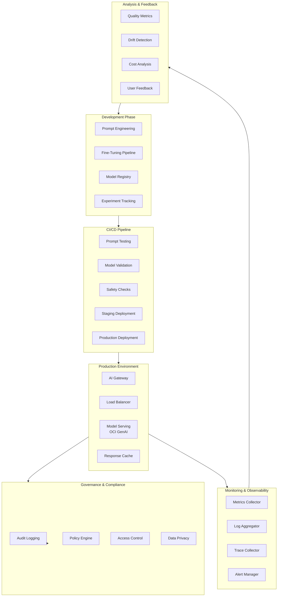

# LLMOps Pattern

> End-to-end MLOps pipeline for Large Language Model deployment, monitoring, fine-tuning iteration, and governance in enterprise production environments.

## Overview

The LLMOps pattern establishes a comprehensive operational framework for managing LLMs throughout their lifecycle - from initial deployment through continuous monitoring, evaluation, fine-tuning, and governance. It addresses the unique challenges of LLM operations including prompt versioning, model drift detection, cost optimization, and compliance requirements.

## Architecture Diagram



## Core Components

### 1. Prompt Management System

Version-controlled prompt engineering with A/B testing and rollback capabilities.

```typescript
// prompt-management.ts
interface PromptVersion {
  id: string;
  name: string;
  version: string;
  template: string;
  variables: PromptVariable[];
  metadata: PromptMetadata;
  status: 'draft' | 'testing' | 'staging' | 'production' | 'deprecated';
  createdAt: Date;
  updatedAt: Date;
  createdBy: string;
}

interface PromptVariable {
  name: string;
  type: 'string' | 'number' | 'array' | 'object';
  required: boolean;
  defaultValue?: unknown;
  validation?: string;
  description: string;
}

interface PromptMetadata {
  modelCompatibility: string[];
  maxTokens: number;
  temperature: number;
  topP: number;
  tags: string[];
  performance: PromptPerformance;
}

interface PromptPerformance {
  avgLatencyMs: number;
  avgTokens: number;
  successRate: number;
  qualityScore: number;
  sampleSize: number;
}

export class PromptManager {
  private db: Database;
  private cache: Cache;
  private versionControl: VersionControl;

  constructor(config: PromptManagerConfig) {
    this.db = new Database(config.dbUrl);
    this.cache = new Cache(config.cacheUrl);
    this.versionControl = new VersionControl(config.repoUrl);
  }

  async createPrompt(prompt: CreatePromptInput): Promise<PromptVersion> {
    // Validate template syntax
    this.validateTemplate(prompt.template);

    // Create new version
    const version = await this.db.prompts.create({
      ...prompt,
      version: '1.0.0',
      status: 'draft',
      createdAt: new Date(),
      updatedAt: new Date(),
    });

    // Store in version control
    await this.versionControl.commit({
      path: `prompts/${prompt.name}/v${version.version}.yaml`,
      content: this.serializePrompt(version),
      message: `Create prompt: ${prompt.name}`,
    });

    return version;
  }

  async updatePrompt(
    promptId: string,
    updates: Partial<PromptVersion>
  ): Promise<PromptVersion> {
    const existing = await this.db.prompts.findById(promptId);

    if (!existing) {
      throw new NotFoundError('Prompt not found');
    }

    // Create new version if template changed
    let newVersion = existing.version;
    if (updates.template && updates.template !== existing.template) {
      newVersion = this.incrementVersion(existing.version);
    }

    const updated = await this.db.prompts.update(promptId, {
      ...updates,
      version: newVersion,
      updatedAt: new Date(),
    });

    // Commit to version control
    await this.versionControl.commit({
      path: `prompts/${existing.name}/v${newVersion}.yaml`,
      content: this.serializePrompt(updated),
      message: `Update prompt: ${existing.name} to v${newVersion}`,
    });

    // Invalidate cache
    await this.cache.delete(`prompt:${promptId}`);

    return updated;
  }

  async deployPrompt(
    promptId: string,
    environment: 'staging' | 'production'
  ): Promise<DeploymentResult> {
    const prompt = await this.db.prompts.findById(promptId);

    // Validate prompt is ready for deployment
    if (environment === 'production' && prompt.status !== 'staging') {
      throw new ValidationError('Prompt must be in staging before production deployment');
    }

    // Run pre-deployment checks
    const checks = await this.runPreDeploymentChecks(prompt, environment);
    if (!checks.passed) {
      throw new DeploymentError('Pre-deployment checks failed', checks.failures);
    }

    // Deploy to environment
    const deployment = await this.deployToEnvironment(prompt, environment);

    // Update prompt status
    await this.db.prompts.update(promptId, {
      status: environment,
      deployedAt: new Date(),
    });

    return deployment;
  }

  async getActivePrompt(name: string, environment: string): Promise<PromptVersion> {
    // Check cache first
    const cacheKey = `prompt:${name}:${environment}`;
    const cached = await this.cache.get(cacheKey);
    if (cached) {
      return JSON.parse(cached);
    }

    // Load from database
    const prompt = await this.db.prompts.findOne({
      name,
      status: environment,
    });

    if (!prompt) {
      throw new NotFoundError(`No ${environment} prompt found for: ${name}`);
    }

    // Cache for 5 minutes
    await this.cache.setex(cacheKey, 300, JSON.stringify(prompt));

    return prompt;
  }

  async rollback(promptName: string, targetVersion: string): Promise<PromptVersion> {
    // Load historical version
    const historical = await this.db.prompts.findOne({
      name: promptName,
      version: targetVersion,
    });

    if (!historical) {
      throw new NotFoundError(`Version ${targetVersion} not found`);
    }

    // Create new version based on historical
    const newVersion = this.incrementVersion(
      await this.getCurrentVersion(promptName)
    );

    const rollback = await this.db.prompts.create({
      ...historical,
      id: undefined,
      version: newVersion,
      metadata: {
        ...historical.metadata,
        rollbackFrom: historical.version,
      },
      createdAt: new Date(),
    });

    // Log rollback event
    await this.auditLog('PROMPT_ROLLBACK', {
      promptName,
      fromVersion: await this.getCurrentVersion(promptName),
      toVersion: targetVersion,
      newVersion,
    });

    return rollback;
  }

  private async runPreDeploymentChecks(
    prompt: PromptVersion,
    environment: string
  ): Promise<CheckResult> {
    const checks: Check[] = [
      // Syntax validation
      async () => this.validateTemplate(prompt.template),

      // Safety checks
      async () => this.runSafetyChecks(prompt),

      // Performance baseline
      async () => this.checkPerformanceBaseline(prompt, environment),

      // Token limit validation
      async () => this.validateTokenLimits(prompt),
    ];

    const results = await Promise.all(checks.map(c => c().catch(e => e)));
    const failures = results.filter(r => r instanceof Error);

    return {
      passed: failures.length === 0,
      failures: failures.map(f => f.message),
    };
  }
}
```

### 2. Model Serving Pipeline

Scalable model serving with auto-scaling, caching, and failover.

```python
# model_serving.py
from dataclasses import dataclass, field
from typing import Dict, List, Optional, Any
from datetime import datetime
import asyncio
from oci.generative_ai_inference import GenerativeAiInferenceClient
from oci.generative_ai import GenerativeAiClient

@dataclass
class ModelConfig:
    model_id: str
    endpoint: str
    max_tokens: int
    temperature: float
    top_p: float
    timeout_seconds: int = 30
    retry_attempts: int = 3
    fallback_model: Optional[str] = None

@dataclass
class InferenceRequest:
    request_id: str
    model_id: str
    prompt: str
    parameters: Dict[str, Any]
    metadata: Dict[str, Any] = field(default_factory=dict)

@dataclass
class InferenceResponse:
    request_id: str
    model_id: str
    content: str
    usage: Dict[str, int]
    latency_ms: int
    cached: bool
    metadata: Dict[str, Any] = field(default_factory=dict)

class ModelServingPipeline:
    def __init__(self, config: Dict[str, ModelConfig]):
        self.configs = config
        self.clients: Dict[str, GenerativeAiInferenceClient] = {}
        self.metrics = MetricsCollector()
        self.cache = ResponseCache()
        self.circuit_breaker = CircuitBreaker()

    async def initialize(self):
        """Initialize model clients"""
        for model_id, config in self.configs.items():
            self.clients[model_id] = GenerativeAiInferenceClient(
                config=self._get_oci_config(),
                service_endpoint=config.endpoint
            )

    async def infer(self, request: InferenceRequest) -> InferenceResponse:
        start_time = datetime.now()

        # Check cache
        cache_key = self._compute_cache_key(request)
        cached_response = await self.cache.get(cache_key)
        if cached_response:
            self.metrics.increment("cache_hit")
            return InferenceResponse(
                request_id=request.request_id,
                model_id=request.model_id,
                content=cached_response["content"],
                usage=cached_response["usage"],
                latency_ms=0,
                cached=True
            )

        # Check circuit breaker
        config = self.configs[request.model_id]
        if self.circuit_breaker.is_open(request.model_id):
            if config.fallback_model:
                return await self._fallback_infer(request, config)
            raise ServiceUnavailableError(f"Model {request.model_id} circuit open")

        # Execute inference with retry
        try:
            response = await self._execute_with_retry(request, config)

            # Cache response
            await self.cache.set(cache_key, {
                "content": response.content,
                "usage": response.usage
            }, ttl=3600)

            # Record success
            self.circuit_breaker.record_success(request.model_id)

            latency_ms = int((datetime.now() - start_time).total_seconds() * 1000)
            self.metrics.record_latency(request.model_id, latency_ms)

            return InferenceResponse(
                request_id=request.request_id,
                model_id=request.model_id,
                content=response.content,
                usage=response.usage,
                latency_ms=latency_ms,
                cached=False
            )

        except Exception as e:
            self.circuit_breaker.record_failure(request.model_id)
            self.metrics.increment("inference_error", tags={"model": request.model_id})

            if config.fallback_model:
                return await self._fallback_infer(request, config)

            raise

    async def _execute_with_retry(
        self,
        request: InferenceRequest,
        config: ModelConfig
    ) -> Any:
        last_error = None

        for attempt in range(config.retry_attempts):
            try:
                client = self.clients[request.model_id]

                response = await asyncio.wait_for(
                    client.chat(
                        model_id=config.model_id,
                        chat_details={
                            "messages": [{"role": "user", "content": request.prompt}],
                            "max_tokens": request.parameters.get("max_tokens", config.max_tokens),
                            "temperature": request.parameters.get("temperature", config.temperature),
                            "top_p": request.parameters.get("top_p", config.top_p),
                        }
                    ),
                    timeout=config.timeout_seconds
                )

                return response

            except asyncio.TimeoutError:
                last_error = TimeoutError(f"Inference timeout after {config.timeout_seconds}s")
                self.metrics.increment("inference_timeout")
                await asyncio.sleep(2 ** attempt)  # Exponential backoff

            except Exception as e:
                last_error = e
                if not self._is_retryable(e):
                    raise
                await asyncio.sleep(2 ** attempt)

        raise last_error

    async def _fallback_infer(
        self,
        request: InferenceRequest,
        config: ModelConfig
    ) -> InferenceResponse:
        self.metrics.increment("fallback_used", tags={"from": request.model_id, "to": config.fallback_model})

        fallback_request = InferenceRequest(
            request_id=request.request_id,
            model_id=config.fallback_model,
            prompt=request.prompt,
            parameters=request.parameters,
            metadata={**request.metadata, "fallback": True}
        )

        return await self.infer(fallback_request)


class CircuitBreaker:
    """Circuit breaker for model endpoint protection"""

    def __init__(
        self,
        failure_threshold: int = 5,
        recovery_timeout: int = 60,
        half_open_requests: int = 3
    ):
        self.failure_threshold = failure_threshold
        self.recovery_timeout = recovery_timeout
        self.half_open_requests = half_open_requests
        self.states: Dict[str, CircuitState] = {}

    def is_open(self, model_id: str) -> bool:
        state = self.states.get(model_id)
        if not state:
            return False

        if state.status == "open":
            # Check if recovery timeout has passed
            if (datetime.now() - state.last_failure).seconds > self.recovery_timeout:
                state.status = "half_open"
                state.half_open_count = 0
                return False
            return True

        return False

    def record_success(self, model_id: str):
        state = self.states.get(model_id)
        if state:
            if state.status == "half_open":
                state.half_open_count += 1
                if state.half_open_count >= self.half_open_requests:
                    state.status = "closed"
                    state.failure_count = 0
            else:
                state.failure_count = max(0, state.failure_count - 1)

    def record_failure(self, model_id: str):
        if model_id not in self.states:
            self.states[model_id] = CircuitState(
                model_id=model_id,
                status="closed",
                failure_count=0
            )

        state = self.states[model_id]
        state.failure_count += 1
        state.last_failure = datetime.now()

        if state.failure_count >= self.failure_threshold:
            state.status = "open"
```

### 3. Monitoring and Observability

Comprehensive monitoring for LLM-specific metrics and behaviors.

```typescript
// llm-monitoring.ts
interface LLMMetrics {
  // Latency metrics
  inferenceLatencyMs: number;
  timeToFirstToken: number;
  tokensPerSecond: number;

  // Usage metrics
  inputTokens: number;
  outputTokens: number;
  totalTokens: number;

  // Quality metrics
  responseQuality: number;
  halluccinationScore: number;
  relevanceScore: number;

  // Cost metrics
  estimatedCost: number;

  // Error metrics
  errorRate: number;
  timeoutRate: number;
  fallbackRate: number;
}

interface MonitoringConfig {
  metricsEndpoint: string;
  logsEndpoint: string;
  tracesEndpoint: string;
  alertRules: AlertRule[];
  samplingRate: number;
}

export class LLMMonitor {
  private metricsClient: MetricsClient;
  private logsClient: LogsClient;
  private tracesClient: TracesClient;
  private alertManager: AlertManager;
  private config: MonitoringConfig;

  constructor(config: MonitoringConfig) {
    this.config = config;
    this.metricsClient = new MetricsClient(config.metricsEndpoint);
    this.logsClient = new LogsClient(config.logsEndpoint);
    this.tracesClient = new TracesClient(config.tracesEndpoint);
    this.alertManager = new AlertManager(config.alertRules);
  }

  async recordInference(
    request: InferenceRequest,
    response: InferenceResponse,
    metadata: Record<string, unknown>
  ): Promise<void> {
    const metrics: LLMMetrics = {
      inferenceLatencyMs: response.latency_ms,
      timeToFirstToken: metadata.timeToFirstToken as number,
      tokensPerSecond: response.usage.total_tokens / (response.latency_ms / 1000),
      inputTokens: response.usage.prompt_tokens,
      outputTokens: response.usage.completion_tokens,
      totalTokens: response.usage.total_tokens,
      responseQuality: await this.assessQuality(request.prompt, response.content),
      halluccinationScore: 0, // Computed separately
      relevanceScore: 0, // Computed separately
      estimatedCost: this.calculateCost(response.usage, request.model_id),
      errorRate: 0,
      timeoutRate: 0,
      fallbackRate: response.metadata.fallback ? 1 : 0,
    };

    // Record metrics
    await this.metricsClient.record({
      namespace: 'llm_ops',
      metrics: this.formatMetrics(metrics),
      dimensions: {
        model_id: request.model_id,
        prompt_name: metadata.promptName as string,
        environment: process.env.ENVIRONMENT || 'production',
      },
      timestamp: new Date(),
    });

    // Record trace
    if (Math.random() < this.config.samplingRate) {
      await this.tracesClient.record({
        traceId: request.request_id,
        spans: this.buildSpans(request, response, metadata),
      });
    }

    // Check alerts
    await this.alertManager.check(metrics);
  }

  async recordError(
    request: InferenceRequest,
    error: Error,
    metadata: Record<string, unknown>
  ): Promise<void> {
    // Log error
    await this.logsClient.error({
      message: `Inference error: ${error.message}`,
      request_id: request.request_id,
      model_id: request.model_id,
      error_type: error.constructor.name,
      stack_trace: error.stack,
      metadata,
      timestamp: new Date(),
    });

    // Record error metric
    await this.metricsClient.increment('llm_ops.inference_errors', {
      model_id: request.model_id,
      error_type: error.constructor.name,
    });

    // Check alert conditions
    await this.alertManager.checkErrorRate(request.model_id);
  }

  private async assessQuality(
    prompt: string,
    response: string
  ): Promise<number> {
    // Quick quality assessment based on:
    // 1. Response length relative to prompt complexity
    // 2. Presence of key expected elements
    // 3. Coherence score

    const lengthScore = Math.min(response.length / 100, 1);
    const coherenceScore = await this.calculateCoherence(response);

    return (lengthScore + coherenceScore) / 2;
  }

  private buildSpans(
    request: InferenceRequest,
    response: InferenceResponse,
    metadata: Record<string, unknown>
  ): Span[] {
    return [
      {
        name: 'llm_inference',
        startTime: metadata.startTime as Date,
        endTime: new Date(),
        attributes: {
          'llm.model_id': request.model_id,
          'llm.prompt_tokens': response.usage.prompt_tokens,
          'llm.completion_tokens': response.usage.completion_tokens,
          'llm.total_tokens': response.usage.total_tokens,
          'llm.cached': response.cached,
        },
      },
    ];
  }
}

// Drift detection for LLM outputs
export class DriftDetector {
  private baselineMetrics: Map<string, BaselineMetrics>;
  private windowSize: number;
  private threshold: number;

  constructor(windowSize: number = 1000, threshold: number = 0.1) {
    this.baselineMetrics = new Map();
    this.windowSize = windowSize;
    this.threshold = threshold;
  }

  async detectDrift(
    modelId: string,
    metrics: LLMMetrics[]
  ): Promise<DriftReport> {
    const baseline = this.baselineMetrics.get(modelId);

    if (!baseline) {
      // Establish baseline
      await this.establishBaseline(modelId, metrics);
      return { detected: false, details: 'Baseline established' };
    }

    const drifts: DriftDetail[] = [];

    // Check latency drift
    const latencyMean = this.mean(metrics.map(m => m.inferenceLatencyMs));
    const latencyDrift = Math.abs(latencyMean - baseline.latencyMean) / baseline.latencyMean;
    if (latencyDrift > this.threshold) {
      drifts.push({
        metric: 'latency',
        baselineValue: baseline.latencyMean,
        currentValue: latencyMean,
        driftPercentage: latencyDrift * 100,
      });
    }

    // Check token usage drift
    const tokenMean = this.mean(metrics.map(m => m.totalTokens));
    const tokenDrift = Math.abs(tokenMean - baseline.tokenMean) / baseline.tokenMean;
    if (tokenDrift > this.threshold) {
      drifts.push({
        metric: 'token_usage',
        baselineValue: baseline.tokenMean,
        currentValue: tokenMean,
        driftPercentage: tokenDrift * 100,
      });
    }

    // Check quality drift
    const qualityMean = this.mean(metrics.map(m => m.responseQuality));
    const qualityDrift = Math.abs(qualityMean - baseline.qualityMean) / baseline.qualityMean;
    if (qualityDrift > this.threshold) {
      drifts.push({
        metric: 'quality',
        baselineValue: baseline.qualityMean,
        currentValue: qualityMean,
        driftPercentage: qualityDrift * 100,
      });
    }

    return {
      detected: drifts.length > 0,
      drifts,
      recommendation: this.generateRecommendation(drifts),
    };
  }
}
```

### 4. Fine-Tuning Pipeline

Automated fine-tuning workflow with experiment tracking and model evaluation.

```python
# fine_tuning_pipeline.py
from dataclasses import dataclass
from typing import Dict, List, Optional, Any
from datetime import datetime
import json
from oci.generative_ai import GenerativeAiClient

@dataclass
class FineTuningConfig:
    base_model: str
    training_data_path: str
    validation_data_path: str
    hyperparameters: Dict[str, Any]
    compute_config: Dict[str, Any]
    evaluation_config: Dict[str, Any]

@dataclass
class FineTuningJob:
    job_id: str
    config: FineTuningConfig
    status: str
    metrics: Dict[str, float]
    created_at: datetime
    completed_at: Optional[datetime] = None
    model_id: Optional[str] = None

@dataclass
class EvaluationResult:
    job_id: str
    metrics: Dict[str, float]
    sample_outputs: List[Dict]
    comparison: Dict[str, Any]
    recommendation: str

class FineTuningPipeline:
    def __init__(
        self,
        oci_config: dict,
        experiment_tracker: 'ExperimentTracker',
        model_registry: 'ModelRegistry'
    ):
        self.client = GenerativeAiClient(oci_config)
        self.experiment_tracker = experiment_tracker
        self.model_registry = model_registry

    async def start_fine_tuning(
        self,
        config: FineTuningConfig,
        experiment_name: str
    ) -> FineTuningJob:
        # Validate training data
        await self._validate_training_data(config.training_data_path)

        # Start experiment tracking
        experiment_id = await self.experiment_tracker.create_experiment(
            name=experiment_name,
            config=config.__dict__
        )

        # Create fine-tuning job in OCI
        job_response = await self.client.create_dedicated_ai_cluster(
            create_dedicated_ai_cluster_details={
                "compartment_id": self.compartment_id,
                "display_name": f"finetune-{experiment_name}",
                "description": f"Fine-tuning job for {experiment_name}",
                "type": "FINE_TUNING",
                "unit_count": config.compute_config.get("unit_count", 1),
                "unit_shape": config.compute_config.get("unit_shape", "LARGE_COHERE")
            }
        )

        # Start fine-tuning
        finetune_response = await self.client.create_model(
            create_model_details={
                "compartment_id": self.compartment_id,
                "display_name": f"model-{experiment_name}",
                "base_model_id": config.base_model,
                "fine_tune_details": {
                    "training_dataset": {
                        "dataset_type": "OBJECT_STORAGE",
                        "bucket": config.training_data_path.split("/")[0],
                        "object": "/".join(config.training_data_path.split("/")[1:])
                    },
                    "dedicated_ai_cluster_id": job_response.data.id,
                    "training_config": {
                        "training_config_type": "TFEW_TRAINING_CONFIG",
                        "total_training_epochs": config.hyperparameters.get("epochs", 3),
                        "learning_rate": config.hyperparameters.get("learning_rate", 0.0001),
                        "early_stopping_patience": config.hyperparameters.get("patience", 3),
                        "early_stopping_threshold": config.hyperparameters.get("threshold", 0.01)
                    }
                }
            }
        )

        job = FineTuningJob(
            job_id=finetune_response.data.id,
            config=config,
            status="RUNNING",
            metrics={},
            created_at=datetime.now()
        )

        # Log to experiment tracker
        await self.experiment_tracker.log_job_start(experiment_id, job)

        return job

    async def monitor_job(self, job_id: str) -> FineTuningJob:
        """Monitor fine-tuning job progress"""
        response = await self.client.get_model(model_id=job_id)
        model = response.data

        job = FineTuningJob(
            job_id=job_id,
            config=None,
            status=model.lifecycle_state,
            metrics=self._parse_metrics(model),
            created_at=model.time_created,
            completed_at=model.time_updated if model.lifecycle_state in ["ACTIVE", "FAILED"] else None,
            model_id=model.id if model.lifecycle_state == "ACTIVE" else None
        )

        # Update experiment tracker
        await self.experiment_tracker.log_metrics(job_id, job.metrics)

        return job

    async def evaluate_model(
        self,
        model_id: str,
        evaluation_dataset: str
    ) -> EvaluationResult:
        """Evaluate fine-tuned model against baseline"""

        # Load evaluation data
        eval_data = await self._load_evaluation_data(evaluation_dataset)

        # Run inference on both models
        base_results = await self._run_evaluation(
            self.config.base_model,
            eval_data
        )

        finetuned_results = await self._run_evaluation(
            model_id,
            eval_data
        )

        # Calculate metrics
        metrics = {
            "perplexity": self._calculate_perplexity(finetuned_results),
            "accuracy": self._calculate_accuracy(finetuned_results, eval_data),
            "f1_score": self._calculate_f1(finetuned_results, eval_data),
            "rouge_l": self._calculate_rouge_l(finetuned_results, eval_data),
            "latency_improvement": self._calculate_latency_improvement(
                base_results,
                finetuned_results
            )
        }

        # Compare with baseline
        comparison = {
            "perplexity_change": metrics["perplexity"] - base_results["perplexity"],
            "accuracy_change": metrics["accuracy"] - base_results["accuracy"],
            "f1_change": metrics["f1_score"] - base_results["f1_score"],
        }

        # Generate recommendation
        recommendation = self._generate_recommendation(metrics, comparison)

        return EvaluationResult(
            job_id=model_id,
            metrics=metrics,
            sample_outputs=finetuned_results[:10],
            comparison=comparison,
            recommendation=recommendation
        )

    async def deploy_model(
        self,
        model_id: str,
        endpoint_name: str,
        deployment_config: Dict[str, Any]
    ) -> str:
        """Deploy fine-tuned model to endpoint"""

        # Register model
        await self.model_registry.register(
            model_id=model_id,
            name=endpoint_name,
            version=self._get_next_version(endpoint_name),
            metadata=deployment_config
        )

        # Create endpoint
        endpoint_response = await self.client.create_endpoint(
            create_endpoint_details={
                "compartment_id": self.compartment_id,
                "display_name": endpoint_name,
                "model_id": model_id,
                "dedicated_ai_cluster_id": deployment_config.get("cluster_id"),
            }
        )

        return endpoint_response.data.id


class ExperimentTracker:
    """Track fine-tuning experiments and results"""

    def __init__(self, db_url: str):
        self.db = Database(db_url)

    async def create_experiment(
        self,
        name: str,
        config: Dict[str, Any]
    ) -> str:
        experiment = await self.db.experiments.create({
            "name": name,
            "config": json.dumps(config),
            "status": "CREATED",
            "created_at": datetime.now()
        })
        return experiment.id

    async def log_metrics(
        self,
        experiment_id: str,
        metrics: Dict[str, float]
    ):
        await self.db.metrics.create({
            "experiment_id": experiment_id,
            "metrics": json.dumps(metrics),
            "timestamp": datetime.now()
        })

    async def compare_experiments(
        self,
        experiment_ids: List[str]
    ) -> Dict[str, Any]:
        experiments = await self.db.experiments.find_many(
            where={"id": {"in": experiment_ids}}
        )

        metrics = await self.db.metrics.find_many(
            where={"experiment_id": {"in": experiment_ids}}
        )

        return self._build_comparison_report(experiments, metrics)
```

### 5. Governance and Compliance

Comprehensive governance framework for LLM operations.

```typescript
// llm-governance.ts
interface GovernancePolicy {
  id: string;
  name: string;
  type: 'content' | 'access' | 'data' | 'cost' | 'audit';
  rules: PolicyRule[];
  enforcement: 'block' | 'warn' | 'log';
  enabled: boolean;
}

interface PolicyRule {
  condition: string;
  action: string;
  parameters: Record<string, unknown>;
}

interface AuditEvent {
  eventId: string;
  timestamp: Date;
  userId: string;
  action: string;
  resource: string;
  outcome: 'success' | 'failure' | 'blocked';
  details: Record<string, unknown>;
  policyViolations: string[];
}

interface ComplianceReport {
  period: { start: Date; end: Date };
  totalRequests: number;
  policyViolations: PolicyViolationSummary[];
  dataAccessAudit: DataAccessSummary[];
  costBreakdown: CostSummary;
  recommendations: string[];
}

export class LLMGovernance {
  private policyEngine: PolicyEngine;
  private auditLogger: AuditLogger;
  private accessControl: AccessControl;
  private dataPrivacy: DataPrivacyManager;

  constructor(config: GovernanceConfig) {
    this.policyEngine = new PolicyEngine(config.policies);
    this.auditLogger = new AuditLogger(config.auditConfig);
    this.accessControl = new AccessControl(config.accessConfig);
    this.dataPrivacy = new DataPrivacyManager(config.privacyConfig);
  }

  async evaluateRequest(
    request: InferenceRequest,
    context: RequestContext
  ): Promise<PolicyEvaluationResult> {
    const violations: PolicyViolation[] = [];

    // Check access control
    const accessResult = await this.accessControl.checkAccess(
      context.userId,
      request.model_id,
      'inference'
    );

    if (!accessResult.allowed) {
      violations.push({
        policyId: 'access-control',
        severity: 'high',
        message: accessResult.reason,
      });
    }

    // Check content policies
    const contentResult = await this.policyEngine.evaluateContent(
      request.prompt,
      context
    );

    violations.push(...contentResult.violations);

    // Check data privacy
    const privacyResult = await this.dataPrivacy.scan(request.prompt);
    if (privacyResult.piiDetected) {
      violations.push({
        policyId: 'data-privacy',
        severity: 'high',
        message: `PII detected: ${privacyResult.piiTypes.join(', ')}`,
        details: privacyResult,
      });
    }

    // Check cost policies
    const costResult = await this.policyEngine.evaluateCost(
      context.tenantId,
      request
    );

    if (costResult.budgetExceeded) {
      violations.push({
        policyId: 'cost-control',
        severity: 'medium',
        message: `Budget exceeded: ${costResult.currentSpend} / ${costResult.budget}`,
      });
    }

    // Log audit event
    await this.auditLogger.log({
      eventId: request.request_id,
      timestamp: new Date(),
      userId: context.userId,
      action: 'inference_request',
      resource: request.model_id,
      outcome: violations.length > 0 ? 'blocked' : 'success',
      details: {
        prompt_length: request.prompt.length,
        model_id: request.model_id,
      },
      policyViolations: violations.map(v => v.policyId),
    });

    return {
      allowed: violations.filter(v => v.severity === 'high').length === 0,
      violations,
      warnings: violations.filter(v => v.severity !== 'high'),
    };
  }

  async generateComplianceReport(
    tenantId: string,
    startDate: Date,
    endDate: Date
  ): Promise<ComplianceReport> {
    // Gather audit data
    const auditEvents = await this.auditLogger.query({
      tenantId,
      startDate,
      endDate,
    });

    // Analyze policy violations
    const violations = this.analyzePolicyViolations(auditEvents);

    // Analyze data access
    const dataAccess = await this.analyzeDataAccess(auditEvents);

    // Analyze costs
    const costs = await this.analyzeCosts(tenantId, startDate, endDate);

    // Generate recommendations
    const recommendations = this.generateRecommendations(
      violations,
      dataAccess,
      costs
    );

    return {
      period: { start: startDate, end: endDate },
      totalRequests: auditEvents.length,
      policyViolations: violations,
      dataAccessAudit: dataAccess,
      costBreakdown: costs,
      recommendations,
    };
  }
}

// Access control with RBAC
export class AccessControl {
  private roles: Map<string, Role>;
  private userRoles: Map<string, string[]>;

  async checkAccess(
    userId: string,
    resource: string,
    action: string
  ): Promise<AccessResult> {
    const userRoleIds = this.userRoles.get(userId) || [];
    const userRoles = userRoleIds.map(id => this.roles.get(id)).filter(Boolean);

    for (const role of userRoles) {
      if (this.roleHasPermission(role!, resource, action)) {
        return { allowed: true };
      }
    }

    return {
      allowed: false,
      reason: `User ${userId} lacks permission for ${action} on ${resource}`,
    };
  }

  private roleHasPermission(
    role: Role,
    resource: string,
    action: string
  ): boolean {
    for (const permission of role.permissions) {
      if (this.matchesResource(permission.resource, resource) &&
          permission.actions.includes(action)) {
        return true;
      }
    }
    return false;
  }
}

// Data privacy management
export class DataPrivacyManager {
  private piiPatterns: Map<string, RegExp>;
  private redactor: Redactor;

  async scan(content: string): Promise<PrivacyScanResult> {
    const detected: PIIDetection[] = [];

    for (const [type, pattern] of this.piiPatterns) {
      const matches = content.matchAll(pattern);
      for (const match of matches) {
        detected.push({
          type,
          value: match[0],
          start: match.index!,
          end: match.index! + match[0].length,
        });
      }
    }

    return {
      piiDetected: detected.length > 0,
      piiTypes: [...new Set(detected.map(d => d.type))],
      detections: detected,
    };
  }

  async redact(content: string): Promise<string> {
    const scanResult = await this.scan(content);
    return this.redactor.redact(content, scanResult.detections);
  }
}
```

## Deployment Configuration

### CI/CD Pipeline

```yaml
# .github/workflows/llmops-pipeline.yml
name: LLMOps Pipeline

on:
  push:
    branches: [main]
    paths:
      - 'prompts/**'
      - 'models/**'
      - 'config/**'
  pull_request:
    branches: [main]

jobs:
  validate:
    runs-on: ubuntu-latest
    steps:
      - uses: actions/checkout@v4

      - name: Validate Prompts
        run: |
          python scripts/validate_prompts.py prompts/

      - name: Run Safety Checks
        run: |
          python scripts/safety_checks.py prompts/

      - name: Run Quality Tests
        run: |
          python scripts/quality_tests.py \
            --prompts prompts/ \
            --test-data tests/evaluation_data.json

  staging-deploy:
    needs: validate
    runs-on: ubuntu-latest
    environment: staging
    steps:
      - uses: actions/checkout@v4

      - name: Deploy to Staging
        run: |
          python scripts/deploy.py \
            --environment staging \
            --prompts prompts/ \
            --config config/staging.yaml

      - name: Run Integration Tests
        run: |
          python scripts/integration_tests.py \
            --endpoint ${{ secrets.STAGING_ENDPOINT }}

      - name: Run Load Tests
        run: |
          python scripts/load_tests.py \
            --endpoint ${{ secrets.STAGING_ENDPOINT }} \
            --duration 300 \
            --concurrency 10

  production-deploy:
    needs: staging-deploy
    runs-on: ubuntu-latest
    environment: production
    steps:
      - uses: actions/checkout@v4

      - name: Blue-Green Deploy
        run: |
          python scripts/deploy.py \
            --environment production \
            --strategy blue-green \
            --prompts prompts/ \
            --config config/production.yaml

      - name: Verify Deployment
        run: |
          python scripts/verify_deployment.py \
            --endpoint ${{ secrets.PROD_ENDPOINT }}

      - name: Update Model Registry
        run: |
          python scripts/update_registry.py \
            --version ${{ github.sha }}
```

### Kubernetes Deployment

```yaml
# kubernetes/llmops-deployment.yaml
apiVersion: apps/v1
kind: Deployment
metadata:
  name: llm-service
  labels:
    app: llm-service
spec:
  replicas: 3
  selector:
    matchLabels:
      app: llm-service
  template:
    metadata:
      labels:
        app: llm-service
      annotations:
        prometheus.io/scrape: "true"
        prometheus.io/port: "9090"
    spec:
      containers:
      - name: llm-service
        image: ${REGION}.ocir.io/${NAMESPACE}/llm-service:latest
        ports:
        - containerPort: 8080
          name: http
        - containerPort: 9090
          name: metrics
        env:
        - name: OCI_CONFIG_FILE
          value: /app/.oci/config
        - name: PROMPT_REGISTRY_URL
          valueFrom:
            secretKeyRef:
              name: llm-secrets
              key: prompt-registry-url
        - name: MODEL_ENDPOINT
          valueFrom:
            secretKeyRef:
              name: llm-secrets
              key: model-endpoint
        resources:
          requests:
            memory: "2Gi"
            cpu: "1000m"
          limits:
            memory: "4Gi"
            cpu: "2000m"
        livenessProbe:
          httpGet:
            path: /health
            port: 8080
          initialDelaySeconds: 30
          periodSeconds: 10
        readinessProbe:
          httpGet:
            path: /ready
            port: 8080
          initialDelaySeconds: 5
          periodSeconds: 5
---
apiVersion: autoscaling/v2
kind: HorizontalPodAutoscaler
metadata:
  name: llm-service-hpa
spec:
  scaleTargetRef:
    apiVersion: apps/v1
    kind: Deployment
    name: llm-service
  minReplicas: 3
  maxReplicas: 20
  metrics:
  - type: Resource
    resource:
      name: cpu
      target:
        type: Utilization
        averageUtilization: 70
  - type: Pods
    pods:
      metric:
        name: inference_queue_depth
      target:
        type: AverageValue
        averageValue: "10"
```

## Cost Optimization Tips

### 1. Model Selection Strategy

| Use Case | Model Tier | Cost/1K Tokens | When to Use |
|----------|-----------|----------------|-------------|
| Classification | Light | $0.0004 | Intent detection, routing |
| Simple Tasks | Standard | $0.001 | FAQ, simple summarization |
| Complex Tasks | Plus | $0.003 | Analysis, reasoning |
| Fine-tuned | Custom | Variable | Domain-specific tasks |

### 2. Caching Strategy

```typescript
// Multi-level caching for cost reduction
class LLMCache {
  private l1: Map<string, CacheEntry>; // In-memory (hot)
  private l2: Redis;                    // Redis (warm)
  private l3: ObjectStorage;            // OCI (cold)

  async get(key: string): Promise<CacheEntry | null> {
    // L1 - fastest
    if (this.l1.has(key)) {
      return this.l1.get(key)!;
    }

    // L2 - fast
    const l2Result = await this.l2.get(key);
    if (l2Result) {
      const entry = JSON.parse(l2Result);
      this.l1.set(key, entry);
      return entry;
    }

    // L3 - slow but persistent
    const l3Result = await this.l3.getObject(key);
    if (l3Result) {
      const entry = JSON.parse(l3Result);
      await this.warmCache(key, entry);
      return entry;
    }

    return null;
  }
}
```

### 3. Batch Processing

```python
# Batch similar requests for efficiency
class RequestBatcher:
    def __init__(self, max_batch_size: int = 10, max_wait_ms: int = 100):
        self.max_batch_size = max_batch_size
        self.max_wait_ms = max_wait_ms
        self.pending: Dict[str, List] = {}

    async def add_request(self, request: InferenceRequest) -> InferenceResponse:
        batch_key = f"{request.model_id}:{request.parameters.get('temperature', 0.7)}"

        if batch_key not in self.pending:
            self.pending[batch_key] = []

        future = asyncio.Future()
        self.pending[batch_key].append((request, future))

        if len(self.pending[batch_key]) >= self.max_batch_size:
            await self._process_batch(batch_key)

        return await future
```

## Security Considerations

### 1. Prompt Injection Prevention

```typescript
// Sanitize and validate prompts
class PromptSanitizer {
  private injectionPatterns: RegExp[] = [
    /ignore (all )?(previous|prior|above) instructions/i,
    /disregard (all )?(previous|prior|above)/i,
    /forget (everything|all) (you|I) (said|told)/i,
    /you are now/i,
    /new instruction:/i,
  ];

  sanitize(prompt: string): SanitizeResult {
    const violations: string[] = [];

    for (const pattern of this.injectionPatterns) {
      if (pattern.test(prompt)) {
        violations.push(`Potential injection: ${pattern.source}`);
      }
    }

    return {
      safe: violations.length === 0,
      violations,
      sanitizedPrompt: this.escapeSpecialSequences(prompt),
    };
  }
}
```

### 2. Output Validation

```python
# Validate LLM outputs for safety
class OutputValidator:
    def __init__(self):
        self.content_filter = ContentFilter()
        self.pii_detector = PIIDetector()

    async def validate(self, output: str) -> ValidationResult:
        # Check for harmful content
        content_check = await self.content_filter.check(output)

        # Check for PII leakage
        pii_check = await self.pii_detector.detect(output)

        # Check for instruction leakage
        instruction_check = self._check_instruction_leakage(output)

        return ValidationResult(
            safe=all([
                content_check.safe,
                not pii_check.detected,
                not instruction_check.leaked
            ]),
            issues=[
                *content_check.issues,
                *pii_check.findings,
                *instruction_check.leaks
            ]
        )
```

## Monitoring Dashboard

### Key Metrics

| Metric | Description | Alert Threshold |
|--------|-------------|-----------------|
| `inference_latency_p99` | 99th percentile latency | > 5s |
| `error_rate` | Request error rate | > 1% |
| `token_throughput` | Tokens processed per second | < baseline * 0.8 |
| `cache_hit_rate` | Response cache effectiveness | < 30% |
| `cost_per_request` | Average cost per inference | > budget * 1.2 |
| `quality_score` | Average response quality | < 0.7 |
| `drift_score` | Output distribution drift | > 0.1 |

## Related Patterns

- [Multi-Agent Orchestration Pattern](./multi-agent-orchestration-pattern.md) - Agent coordination
- [AI Gateway Pattern](./ai-gateway-pattern.md) - Unified AI access layer
- [RAG Production Pattern](./rag-production-pattern.md) - Retrieval-augmented generation
- [Oracle ADK Blueprint](./oracle-adk-blueprint.md) - Oracle Agent Development Kit

## References

- [OCI Generative AI Service](https://docs.oracle.com/en-us/iaas/Content/generative-ai/home.htm)
- [OCI Model Deployment](https://docs.oracle.com/en-us/iaas/data-science/using/model-dep-about.htm)
- [MLOps Principles](https://ml-ops.org/)
- [LLMOps Best Practices](https://www.databricks.com/glossary/llmops)
