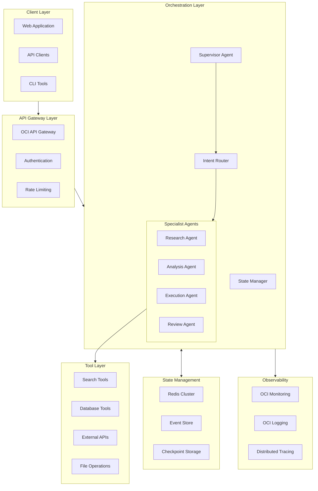

# Multi-Agent Orchestration Pattern

> Production-grade multi-agent system architecture with intelligent handoffs, distributed state management, and robust error recovery for enterprise AI applications.

## Overview

This pattern provides a comprehensive blueprint for building production multi-agent systems that coordinate multiple specialized AI agents to accomplish complex tasks. It addresses the critical challenges of agent handoffs, state management, error recovery, and observability at enterprise scale.

## Architecture Diagram



## Core Components

### 1. Supervisor Agent

The supervisor acts as the central coordinator, managing agent lifecycle, handoffs, and overall workflow execution.

```typescript
// supervisor-agent.ts
import { Agent, AgentContext, HandoffResult } from '@enterprise/agent-sdk';
import { OCI } from 'oci-sdk';

interface SupervisorConfig {
  maxConcurrentAgents: number;
  handoffTimeout: number;
  maxRetries: number;
  checkpointInterval: number;
}

interface AgentTask {
  id: string;
  agentType: string;
  input: unknown;
  context: AgentContext;
  priority: 'critical' | 'high' | 'normal' | 'low';
  deadline?: Date;
}

interface WorkflowState {
  workflowId: string;
  currentPhase: string;
  completedTasks: string[];
  pendingTasks: AgentTask[];
  agentStates: Map<string, unknown>;
  metadata: Record<string, unknown>;
}

export class SupervisorAgent {
  private agents: Map<string, Agent>;
  private stateManager: StateManager;
  private config: SupervisorConfig;
  private ociConfig: OCI.ConfigFile;

  constructor(config: SupervisorConfig) {
    this.config = config;
    this.agents = new Map();
    this.stateManager = new StateManager();
    this.ociConfig = OCI.ConfigFileReader.parse();
  }

  async orchestrate(input: string, context: AgentContext): Promise<WorkflowResult> {
    const workflowId = this.generateWorkflowId();
    const state = await this.initializeState(workflowId, input, context);

    try {
      // Phase 1: Plan the workflow
      const plan = await this.planWorkflow(input, context);
      await this.checkpoint(state, 'planning_complete');

      // Phase 2: Execute agents in sequence or parallel
      for (const phase of plan.phases) {
        state.currentPhase = phase.name;

        if (phase.parallel) {
          await this.executeParallel(phase.tasks, state);
        } else {
          await this.executeSequential(phase.tasks, state);
        }

        await this.checkpoint(state, `phase_${phase.name}_complete`);
      }

      // Phase 3: Aggregate and validate results
      const result = await this.aggregateResults(state);
      await this.finalizeWorkflow(state, result);

      return result;
    } catch (error) {
      return await this.handleWorkflowError(state, error);
    }
  }

  private async planWorkflow(
    input: string,
    context: AgentContext
  ): Promise<WorkflowPlan> {
    const plannerAgent = this.getAgent('planner');

    const planResponse = await plannerAgent.execute({
      input,
      systemPrompt: `You are a workflow planner. Analyze the request and create an execution plan.

        Available agents:
        - research: Gathers information from various sources
        - analysis: Analyzes data and generates insights
        - execution: Performs actions and operations
        - review: Validates outputs and ensures quality

        Output a JSON plan with phases, dependencies, and resource requirements.`,
      context,
    });

    return this.parsePlan(planResponse);
  }

  private async executeParallel(
    tasks: AgentTask[],
    state: WorkflowState
  ): Promise<void> {
    const semaphore = new Semaphore(this.config.maxConcurrentAgents);

    const taskPromises = tasks.map(async (task) => {
      await semaphore.acquire();
      try {
        return await this.executeTask(task, state);
      } finally {
        semaphore.release();
      }
    });

    const results = await Promise.allSettled(taskPromises);

    // Handle any failures
    const failures = results.filter(r => r.status === 'rejected');
    if (failures.length > 0) {
      await this.handlePartialFailure(failures, state);
    }
  }

  private async executeTask(
    task: AgentTask,
    state: WorkflowState
  ): Promise<TaskResult> {
    const agent = this.getAgent(task.agentType);
    let attempts = 0;

    while (attempts < this.config.maxRetries) {
      try {
        const result = await this.withTimeout(
          agent.execute({
            input: task.input,
            context: {
              ...task.context,
              workflowState: state,
              taskId: task.id,
            },
          }),
          this.config.handoffTimeout
        );

        state.completedTasks.push(task.id);
        state.agentStates.set(task.id, result);

        return { success: true, result, taskId: task.id };
      } catch (error) {
        attempts++;
        await this.logRetry(task, error, attempts);

        if (attempts >= this.config.maxRetries) {
          throw new AgentExecutionError(task, error);
        }

        await this.exponentialBackoff(attempts);
      }
    }

    throw new Error('Unexpected execution path');
  }

  private async handoff(
    fromAgent: string,
    toAgent: string,
    payload: HandoffPayload,
    state: WorkflowState
  ): Promise<HandoffResult> {
    // Record handoff event
    await this.stateManager.recordEvent({
      type: 'HANDOFF',
      from: fromAgent,
      to: toAgent,
      timestamp: new Date(),
      payload,
    });

    // Validate handoff
    const targetAgent = this.getAgent(toAgent);
    const validation = await targetAgent.validateInput(payload);

    if (!validation.valid) {
      throw new HandoffValidationError(fromAgent, toAgent, validation.errors);
    }

    // Execute handoff with state transfer
    const result = await targetAgent.execute({
      input: payload.data,
      context: {
        ...payload.context,
        handoffSource: fromAgent,
        previousResults: state.agentStates.get(fromAgent),
      },
    });

    return {
      success: true,
      fromAgent,
      toAgent,
      result,
    };
  }
}
```

### 2. State Management

Robust state management with checkpointing for recovery and audit trails.

```typescript
// state-manager.ts
import { Redis } from 'ioredis';
import { OCI } from 'oci-sdk';

interface StateEvent {
  eventId: string;
  workflowId: string;
  type: string;
  timestamp: Date;
  data: unknown;
  metadata: Record<string, unknown>;
}

interface Checkpoint {
  checkpointId: string;
  workflowId: string;
  state: WorkflowState;
  timestamp: Date;
  ttl: number;
}

export class StateManager {
  private redis: Redis;
  private objectStorage: OCI.ObjectStorageClient;
  private eventStore: EventStore;

  constructor() {
    this.redis = new Redis({
      host: process.env.REDIS_HOST,
      port: parseInt(process.env.REDIS_PORT || '6379'),
      password: process.env.REDIS_PASSWORD,
      retryStrategy: (times) => Math.min(times * 50, 2000),
    });

    this.objectStorage = new OCI.ObjectStorageClient({
      authenticationDetailsProvider: new OCI.ConfigFileAuthenticationDetailsProvider(),
    });

    this.eventStore = new EventStore();
  }

  async saveState(workflowId: string, state: WorkflowState): Promise<void> {
    const key = `workflow:${workflowId}:state`;
    const serialized = JSON.stringify(state);

    // Save to Redis with TTL
    await this.redis.setex(key, 86400, serialized); // 24 hour TTL

    // Record state change event
    await this.eventStore.append({
      streamId: `workflow-${workflowId}`,
      eventType: 'StateUpdated',
      data: state,
      metadata: { timestamp: new Date() },
    });
  }

  async loadState(workflowId: string): Promise<WorkflowState | null> {
    const key = `workflow:${workflowId}:state`;
    const data = await this.redis.get(key);

    if (!data) {
      // Try to recover from checkpoint
      return await this.recoverFromCheckpoint(workflowId);
    }

    return JSON.parse(data);
  }

  async checkpoint(
    workflowId: string,
    state: WorkflowState,
    label: string
  ): Promise<string> {
    const checkpointId = `${workflowId}-${label}-${Date.now()}`;

    const checkpoint: Checkpoint = {
      checkpointId,
      workflowId,
      state: structuredClone(state),
      timestamp: new Date(),
      ttl: 7 * 24 * 60 * 60, // 7 days
    };

    // Store checkpoint in Object Storage for durability
    await this.objectStorage.putObject({
      namespaceName: process.env.OCI_NAMESPACE!,
      bucketName: 'agent-checkpoints',
      objectName: `${workflowId}/${checkpointId}.json`,
      putObjectBody: JSON.stringify(checkpoint),
      contentType: 'application/json',
    });

    // Index in Redis for fast lookup
    await this.redis.zadd(
      `workflow:${workflowId}:checkpoints`,
      checkpoint.timestamp.getTime(),
      checkpointId
    );

    return checkpointId;
  }

  async recoverFromCheckpoint(workflowId: string): Promise<WorkflowState | null> {
    // Get latest checkpoint
    const checkpoints = await this.redis.zrevrange(
      `workflow:${workflowId}:checkpoints`,
      0,
      0
    );

    if (checkpoints.length === 0) {
      return null;
    }

    const checkpointId = checkpoints[0];

    // Load from Object Storage
    const response = await this.objectStorage.getObject({
      namespaceName: process.env.OCI_NAMESPACE!,
      bucketName: 'agent-checkpoints',
      objectName: `${workflowId}/${checkpointId}.json`,
    });

    const checkpoint: Checkpoint = JSON.parse(
      await this.streamToString(response.value)
    );

    return checkpoint.state;
  }

  async recordEvent(event: Omit<StateEvent, 'eventId'>): Promise<void> {
    const eventId = crypto.randomUUID();

    await this.eventStore.append({
      streamId: `workflow-${event.workflowId}`,
      eventType: event.type,
      data: event.data,
      metadata: {
        ...event.metadata,
        eventId,
        timestamp: event.timestamp,
      },
    });
  }

  async getWorkflowHistory(workflowId: string): Promise<StateEvent[]> {
    return await this.eventStore.readStream(`workflow-${workflowId}`);
  }
}
```

### 3. Error Recovery

Comprehensive error handling with automatic recovery strategies.

```typescript
// error-recovery.ts
import { Logger } from '@enterprise/logging';

type RecoveryStrategy = 'retry' | 'fallback' | 'compensate' | 'escalate' | 'abort';

interface ErrorContext {
  workflowId: string;
  taskId: string;
  agentType: string;
  error: Error;
  attempts: number;
  state: WorkflowState;
}

interface RecoveryResult {
  strategy: RecoveryStrategy;
  success: boolean;
  result?: unknown;
  compensationActions?: CompensationAction[];
}

interface CompensationAction {
  id: string;
  type: string;
  execute: () => Promise<void>;
  rollback: () => Promise<void>;
}

export class ErrorRecoveryManager {
  private logger: Logger;
  private strategies: Map<string, RecoveryHandler>;
  private compensationLog: CompensationAction[];

  constructor() {
    this.logger = new Logger('ErrorRecovery');
    this.strategies = new Map();
    this.compensationLog = [];
    this.registerDefaultStrategies();
  }

  private registerDefaultStrategies(): void {
    // Transient error strategy - retry with backoff
    this.strategies.set('transient', async (ctx: ErrorContext) => {
      if (ctx.attempts < 3) {
        await this.exponentialBackoff(ctx.attempts);
        return { strategy: 'retry' as RecoveryStrategy, success: true };
      }
      return { strategy: 'escalate' as RecoveryStrategy, success: false };
    });

    // Resource error strategy - try fallback
    this.strategies.set('resource', async (ctx: ErrorContext) => {
      const fallbackAgent = this.getFallbackAgent(ctx.agentType);
      if (fallbackAgent) {
        try {
          const result = await fallbackAgent.execute(ctx.state.pendingTasks[0]);
          return { strategy: 'fallback' as RecoveryStrategy, success: true, result };
        } catch {
          return { strategy: 'escalate' as RecoveryStrategy, success: false };
        }
      }
      return { strategy: 'escalate' as RecoveryStrategy, success: false };
    });

    // Data error strategy - compensate and retry
    this.strategies.set('data', async (ctx: ErrorContext) => {
      const compensations = await this.executeCompensations(ctx);
      return {
        strategy: 'compensate' as RecoveryStrategy,
        success: compensations.every(c => c.success),
        compensationActions: compensations,
      };
    });

    // Critical error strategy - abort with cleanup
    this.strategies.set('critical', async (ctx: ErrorContext) => {
      await this.abortWorkflow(ctx);
      return { strategy: 'abort' as RecoveryStrategy, success: true };
    });
  }

  async handleError(context: ErrorContext): Promise<RecoveryResult> {
    const errorType = this.classifyError(context.error);

    this.logger.error('Agent error occurred', {
      workflowId: context.workflowId,
      taskId: context.taskId,
      errorType,
      error: context.error.message,
      attempts: context.attempts,
    });

    const strategy = this.strategies.get(errorType);
    if (!strategy) {
      return await this.defaultRecovery(context);
    }

    return await strategy(context);
  }

  private classifyError(error: Error): string {
    // Classify based on error type and message
    if (error.message.includes('timeout') ||
        error.message.includes('ECONNREFUSED')) {
      return 'transient';
    }

    if (error.message.includes('rate limit') ||
        error.message.includes('quota exceeded')) {
      return 'resource';
    }

    if (error.message.includes('validation') ||
        error.message.includes('invalid data')) {
      return 'data';
    }

    if (error.message.includes('auth') ||
        error.message.includes('permission denied')) {
      return 'critical';
    }

    return 'unknown';
  }

  async executeCompensations(context: ErrorContext): Promise<CompensationResult[]> {
    const results: CompensationResult[] = [];

    // Execute compensations in reverse order (LIFO)
    for (const action of this.compensationLog.reverse()) {
      try {
        await action.rollback();
        results.push({ actionId: action.id, success: true });
      } catch (error) {
        this.logger.error('Compensation failed', {
          actionId: action.id,
          error: (error as Error).message,
        });
        results.push({
          actionId: action.id,
          success: false,
          error: error as Error
        });
      }
    }

    return results;
  }

  async abortWorkflow(context: ErrorContext): Promise<void> {
    // Execute all compensations
    await this.executeCompensations(context);

    // Clean up resources
    await this.cleanupResources(context.workflowId);

    // Record abort event
    await this.recordAbort(context);

    // Notify stakeholders
    await this.notifyAbort(context);
  }

  private async exponentialBackoff(attempt: number): Promise<void> {
    const baseDelay = 1000; // 1 second
    const maxDelay = 30000; // 30 seconds
    const delay = Math.min(baseDelay * Math.pow(2, attempt), maxDelay);
    const jitter = Math.random() * 1000;

    await new Promise(resolve => setTimeout(resolve, delay + jitter));
  }

  registerCompensation(action: CompensationAction): void {
    this.compensationLog.push(action);
  }
}
```

### 4. Agent Handoff Protocol

Structured handoff protocol ensuring reliable agent transitions.

```python
# handoff_protocol.py
from dataclasses import dataclass, field
from typing import Any, Optional, Dict, List
from enum import Enum
import asyncio
from datetime import datetime

class HandoffStatus(Enum):
    PENDING = "pending"
    IN_PROGRESS = "in_progress"
    COMPLETED = "completed"
    FAILED = "failed"
    ROLLED_BACK = "rolled_back"

@dataclass
class HandoffContext:
    """Context passed during agent handoffs"""
    workflow_id: str
    source_agent: str
    target_agent: str
    timestamp: datetime

    # State transfer
    shared_state: Dict[str, Any] = field(default_factory=dict)
    conversation_history: List[Dict] = field(default_factory=list)
    intermediate_results: Dict[str, Any] = field(default_factory=dict)

    # Control parameters
    priority: str = "normal"
    timeout_seconds: int = 300
    max_retries: int = 3

    # Metadata
    metadata: Dict[str, Any] = field(default_factory=dict)

@dataclass
class HandoffResult:
    """Result of an agent handoff"""
    status: HandoffStatus
    source_agent: str
    target_agent: str
    result: Optional[Any] = None
    error: Optional[str] = None
    duration_ms: int = 0
    retries: int = 0

class HandoffManager:
    """Manages agent-to-agent handoffs with validation and recovery"""

    def __init__(self, agent_registry: 'AgentRegistry', state_manager: 'StateManager'):
        self.registry = agent_registry
        self.state_manager = state_manager
        self.active_handoffs: Dict[str, HandoffContext] = {}

    async def initiate_handoff(
        self,
        context: HandoffContext,
        payload: Any
    ) -> HandoffResult:
        """Execute a validated handoff between agents"""

        handoff_id = f"{context.workflow_id}:{context.source_agent}:{context.target_agent}"
        self.active_handoffs[handoff_id] = context

        start_time = datetime.now()
        retries = 0

        try:
            # Step 1: Validate source agent can release
            source_agent = self.registry.get_agent(context.source_agent)
            if not await source_agent.can_release():
                raise HandoffError("Source agent cannot release - work in progress")

            # Step 2: Validate target agent can accept
            target_agent = self.registry.get_agent(context.target_agent)
            validation = await target_agent.validate_handoff(context, payload)

            if not validation.is_valid:
                raise HandoffValidationError(validation.errors)

            # Step 3: Prepare handoff state
            handoff_state = await self._prepare_handoff_state(context, payload)

            # Step 4: Execute handoff with retries
            while retries < context.max_retries:
                try:
                    result = await asyncio.wait_for(
                        self._execute_handoff(target_agent, handoff_state),
                        timeout=context.timeout_seconds
                    )

                    # Step 5: Confirm handoff success
                    await source_agent.release()
                    await self._record_handoff_success(context, result)

                    duration = (datetime.now() - start_time).total_seconds() * 1000

                    return HandoffResult(
                        status=HandoffStatus.COMPLETED,
                        source_agent=context.source_agent,
                        target_agent=context.target_agent,
                        result=result,
                        duration_ms=int(duration),
                        retries=retries
                    )

                except asyncio.TimeoutError:
                    retries += 1
                    if retries >= context.max_retries:
                        raise
                    await asyncio.sleep(2 ** retries)  # Exponential backoff

        except Exception as e:
            # Record failure and attempt rollback
            await self._handle_handoff_failure(context, e)

            return HandoffResult(
                status=HandoffStatus.FAILED,
                source_agent=context.source_agent,
                target_agent=context.target_agent,
                error=str(e),
                retries=retries
            )

        finally:
            del self.active_handoffs[handoff_id]

    async def _prepare_handoff_state(
        self,
        context: HandoffContext,
        payload: Any
    ) -> Dict[str, Any]:
        """Prepare complete state for handoff"""

        # Get current workflow state
        workflow_state = await self.state_manager.load_state(context.workflow_id)

        return {
            "payload": payload,
            "context": {
                "workflow_id": context.workflow_id,
                "handoff_source": context.source_agent,
                "priority": context.priority,
            },
            "shared_state": context.shared_state,
            "conversation_history": context.conversation_history,
            "intermediate_results": context.intermediate_results,
            "workflow_state": workflow_state,
        }

    async def _execute_handoff(
        self,
        target_agent: 'Agent',
        state: Dict[str, Any]
    ) -> Any:
        """Execute the actual handoff to target agent"""

        return await target_agent.execute(
            input=state["payload"],
            context=state["context"],
            history=state["conversation_history"],
            state=state["shared_state"]
        )

    async def _handle_handoff_failure(
        self,
        context: HandoffContext,
        error: Exception
    ) -> None:
        """Handle handoff failure with appropriate recovery"""

        # Log the failure
        await self.state_manager.record_event({
            "type": "HANDOFF_FAILED",
            "workflow_id": context.workflow_id,
            "source": context.source_agent,
            "target": context.target_agent,
            "error": str(error),
            "timestamp": datetime.now().isoformat()
        })

        # Attempt to return control to source agent
        try:
            source_agent = self.registry.get_agent(context.source_agent)
            await source_agent.recover_from_failed_handoff(context)
        except Exception as recovery_error:
            # Log recovery failure - may need manual intervention
            await self._escalate_handoff_failure(context, error, recovery_error)
```

## Implementation Guide

### Step 1: Set Up Infrastructure

```yaml
# infrastructure/docker-compose.yml
version: '3.8'

services:
  redis:
    image: redis:7-alpine
    ports:
      - "6379:6379"
    volumes:
      - redis_data:/data
    command: redis-server --appendonly yes
    healthcheck:
      test: ["CMD", "redis-cli", "ping"]
      interval: 10s
      timeout: 5s
      retries: 5

  supervisor:
    build:
      context: .
      dockerfile: Dockerfile.supervisor
    environment:
      - OCI_CONFIG_FILE=/app/.oci/config
      - REDIS_HOST=redis
      - REDIS_PORT=6379
      - OCI_COMPARTMENT_ID=${OCI_COMPARTMENT_ID}
      - LOG_LEVEL=info
    depends_on:
      redis:
        condition: service_healthy
    ports:
      - "8080:8080"
    deploy:
      replicas: 3
      resources:
        limits:
          cpus: '2'
          memory: 4G

  agent-research:
    build:
      context: .
      dockerfile: Dockerfile.agent
    environment:
      - AGENT_TYPE=research
      - SUPERVISOR_URL=http://supervisor:8080
    deploy:
      replicas: 2

  agent-analysis:
    build:
      context: .
      dockerfile: Dockerfile.agent
    environment:
      - AGENT_TYPE=analysis
      - SUPERVISOR_URL=http://supervisor:8080
    deploy:
      replicas: 2

  agent-execution:
    build:
      context: .
      dockerfile: Dockerfile.agent
    environment:
      - AGENT_TYPE=execution
      - SUPERVISOR_URL=http://supervisor:8080
    deploy:
      replicas: 2

volumes:
  redis_data:
```

### Step 2: Deploy to OCI Kubernetes (OKE)

```yaml
# kubernetes/supervisor-deployment.yaml
apiVersion: apps/v1
kind: Deployment
metadata:
  name: supervisor-agent
  labels:
    app: multi-agent-system
    component: supervisor
spec:
  replicas: 3
  selector:
    matchLabels:
      app: multi-agent-system
      component: supervisor
  template:
    metadata:
      labels:
        app: multi-agent-system
        component: supervisor
    spec:
      serviceAccountName: agent-service-account
      containers:
      - name: supervisor
        image: ${REGION}.ocir.io/${NAMESPACE}/supervisor-agent:latest
        ports:
        - containerPort: 8080
          name: http
        - containerPort: 9090
          name: metrics
        env:
        - name: OCI_RESOURCE_PRINCIPAL_VERSION
          value: "2.2"
        - name: REDIS_HOST
          valueFrom:
            secretKeyRef:
              name: redis-credentials
              key: host
        resources:
          requests:
            memory: "2Gi"
            cpu: "1000m"
          limits:
            memory: "4Gi"
            cpu: "2000m"
        livenessProbe:
          httpGet:
            path: /health
            port: 8080
          initialDelaySeconds: 30
          periodSeconds: 10
        readinessProbe:
          httpGet:
            path: /ready
            port: 8080
          initialDelaySeconds: 5
          periodSeconds: 5
---
apiVersion: v1
kind: Service
metadata:
  name: supervisor-service
spec:
  selector:
    app: multi-agent-system
    component: supervisor
  ports:
  - name: http
    port: 80
    targetPort: 8080
  - name: metrics
    port: 9090
    targetPort: 9090
---
apiVersion: autoscaling/v2
kind: HorizontalPodAutoscaler
metadata:
  name: supervisor-hpa
spec:
  scaleTargetRef:
    apiVersion: apps/v1
    kind: Deployment
    name: supervisor-agent
  minReplicas: 3
  maxReplicas: 10
  metrics:
  - type: Resource
    resource:
      name: cpu
      target:
        type: Utilization
        averageUtilization: 70
  - type: Pods
    pods:
      metric:
        name: active_workflows
      target:
        type: AverageValue
        averageValue: "50"
```

## Deployment Considerations

### High Availability

1. **Multi-Zone Deployment**: Deploy supervisor and agents across multiple availability domains
2. **State Replication**: Use Redis Cluster with replicas for state durability
3. **Checkpoint Storage**: Store checkpoints in OCI Object Storage with cross-region replication
4. **Circuit Breakers**: Implement circuit breakers for agent calls to prevent cascade failures

### Scalability

1. **Horizontal Scaling**: Auto-scale agents based on queue depth
2. **Work Partitioning**: Partition workflows by tenant/region for isolation
3. **Async Processing**: Use OCI Streaming for async task distribution
4. **Connection Pooling**: Pool connections to databases and external services

## Cost Optimization Tips

### 1. Model Selection Strategy

```python
# Select appropriate model based on task complexity
MODEL_TIERS = {
    "simple": {
        "model": "cohere.command-light",
        "cost_per_1k": 0.0004,
        "use_cases": ["classification", "routing", "simple qa"]
    },
    "standard": {
        "model": "cohere.command-r",
        "cost_per_1k": 0.001,
        "use_cases": ["analysis", "summarization", "code review"]
    },
    "complex": {
        "model": "cohere.command-r-plus",
        "cost_per_1k": 0.003,
        "use_cases": ["complex reasoning", "multi-step planning", "creative tasks"]
    }
}

async def select_model(task_type: str, complexity_score: float) -> str:
    if complexity_score < 0.3:
        return MODEL_TIERS["simple"]["model"]
    elif complexity_score < 0.7:
        return MODEL_TIERS["standard"]["model"]
    return MODEL_TIERS["complex"]["model"]
```

### 2. Caching Strategy

```typescript
// Implement multi-level caching
class AgentCache {
  private l1Cache: Map<string, CacheEntry>; // In-memory
  private l2Cache: Redis;                    // Redis
  private l3Cache: ObjectStorage;            // OCI Object Storage

  async get(key: string): Promise<CacheEntry | null> {
    // Check L1 (fastest)
    if (this.l1Cache.has(key)) {
      return this.l1Cache.get(key)!;
    }

    // Check L2 (fast)
    const l2Result = await this.l2Cache.get(key);
    if (l2Result) {
      this.l1Cache.set(key, JSON.parse(l2Result));
      return JSON.parse(l2Result);
    }

    // Check L3 (slower but persistent)
    try {
      const l3Result = await this.l3Cache.getObject(key);
      if (l3Result) {
        const entry = JSON.parse(l3Result);
        await this.warmCache(key, entry);
        return entry;
      }
    } catch {
      return null;
    }

    return null;
  }
}
```

### 3. Resource Right-Sizing

| Component | Development | Production | High-Scale |
|-----------|-------------|------------|------------|
| Supervisor | 1 replica, 1 CPU, 2GB | 3 replicas, 2 CPU, 4GB | 5+ replicas, 4 CPU, 8GB |
| Agents | 1 per type | 2-3 per type | Auto-scale 2-10 |
| Redis | Single node | 3-node cluster | 6-node cluster |
| State Storage | Standard tier | Standard tier | High-performance tier |

## Security Considerations

### 1. Agent Authentication

```typescript
// Implement mutual TLS for agent communication
const agentTLSConfig = {
  key: fs.readFileSync('/etc/certs/agent.key'),
  cert: fs.readFileSync('/etc/certs/agent.crt'),
  ca: fs.readFileSync('/etc/certs/ca.crt'),
  requestCert: true,
  rejectUnauthorized: true,
};

// Validate agent identity on each request
async function validateAgentIdentity(cert: Certificate): Promise<boolean> {
  const agentId = cert.subject.CN;
  const registeredAgent = await agentRegistry.get(agentId);

  if (!registeredAgent) {
    throw new SecurityError('Unknown agent identity');
  }

  return registeredAgent.fingerprint === cert.fingerprint256;
}
```

### 2. Permission Boundaries

```python
# Define agent permission scopes
AGENT_PERMISSIONS = {
    "research": {
        "allowed_tools": ["search", "fetch_document", "query_database"],
        "denied_tools": ["execute_code", "modify_data", "send_email"],
        "data_access": ["read"],
        "resource_limits": {
            "max_api_calls": 100,
            "max_data_size_mb": 50
        }
    },
    "execution": {
        "allowed_tools": ["execute_code", "modify_data", "create_resource"],
        "denied_tools": ["delete_resource", "admin_operations"],
        "data_access": ["read", "write"],
        "resource_limits": {
            "max_api_calls": 50,
            "max_data_size_mb": 100
        }
    }
}

def enforce_permissions(agent_type: str, operation: str) -> bool:
    permissions = AGENT_PERMISSIONS.get(agent_type)
    if not permissions:
        return False

    if operation in permissions.get("denied_tools", []):
        raise PermissionDeniedError(f"Agent {agent_type} cannot perform {operation}")

    return operation in permissions.get("allowed_tools", [])
```

### 3. Audit Logging

```typescript
// Comprehensive audit logging for compliance
interface AuditEvent {
  eventId: string;
  timestamp: Date;
  workflowId: string;
  agentId: string;
  action: string;
  resource: string;
  outcome: 'success' | 'failure' | 'denied';
  userId?: string;
  metadata: Record<string, unknown>;
}

class AuditLogger {
  private ociLogging: OCI.LoggingClient;

  async logAgentAction(event: AuditEvent): Promise<void> {
    // Log to OCI Logging
    await this.ociLogging.putLogs({
      logId: process.env.AUDIT_LOG_OCID!,
      putLogsDetails: {
        specversion: '1.0',
        logEntryBatches: [{
          entries: [{
            data: JSON.stringify(event),
            id: event.eventId,
            time: event.timestamp.toISOString(),
          }],
          source: 'multi-agent-system',
          type: 'agent-audit',
        }],
      },
    });

    // Also store in immutable audit table
    await this.auditDb.insert('audit_events', event);
  }
}
```

## Monitoring and Observability

### Key Metrics

| Metric | Description | Alert Threshold |
|--------|-------------|-----------------|
| `workflow_duration_p99` | 99th percentile workflow completion time | > 30s |
| `handoff_success_rate` | Percentage of successful handoffs | < 99% |
| `agent_error_rate` | Agent execution error rate | > 1% |
| `checkpoint_lag` | Time since last checkpoint | > 60s |
| `active_workflows` | Number of concurrent workflows | > 1000 |
| `recovery_operations` | Number of recovery attempts | > 10/min |

### Dashboard Configuration

```yaml
# OCI Monitoring Dashboard
widgets:
  - type: metric_chart
    title: Workflow Performance
    metrics:
      - name: workflow_duration_p99
        namespace: multi_agent
      - name: workflow_duration_p50
        namespace: multi_agent

  - type: metric_chart
    title: Agent Health
    metrics:
      - name: agent_error_rate
        namespace: multi_agent
        dimensions:
          agent_type: ["research", "analysis", "execution", "review"]

  - type: alarm_status
    title: System Alerts
    alarms:
      - handoff_failure_alarm
      - high_latency_alarm
      - error_rate_alarm
```

## Related Patterns

- [AI Gateway Pattern](./ai-gateway-pattern.md) - Centralized AI request routing and management
- [RAG Production Pattern](./rag-production-pattern.md) - Production retrieval-augmented generation
- [LLMOps Pattern](./llm-ops-pattern.md) - LLM deployment and monitoring pipelines
- [Oracle ADK Blueprint](./oracle-adk-blueprint.md) - Oracle Agent Development Kit architecture

## References

- [Oracle ADK Documentation](https://docs.oracle.com/en-us/iaas/Content/agent-development-kit/)
- [OCI Monitoring Service](https://docs.oracle.com/en-us/iaas/Content/Monitoring/home.htm)
- [Event Sourcing Pattern](https://microservices.io/patterns/data/event-sourcing.html)
- [Saga Pattern for Distributed Transactions](https://microservices.io/patterns/data/saga.html)
