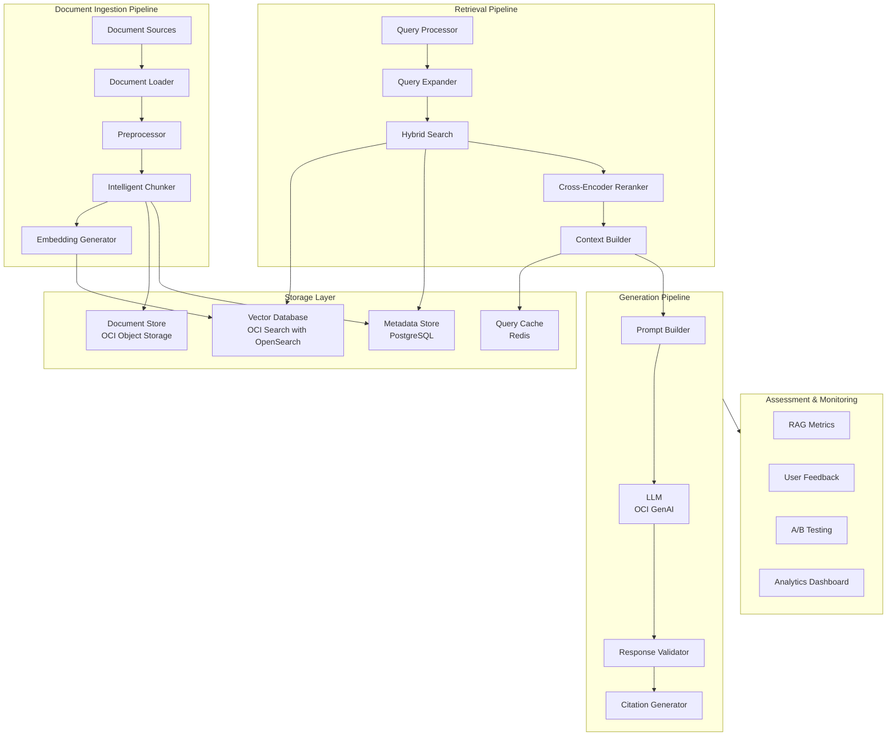

# RAG Production Pattern

> Production-grade Retrieval-Augmented Generation architecture with advanced chunking strategies, hybrid search, reranking, and comprehensive assessment frameworks for enterprise AI applications.

## Overview

This pattern provides a comprehensive blueprint for building production RAG systems that go beyond basic vector search. It addresses critical challenges including optimal chunking, hybrid retrieval, context compression, hallucination mitigation, and continuous assessment.

## Architecture Diagram



## Core Components

### 1. Intelligent Document Chunking

Advanced chunking strategies that preserve semantic coherence and optimize retrieval quality.

```typescript
// chunking-strategies.ts
interface ChunkingConfig {
  strategy: 'fixed' | 'semantic' | 'recursive' | 'document_structure' | 'hybrid';
  chunkSize: number;
  chunkOverlap: number;
  minChunkSize: number;
  maxChunkSize: number;
  preserveStructure: boolean;
}

interface Chunk {
  id: string;
  content: string;
  metadata: ChunkMetadata;
  embedding?: number[];
  parentId?: string;
  childIds?: string[];
}

interface ChunkMetadata {
  sourceId: string;
  sourcePath: string;
  pageNumber?: number;
  sectionTitle?: string;
  chunkIndex: number;
  totalChunks: number;
  tokenCount: number;
  createdAt: Date;
  documentType: string;
  hierarchy: string[];
}

export class IntelligentChunker {
  private config: ChunkingConfig;
  private tokenizer: Tokenizer;
  private structureDetector: DocumentStructureDetector;

  constructor(config: ChunkingConfig) {
    this.config = config;
    this.tokenizer = new Tokenizer();
    this.structureDetector = new DocumentStructureDetector();
  }

  async chunk(document: Document): Promise<Chunk[]> {
    switch (this.config.strategy) {
      case 'semantic':
        return this.semanticChunking(document);
      case 'recursive':
        return this.recursiveChunking(document);
      case 'document_structure':
        return this.structureAwareChunking(document);
      case 'hybrid':
        return this.hybridChunking(document);
      default:
        return this.fixedSizeChunking(document);
    }
  }

  // Semantic chunking based on sentence boundaries and topic coherence
  private async semanticChunking(document: Document): Promise<Chunk[]> {
    const sentences = this.splitIntoSentences(document.content);
    const chunks: Chunk[] = [];
    let currentChunk: string[] = [];
    let currentTokens = 0;

    for (let i = 0; i < sentences.length; i++) {
      const sentence = sentences[i];
      const sentenceTokens = this.tokenizer.count(sentence);

      // Check if adding sentence exceeds chunk size
      if (currentTokens + sentenceTokens > this.config.chunkSize && currentChunk.length > 0) {
        // Check semantic coherence before splitting
        const shouldSplit = await this.shouldSplitHere(
          currentChunk,
          sentences.slice(i)
        );

        if (shouldSplit) {
          chunks.push(this.createChunk(
            currentChunk.join(' '),
            document,
            chunks.length
          ));

          // Add overlap from previous chunk
          const overlapSentences = this.getOverlapSentences(currentChunk);
          currentChunk = [...overlapSentences, sentence];
          currentTokens = this.tokenizer.count(currentChunk.join(' '));
        } else {
          currentChunk.push(sentence);
          currentTokens += sentenceTokens;
        }
      } else {
        currentChunk.push(sentence);
        currentTokens += sentenceTokens;
      }
    }

    // Don't forget the last chunk
    if (currentChunk.length > 0) {
      chunks.push(this.createChunk(
        currentChunk.join(' '),
        document,
        chunks.length
      ));
    }

    return chunks;
  }

  // Structure-aware chunking that respects document hierarchy
  private async structureAwareChunking(document: Document): Promise<Chunk[]> {
    // Detect document structure (headings, sections, lists, etc.)
    const structure = await this.structureDetector.analyze(document);
    const chunks: Chunk[] = [];

    for (const section of structure.sections) {
      // Create parent chunk for section
      const parentChunk = this.createChunk(
        section.summary || section.title,
        document,
        chunks.length,
        { sectionTitle: section.title, hierarchy: section.hierarchy }
      );
      chunks.push(parentChunk);

      // Create child chunks for section content
      const sectionChunks = await this.chunkSection(section, document, parentChunk.id);
      chunks.push(...sectionChunks);

      // Update parent with child references
      parentChunk.childIds = sectionChunks.map(c => c.id);
    }

    return chunks;
  }

  // Hybrid approach combining multiple strategies
  private async hybridChunking(document: Document): Promise<Chunk[]> {
    // First, apply structure-aware chunking
    const structureChunks = await this.structureAwareChunking(document);

    // Then, apply semantic refinement to large chunks
    const refinedChunks: Chunk[] = [];

    for (const chunk of structureChunks) {
      if (this.tokenizer.count(chunk.content) > this.config.maxChunkSize) {
        // Further split using semantic chunking
        const subChunks = await this.semanticChunking({
          ...document,
          content: chunk.content,
        });

        // Maintain parent-child relationships
        for (const subChunk of subChunks) {
          subChunk.parentId = chunk.id;
          refinedChunks.push(subChunk);
        }
        chunk.childIds = subChunks.map(c => c.id);
      }
      refinedChunks.push(chunk);
    }

    return refinedChunks;
  }

  private async shouldSplitHere(
    currentChunk: string[],
    remainingSentences: string[]
  ): Promise<boolean> {
    // Use embedding similarity to detect topic boundaries
    const currentText = currentChunk.slice(-3).join(' ');
    const nextText = remainingSentences.slice(0, 3).join(' ');

    const similarity = await this.computeSimilarity(currentText, nextText);

    // Split if there's a significant topic shift
    return similarity < 0.7;
  }
}
```

### 2. Hybrid Search Implementation

Combining dense (vector) and sparse (BM25) retrieval for optimal results.

```python
# hybrid_search.py
from dataclasses import dataclass
from typing import List, Dict, Optional, Tuple
import numpy as np
from opensearchpy import OpenSearch
from oci.generative_ai_inference import GenerativeAiInferenceClient

@dataclass
class SearchResult:
    chunk_id: str
    content: str
    score: float
    metadata: Dict
    source: str  # 'vector', 'keyword', or 'hybrid'

@dataclass
class SearchConfig:
    vector_weight: float = 0.7
    keyword_weight: float = 0.3
    top_k: int = 20
    rerank_top_k: int = 5
    min_score: float = 0.5
    use_query_expansion: bool = True
    use_reranking: bool = True

class HybridSearchEngine:
    def __init__(
        self,
        opensearch_client: OpenSearch,
        embedding_client: GenerativeAiInferenceClient,
        config: SearchConfig
    ):
        self.opensearch = opensearch_client
        self.embedding_client = embedding_client
        self.config = config
        self.reranker = CrossEncoderReranker()

    async def search(
        self,
        query: str,
        filters: Optional[Dict] = None
    ) -> List[SearchResult]:
        # Step 1: Query expansion
        expanded_queries = await self._expand_query(query) if self.config.use_query_expansion else [query]

        # Step 2: Parallel vector and keyword search
        vector_results = await self._vector_search(expanded_queries[0], filters)
        keyword_results = await self._keyword_search(expanded_queries, filters)

        # Step 3: Reciprocal Rank Fusion
        fused_results = self._reciprocal_rank_fusion(
            vector_results,
            keyword_results
        )

        # Step 4: Cross-encoder reranking
        if self.config.use_reranking:
            reranked_results = await self.reranker.rerank(
                query,
                fused_results[:self.config.top_k]
            )
            return reranked_results[:self.config.rerank_top_k]

        return fused_results[:self.config.rerank_top_k]

    async def _vector_search(
        self,
        query: str,
        filters: Optional[Dict] = None
    ) -> List[SearchResult]:
        # Generate query embedding
        query_embedding = await self._get_embedding(query)

        # Build OpenSearch query
        search_body = {
            "size": self.config.top_k,
            "query": {
                "script_score": {
                    "query": self._build_filter_query(filters),
                    "script": {
                        "source": "cosineSimilarity(params.query_vector, 'embedding') + 1.0",
                        "params": {"query_vector": query_embedding}
                    }
                }
            }
        }

        response = await self.opensearch.search(
            index="documents",
            body=search_body
        )

        return [
            SearchResult(
                chunk_id=hit["_id"],
                content=hit["_source"]["content"],
                score=hit["_score"] / 2.0,  # Normalize to 0-1
                metadata=hit["_source"].get("metadata", {}),
                source="vector"
            )
            for hit in response["hits"]["hits"]
        ]

    async def _keyword_search(
        self,
        queries: List[str],
        filters: Optional[Dict] = None
    ) -> List[SearchResult]:
        # Build BM25 query with multiple queries
        should_clauses = [
            {"match": {"content": {"query": q, "boost": 1.0 / (i + 1)}}}
            for i, q in enumerate(queries)
        ]

        search_body = {
            "size": self.config.top_k,
            "query": {
                "bool": {
                    "should": should_clauses,
                    "filter": self._build_filter_query(filters).get("bool", {}).get("filter", [])
                }
            }
        }

        response = await self.opensearch.search(
            index="documents",
            body=search_body
        )

        # Normalize BM25 scores
        max_score = response["hits"]["max_score"] or 1.0

        return [
            SearchResult(
                chunk_id=hit["_id"],
                content=hit["_source"]["content"],
                score=hit["_score"] / max_score,
                metadata=hit["_source"].get("metadata", {}),
                source="keyword"
            )
            for hit in response["hits"]["hits"]
        ]

    def _reciprocal_rank_fusion(
        self,
        vector_results: List[SearchResult],
        keyword_results: List[SearchResult],
        k: int = 60
    ) -> List[SearchResult]:
        """Combine results using Reciprocal Rank Fusion"""
        scores: Dict[str, float] = {}
        results_map: Dict[str, SearchResult] = {}

        # Process vector results
        for rank, result in enumerate(vector_results):
            rrf_score = self.config.vector_weight / (k + rank + 1)
            scores[result.chunk_id] = scores.get(result.chunk_id, 0) + rrf_score
            results_map[result.chunk_id] = result

        # Process keyword results
        for rank, result in enumerate(keyword_results):
            rrf_score = self.config.keyword_weight / (k + rank + 1)
            scores[result.chunk_id] = scores.get(result.chunk_id, 0) + rrf_score
            if result.chunk_id not in results_map:
                results_map[result.chunk_id] = result

        # Sort by combined score
        sorted_ids = sorted(scores.keys(), key=lambda x: scores[x], reverse=True)

        return [
            SearchResult(
                chunk_id=cid,
                content=results_map[cid].content,
                score=scores[cid],
                metadata=results_map[cid].metadata,
                source="hybrid"
            )
            for cid in sorted_ids
        ]

    async def _expand_query(self, query: str) -> List[str]:
        """Expand query with synonyms and related terms"""
        expansion_prompt = f"""Given the search query: "{query}"

Generate 3 alternative phrasings that capture the same intent.
Return only the alternative queries, one per line."""

        response = await self.embedding_client.chat(
            model="cohere.command-r",
            messages=[{"role": "user", "content": expansion_prompt}],
            max_tokens=150
        )

        expanded = [query]  # Original query first
        for line in response.text.strip().split("\n"):
            line = line.strip()
            if line and line != query:
                expanded.append(line)

        return expanded[:4]  # Original + up to 3 expansions


class CrossEncoderReranker:
    """Cross-encoder model for precise relevance scoring"""

    def __init__(self, model_name: str = "cross-encoder/ms-marco-MiniLM-L-6-v2"):
        from sentence_transformers import CrossEncoder
        self.model = CrossEncoder(model_name)

    async def rerank(
        self,
        query: str,
        results: List[SearchResult]
    ) -> List[SearchResult]:
        if not results:
            return results

        # Prepare query-document pairs
        pairs = [(query, result.content) for result in results]

        # Get cross-encoder scores
        scores = self.model.predict(pairs)

        # Update results with new scores
        for result, score in zip(results, scores):
            result.score = float(score)

        # Sort by cross-encoder score
        return sorted(results, key=lambda x: x.score, reverse=True)
```

### 3. Context Building and Compression

Optimal context assembly with compression for large document sets.

```typescript
// context-builder.ts
interface ContextConfig {
  maxTokens: number;
  compressionEnabled: boolean;
  compressionRatio: number;
  deduplicationEnabled: boolean;
  citationStyle: 'inline' | 'footnote' | 'reference';
}

interface ContextWindow {
  content: string;
  tokenCount: number;
  sources: SourceReference[];
  compressionApplied: boolean;
}

interface SourceReference {
  id: string;
  title: string;
  url?: string;
  pageNumber?: number;
  relevanceScore: number;
}

export class ContextBuilder {
  private config: ContextConfig;
  private tokenizer: Tokenizer;
  private compressor: ContextCompressor;

  constructor(config: ContextConfig) {
    this.config = config;
    this.tokenizer = new Tokenizer();
    this.compressor = new ContextCompressor();
  }

  async buildContext(
    query: string,
    results: SearchResult[],
    conversationHistory?: Message[]
  ): Promise<ContextWindow> {
    // Step 1: Deduplicate similar content
    const dedupedResults = this.config.deduplicationEnabled
      ? await this.deduplicateResults(results)
      : results;

    // Step 2: Sort by relevance and diversity
    const rankedResults = this.diversityRerank(dedupedResults);

    // Step 3: Build context with token budget
    let context = '';
    let tokenCount = 0;
    const sources: SourceReference[] = [];
    const usedChunks: Set<string> = new Set();

    for (const result of rankedResults) {
      // Check for semantic duplicates
      if (await this.isDuplicate(result.content, usedChunks)) {
        continue;
      }

      const chunkTokens = this.tokenizer.count(result.content);

      // Check if we can fit this chunk
      if (tokenCount + chunkTokens <= this.config.maxTokens) {
        context += this.formatChunk(result, sources.length + 1);
        tokenCount += chunkTokens;
        sources.push(this.extractSourceRef(result));
        usedChunks.add(result.chunk_id);
      } else if (this.config.compressionEnabled) {
        // Try to compress remaining important content
        const compressedChunk = await this.compressor.compress(
          result.content,
          this.config.maxTokens - tokenCount
        );

        if (compressedChunk) {
          context += this.formatChunk(
            { ...result, content: compressedChunk },
            sources.length + 1
          );
          tokenCount += this.tokenizer.count(compressedChunk);
          sources.push(this.extractSourceRef(result));
        }
      }

      // Stop if we've reached token limit
      if (tokenCount >= this.config.maxTokens * 0.95) {
        break;
      }
    }

    return {
      content: context,
      tokenCount,
      sources,
      compressionApplied: this.config.compressionEnabled,
    };
  }

  private async deduplicateResults(results: SearchResult[]): Promise<SearchResult[]> {
    const deduplicated: SearchResult[] = [];
    const embeddings: number[][] = [];

    for (const result of results) {
      const embedding = await this.getEmbedding(result.content);

      // Check similarity with existing results
      let isDuplicate = false;
      for (const existing of embeddings) {
        const similarity = this.cosineSimilarity(embedding, existing);
        if (similarity > 0.92) {
          isDuplicate = true;
          break;
        }
      }

      if (!isDuplicate) {
        deduplicated.push(result);
        embeddings.push(embedding);
      }
    }

    return deduplicated;
  }

  private diversityRerank(results: SearchResult[]): SearchResult[] {
    // MMR-style diversity reranking
    const reranked: SearchResult[] = [];
    const remaining = [...results];
    const lambda = 0.7; // Balance between relevance and diversity

    while (remaining.length > 0 && reranked.length < results.length) {
      let bestScore = -Infinity;
      let bestIdx = 0;

      for (let i = 0; i < remaining.length; i++) {
        const relevance = remaining[i].score;

        // Calculate max similarity to already selected docs
        let maxSimilarity = 0;
        for (const selected of reranked) {
          const similarity = this.contentSimilarity(
            remaining[i].content,
            selected.content
          );
          maxSimilarity = Math.max(maxSimilarity, similarity);
        }

        // MMR score
        const mmrScore = lambda * relevance - (1 - lambda) * maxSimilarity;

        if (mmrScore > bestScore) {
          bestScore = mmrScore;
          bestIdx = i;
        }
      }

      reranked.push(remaining[bestIdx]);
      remaining.splice(bestIdx, 1);
    }

    return reranked;
  }

  private formatChunk(result: SearchResult, index: number): string {
    const citation = this.config.citationStyle === 'inline'
      ? `[${index}] `
      : '';

    return `${citation}${result.content}\n\n`;
  }
}

// Context compression using extractive summarization
class ContextCompressor {
  async compress(content: string, targetTokens: number): Promise<string | null> {
    const sentences = this.splitSentences(content);
    const scores = await this.scoreSentences(sentences);

    // Select top sentences by score until we hit token limit
    const sortedIndices = scores
      .map((score, idx) => ({ score, idx }))
      .sort((a, b) => b.score - a.score);

    const selectedIndices: number[] = [];
    let tokenCount = 0;
    const tokenizer = new Tokenizer();

    for (const { idx } of sortedIndices) {
      const sentenceTokens = tokenizer.count(sentences[idx]);
      if (tokenCount + sentenceTokens <= targetTokens) {
        selectedIndices.push(idx);
        tokenCount += sentenceTokens;
      }
    }

    if (selectedIndices.length === 0) {
      return null;
    }

    // Reconstruct in original order
    selectedIndices.sort((a, b) => a - b);
    return selectedIndices.map(idx => sentences[idx]).join(' ');
  }

  private async scoreSentences(sentences: string[]): Promise<number[]> {
    // Score based on:
    // 1. Position (first sentences more important)
    // 2. Length (very short sentences less useful)
    // 3. Named entities and key terms

    return sentences.map((sentence, idx) => {
      const positionScore = 1 / (idx + 1);
      const lengthScore = Math.min(sentence.split(' ').length / 20, 1);
      const keyTermScore = this.countKeyTerms(sentence) * 0.1;

      return positionScore * 0.3 + lengthScore * 0.3 + keyTermScore * 0.4;
    });
  }
}
```

### 4. Response Generation and Validation

LLM response generation with hallucination detection and citation validation.

```python
# response_generator.py
from dataclasses import dataclass
from typing import List, Dict, Optional, Tuple
from enum import Enum
import re

class ResponseQuality(Enum):
    HIGH = "high"
    MEDIUM = "medium"
    LOW = "low"
    HALLUCINATION = "hallucination"

@dataclass
class GeneratedResponse:
    content: str
    citations: List['Citation']
    quality: ResponseQuality
    confidence: float
    validation_details: Dict
    suggestions: List[str]

@dataclass
class Citation:
    text: str
    source_id: str
    source_title: str
    relevance: float
    verified: bool

class RAGResponseGenerator:
    def __init__(
        self,
        llm_client,
        config: dict
    ):
        self.llm = llm_client
        self.config = config
        self.validator = ResponseValidator()

    async def generate(
        self,
        query: str,
        context: 'ContextWindow',
        conversation_history: List[Dict] = None
    ) -> GeneratedResponse:
        # Build the prompt
        prompt = self._build_prompt(query, context, conversation_history)

        # Generate response
        response = await self.llm.generate(
            model=self.config["model"],
            prompt=prompt,
            max_tokens=self.config["max_tokens"],
            temperature=self.config["temperature"]
        )

        # Extract and verify citations
        citations = await self._extract_citations(response.text, context)

        # Validate response quality
        validation = await self.validator.validate(
            query=query,
            response=response.text,
            context=context,
            citations=citations
        )

        return GeneratedResponse(
            content=response.text,
            citations=citations,
            quality=validation.quality,
            confidence=validation.confidence,
            validation_details=validation.details,
            suggestions=validation.suggestions
        )

    def _build_prompt(
        self,
        query: str,
        context: 'ContextWindow',
        history: List[Dict] = None
    ) -> str:
        system_prompt = """You are a helpful AI assistant that answers questions based on the provided context.

IMPORTANT INSTRUCTIONS:
1. Only use information from the provided context to answer questions
2. If the context doesn't contain enough information, say so clearly
3. Cite your sources using [1], [2], etc. matching the source numbers in the context
4. Be precise and accurate - do not make up information
5. If you're unsure about something, express that uncertainty

Context:
{context}

Sources:
{sources}"""

        sources_text = "\n".join([
            f"[{i+1}] {src.title}" + (f" (Page {src.pageNumber})" if src.pageNumber else "")
            for i, src in enumerate(context.sources)
        ])

        formatted_system = system_prompt.format(
            context=context.content,
            sources=sources_text
        )

        messages = [{"role": "system", "content": formatted_system}]

        # Add conversation history if present
        if history:
            for msg in history[-5:]:  # Last 5 turns
                messages.append(msg)

        messages.append({"role": "user", "content": query})

        return messages

    async def _extract_citations(
        self,
        response: str,
        context: 'ContextWindow'
    ) -> List[Citation]:
        citations = []

        # Find citation markers like [1], [2], etc.
        citation_pattern = r'\[(\d+)\]'
        matches = re.finditer(citation_pattern, response)

        for match in matches:
            source_idx = int(match.group(1)) - 1

            if 0 <= source_idx < len(context.sources):
                source = context.sources[source_idx]

                # Get the sentence containing the citation
                start = max(0, match.start() - 200)
                end = min(len(response), match.end() + 50)
                cited_text = response[start:end]

                # Verify the citation against source
                verified = await self._verify_citation(
                    cited_text,
                    source,
                    context
                )

                citations.append(Citation(
                    text=cited_text,
                    source_id=source.id,
                    source_title=source.title,
                    relevance=source.relevanceScore,
                    verified=verified
                ))

        return citations

    async def _verify_citation(
        self,
        cited_text: str,
        source: 'SourceReference',
        context: 'ContextWindow'
    ) -> bool:
        # Check if the claim in cited_text is supported by the source
        # This uses semantic similarity and NLI

        # Find the source content
        source_content = self._get_source_content(source.id, context)

        if not source_content:
            return False

        # Use NLI model to check entailment
        entailment_score = await self._check_entailment(
            premise=source_content,
            hypothesis=cited_text
        )

        return entailment_score > 0.7


class ResponseValidator:
    """Validates RAG responses for quality and hallucinations"""

    async def validate(
        self,
        query: str,
        response: str,
        context: 'ContextWindow',
        citations: List[Citation]
    ) -> 'ValidationResult':
        import asyncio
        checks = await asyncio.gather(
            self._check_groundedness(response, context),
            self._check_relevance(query, response),
            self._check_completeness(query, response, context),
            self._check_citation_coverage(response, citations),
            self._check_factual_consistency(response, context)
        )

        groundedness, relevance, completeness, citation_coverage, consistency = checks

        # Calculate overall quality
        scores = [groundedness, relevance, completeness, citation_coverage, consistency]
        avg_score = sum(scores) / len(scores)

        if avg_score >= 0.8:
            quality = ResponseQuality.HIGH
        elif avg_score >= 0.6:
            quality = ResponseQuality.MEDIUM
        elif consistency < 0.5:
            quality = ResponseQuality.HALLUCINATION
        else:
            quality = ResponseQuality.LOW

        suggestions = self._generate_suggestions(
            groundedness, relevance, completeness, citation_coverage, consistency
        )

        return ValidationResult(
            quality=quality,
            confidence=avg_score,
            details={
                "groundedness": groundedness,
                "relevance": relevance,
                "completeness": completeness,
                "citation_coverage": citation_coverage,
                "factual_consistency": consistency
            },
            suggestions=suggestions
        )

    async def _check_groundedness(
        self,
        response: str,
        context: 'ContextWindow'
    ) -> float:
        """Check if response claims are grounded in context"""
        sentences = self._split_sentences(response)
        grounded_count = 0

        for sentence in sentences:
            # Skip citation markers and common phrases
            if self._is_meta_sentence(sentence):
                grounded_count += 1
                continue

            # Check if sentence is supported by any context chunk
            max_support = 0
            for chunk in context.content.split('\n\n'):
                support = await self._compute_support(sentence, chunk)
                max_support = max(max_support, support)

            if max_support > 0.6:
                grounded_count += 1

        return grounded_count / len(sentences) if sentences else 0

    async def _check_factual_consistency(
        self,
        response: str,
        context: 'ContextWindow'
    ) -> float:
        """Use NLI to check factual consistency"""
        # Extract factual claims from response
        claims = await self._extract_claims(response)

        if not claims:
            return 1.0

        consistent_claims = 0
        for claim in claims:
            # Check against context
            entailment = await self._check_entailment(
                premise=context.content,
                hypothesis=claim
            )

            if entailment > 0.5:
                consistent_claims += 1

        return consistent_claims / len(claims)
```

### 5. RAG Assessment Framework

Comprehensive assessment metrics for RAG system quality.

```typescript
// rag-assessment.ts
interface AssessmentMetrics {
  retrieval: RetrievalMetrics;
  generation: GenerationMetrics;
  endToEnd: EndToEndMetrics;
}

interface RetrievalMetrics {
  precision: number;
  recall: number;
  mrr: number;  // Mean Reciprocal Rank
  ndcg: number; // Normalized Discounted Cumulative Gain
  hitRate: number;
  latencyMs: number;
}

interface GenerationMetrics {
  faithfulness: number;
  answerRelevancy: number;
  contextPrecision: number;
  contextRecall: number;
  hallucinationRate: number;
}

interface EndToEndMetrics {
  answerCorrectness: number;
  userSatisfaction: number;
  taskCompletionRate: number;
  averageLatencyMs: number;
}

interface AssessmentDataset {
  queries: AssessmentQuery[];
}

interface AssessmentQuery {
  id: string;
  query: string;
  groundTruthAnswer: string;
  relevantDocIds: string[];
  metadata: Record<string, unknown>;
}

export class RAGAssessor {
  private ragSystem: RAGSystem;
  private metrics: MetricsCollector;

  constructor(ragSystem: RAGSystem) {
    this.ragSystem = ragSystem;
    this.metrics = new MetricsCollector();
  }

  async assess(dataset: AssessmentDataset): Promise<AssessmentMetrics> {
    const retrievalResults: RetrievalAssessResult[] = [];
    const generationResults: GenerationAssessResult[] = [];
    const e2eResults: E2EAssessResult[] = [];

    for (const query of dataset.queries) {
      // Assess retrieval
      const retrievalResult = await this.assessRetrieval(query);
      retrievalResults.push(retrievalResult);

      // Assess generation
      const generationResult = await this.assessGeneration(query);
      generationResults.push(generationResult);

      // Assess end-to-end
      const e2eResult = await this.assessEndToEnd(query);
      e2eResults.push(e2eResult);
    }

    return {
      retrieval: this.aggregateRetrievalMetrics(retrievalResults),
      generation: this.aggregateGenerationMetrics(generationResults),
      endToEnd: this.aggregateE2EMetrics(e2eResults),
    };
  }

  private async assessRetrieval(query: AssessmentQuery): Promise<RetrievalAssessResult> {
    const startTime = Date.now();

    // Get retrieval results
    const results = await this.ragSystem.retrieve(query.query);
    const latencyMs = Date.now() - startTime;

    const retrievedIds = results.map(r => r.chunk_id);
    const relevantIds = new Set(query.relevantDocIds);

    // Calculate precision
    const truePositives = retrievedIds.filter(id => relevantIds.has(id)).length;
    const precision = truePositives / retrievedIds.length;

    // Calculate recall
    const recall = truePositives / relevantIds.size;

    // Calculate MRR
    let mrr = 0;
    for (let i = 0; i < retrievedIds.length; i++) {
      if (relevantIds.has(retrievedIds[i])) {
        mrr = 1 / (i + 1);
        break;
      }
    }

    // Calculate NDCG
    const ndcg = this.calculateNDCG(retrievedIds, query.relevantDocIds);

    // Calculate hit rate (at least one relevant doc retrieved)
    const hitRate = truePositives > 0 ? 1 : 0;

    return {
      queryId: query.id,
      precision,
      recall,
      mrr,
      ndcg,
      hitRate,
      latencyMs,
    };
  }

  private async assessGeneration(query: AssessmentQuery): Promise<GenerationAssessResult> {
    // Get RAG response
    const response = await this.ragSystem.query(query.query);

    // Assess faithfulness (is the answer grounded in context?)
    const faithfulness = await this.assessFaithfulness(
      response.content,
      response.context
    );

    // Assess answer relevancy (does the answer address the query?)
    const answerRelevancy = await this.assessAnswerRelevancy(
      query.query,
      response.content
    );

    // Assess context precision (how much of the context was useful?)
    const contextPrecision = await this.assessContextPrecision(
      response.content,
      response.context
    );

    // Assess context recall (was all necessary info retrieved?)
    const contextRecall = await this.assessContextRecall(
      query.groundTruthAnswer,
      response.context
    );

    // Detect hallucinations
    const hallucinations = await this.detectHallucinations(
      response.content,
      response.context
    );

    return {
      queryId: query.id,
      faithfulness,
      answerRelevancy,
      contextPrecision,
      contextRecall,
      hallucinations,
      hallucinationRate: hallucinations.length > 0 ? 1 : 0,
    };
  }

  private async assessFaithfulness(
    answer: string,
    context: string
  ): Promise<number> {
    // Extract claims from answer
    const claims = await this.extractClaims(answer);

    if (claims.length === 0) return 1.0;

    // Check each claim against context
    let supportedClaims = 0;
    for (const claim of claims) {
      const isSupported = await this.isClaimSupported(claim, context);
      if (isSupported) supportedClaims++;
    }

    return supportedClaims / claims.length;
  }

  private async detectHallucinations(
    answer: string,
    context: string
  ): Promise<Hallucination[]> {
    const hallucinations: Hallucination[] = [];
    const claims = await this.extractClaims(answer);

    for (const claim of claims) {
      const entailment = await this.checkEntailment(context, claim);

      if (entailment.label === 'contradiction' ||
          (entailment.label === 'neutral' && entailment.confidence > 0.8)) {
        hallucinations.push({
          claim,
          type: entailment.label === 'contradiction' ? 'factual' : 'unsupported',
          confidence: entailment.confidence,
        });
      }
    }

    return hallucinations;
  }

  private calculateNDCG(
    retrievedIds: string[],
    relevantIds: string[],
    k?: number
  ): number {
    const relevantSet = new Set(relevantIds);
    const maxK = k || retrievedIds.length;

    // Calculate DCG
    let dcg = 0;
    for (let i = 0; i < Math.min(maxK, retrievedIds.length); i++) {
      const rel = relevantSet.has(retrievedIds[i]) ? 1 : 0;
      dcg += rel / Math.log2(i + 2);
    }

    // Calculate IDCG (ideal DCG)
    let idcg = 0;
    for (let i = 0; i < Math.min(maxK, relevantIds.length); i++) {
      idcg += 1 / Math.log2(i + 2);
    }

    return idcg > 0 ? dcg / idcg : 0;
  }
}

// A/B Testing for RAG configurations
export class RAGABTester {
  async runExperiment(
    controlConfig: RAGConfig,
    treatmentConfig: RAGConfig,
    dataset: AssessmentDataset,
    sampleSize: number
  ): Promise<ABTestResult> {
    // Split dataset
    const shuffled = this.shuffle(dataset.queries);
    const control = shuffled.slice(0, sampleSize / 2);
    const treatment = shuffled.slice(sampleSize / 2, sampleSize);

    // Run assessments
    const controlSystem = new RAGSystem(controlConfig);
    const treatmentSystem = new RAGSystem(treatmentConfig);

    const controlAssessor = new RAGAssessor(controlSystem);
    const treatmentAssessor = new RAGAssessor(treatmentSystem);

    const [controlMetrics, treatmentMetrics] = await Promise.all([
      controlAssessor.assess({ queries: control }),
      treatmentAssessor.assess({ queries: treatment }),
    ]);

    // Statistical significance testing
    const significance = this.calculateSignificance(
      controlMetrics,
      treatmentMetrics
    );

    return {
      control: controlMetrics,
      treatment: treatmentMetrics,
      improvement: this.calculateImprovement(controlMetrics, treatmentMetrics),
      significant: significance.pValue < 0.05,
      pValue: significance.pValue,
      confidenceInterval: significance.confidenceInterval,
    };
  }
}
```

## Deployment Configuration

### OCI Infrastructure Setup

```hcl
# terraform/rag-infrastructure.tf
# OCI Search with OpenSearch for vector storage
resource "oci_opensearch_opensearch_cluster" "rag_cluster" {
  compartment_id             = var.compartment_id
  display_name               = "rag-vector-store"
  software_version           = "2.11"

  master_node_count          = 3
  master_node_host_type      = "FLEX"
  master_node_host_ocpu_count = 2
  master_node_host_memory_gb = 16

  data_node_count            = 3
  data_node_host_type        = "FLEX"
  data_node_host_ocpu_count  = 4
  data_node_host_memory_gb   = 32
  data_node_storage_gb       = 500

  vcn_id                     = oci_core_vcn.rag_vcn.id
  subnet_id                  = oci_core_subnet.private_subnet.id

  security_mode              = "ENFORCING"
}

# OCI Object Storage for documents
resource "oci_objectstorage_bucket" "document_store" {
  compartment_id = var.compartment_id
  namespace      = data.oci_objectstorage_namespace.ns.namespace
  name           = "rag-documents"
  access_type    = "NoPublicAccess"
  versioning     = "Enabled"

  storage_tier   = "Standard"

  retention_rules {
    display_name         = "compliance-retention"
    duration {
      time_amount = 365
      time_unit   = "DAYS"
    }
  }
}

# OCI Autonomous Database for metadata
resource "oci_database_autonomous_database" "metadata_db" {
  compartment_id           = var.compartment_id
  db_name                  = "ragmetadata"
  display_name             = "RAG Metadata Store"
  db_workload              = "OLTP"
  is_auto_scaling_enabled  = true

  cpu_core_count           = 2
  data_storage_size_in_tbs = 1

  is_mtls_connection_required = true

  whitelisted_ips = [oci_core_subnet.private_subnet.cidr_block]
}
```

### Kubernetes Deployment

```yaml
# kubernetes/rag-deployment.yaml
apiVersion: apps/v1
kind: Deployment
metadata:
  name: rag-service
  labels:
    app: rag-service
spec:
  replicas: 3
  selector:
    matchLabels:
      app: rag-service
  template:
    metadata:
      labels:
        app: rag-service
    spec:
      containers:
      - name: rag-service
        image: ${REGION}.ocir.io/${NAMESPACE}/rag-service:latest
        ports:
        - containerPort: 8080
        env:
        - name: OPENSEARCH_URL
          valueFrom:
            secretKeyRef:
              name: rag-secrets
              key: opensearch-url
        - name: OCI_GENAI_ENDPOINT
          value: "https://inference.generativeai.${REGION}.oci.oraclecloud.com"
        - name: EMBEDDING_MODEL
          value: "cohere.embed-english-v3.0"
        - name: GENERATION_MODEL
          value: "cohere.command-r-plus"
        resources:
          requests:
            memory: "2Gi"
            cpu: "1000m"
          limits:
            memory: "4Gi"
            cpu: "2000m"
---
# Ingestion worker for processing documents
apiVersion: apps/v1
kind: Deployment
metadata:
  name: rag-ingestion-worker
spec:
  replicas: 2
  selector:
    matchLabels:
      app: rag-ingestion
  template:
    spec:
      containers:
      - name: worker
        image: ${REGION}.ocir.io/${NAMESPACE}/rag-ingestion:latest
        env:
        - name: QUEUE_URL
          valueFrom:
            secretKeyRef:
              name: rag-secrets
              key: queue-url
        resources:
          requests:
            memory: "4Gi"
            cpu: "2000m"
```

## Cost Optimization Tips

### 1. Embedding Cost Reduction

```python
import hashlib
import json
from typing import List
import asyncio

# Batch embeddings and cache results
class EmbeddingOptimizer:
    def __init__(self, cache_client, batch_size: int = 100):
        self.cache = cache_client
        self.batch_size = batch_size
        self.pending_texts: List[str] = []
        self.pending_callbacks: List[asyncio.Future] = []

    async def get_embedding(self, text: str) -> List[float]:
        # Check cache first
        cache_key = f"emb:{hashlib.md5(text.encode()).hexdigest()}"
        cached = await self.cache.get(cache_key)

        if cached:
            return json.loads(cached)

        # Add to batch
        future = asyncio.Future()
        self.pending_texts.append(text)
        self.pending_callbacks.append(future)

        # Process batch if full
        if len(self.pending_texts) >= self.batch_size:
            await self._process_batch()

        return await future

    async def _process_batch(self):
        texts = self.pending_texts
        callbacks = self.pending_callbacks
        self.pending_texts = []
        self.pending_callbacks = []

        # Batch API call
        embeddings = await self.embedding_client.embed_batch(texts)

        # Cache and resolve
        for text, embedding, callback in zip(texts, embeddings, callbacks):
            cache_key = f"emb:{hashlib.md5(text.encode()).hexdigest()}"
            await self.cache.setex(cache_key, 86400 * 7, json.dumps(embedding))
            callback.set_result(embedding)
```

### 2. LLM Token Optimization

| Optimization | Impact | Implementation |
|-------------|--------|----------------|
| Context compression | 30-50% token reduction | Extractive summarization |
| Query caching | 20-40% cost reduction | Semantic similarity cache |
| Tiered models | 50% cost reduction | Use smaller models for simple queries |
| Response length limits | Variable | Set appropriate max_tokens |

## Security Considerations

### 1. Document Access Control

```typescript
// Implement document-level access control
interface DocumentACL {
  documentId: string;
  allowedUsers: string[];
  allowedGroups: string[];
  classification: 'public' | 'internal' | 'confidential' | 'restricted';
}

class SecureRAGService {
  async query(
    query: string,
    userId: string,
    userGroups: string[]
  ): Promise<RAGResponse> {
    // Build access filter
    const accessFilter = this.buildAccessFilter(userId, userGroups);

    // Retrieve with access control
    const results = await this.searchEngine.search(query, {
      filter: accessFilter,
    });

    // Double-check access before returning
    const authorizedResults = results.filter(r =>
      this.verifyAccess(r, userId, userGroups)
    );

    return this.generateResponse(query, authorizedResults);
  }

  private buildAccessFilter(userId: string, groups: string[]): object {
    return {
      bool: {
        should: [
          { term: { 'acl.public': true } },
          { term: { 'acl.allowedUsers': userId } },
          { terms: { 'acl.allowedGroups': groups } },
        ],
        minimum_should_match: 1,
      },
    };
  }
}
```

### 2. PII Protection in RAG

```python
# Redact PII before storing and retrieving
class PIIProtectedRAG:
    def __init__(self):
        self.pii_detector = PIIDetector()
        self.encryption = FieldLevelEncryption()

    async def ingest_document(self, document: 'Document') -> str:
        # Detect PII
        pii_entities = await self.pii_detector.detect(document.content)

        # Create redacted version for indexing
        redacted_content = self.redact_pii(document.content, pii_entities)

        # Encrypt original PII for secure storage
        encrypted_pii = {
            entity.id: self.encryption.encrypt(entity.value)
            for entity in pii_entities
        }

        # Store redacted version in vector DB
        chunk_id = await self.store_chunk(redacted_content, {
            "has_pii": len(pii_entities) > 0,
            "pii_types": list(set(e.type for e in pii_entities))
        })

        # Store encrypted PII separately with access control
        if encrypted_pii:
            await self.store_encrypted_pii(chunk_id, encrypted_pii)

        return chunk_id
```

## Monitoring Dashboard

### Key Metrics

| Metric | Description | Target |
|--------|-------------|--------|
| Retrieval Precision@5 | Relevant docs in top 5 | > 80% |
| Answer Faithfulness | Grounding in context | > 90% |
| Hallucination Rate | Unsupported claims | < 5% |
| Query Latency P99 | End-to-end response time | < 3s |
| Cache Hit Rate | Query cache effectiveness | > 30% |
| User Satisfaction | Feedback score | > 4.0/5.0 |

## Related Patterns

- [Multi-Agent Orchestration Pattern](./multi-agent-orchestration-pattern.md) - Agent coordination
- [AI Gateway Pattern](./ai-gateway-pattern.md) - Unified AI access layer
- [LLMOps Pattern](./llm-ops-pattern.md) - LLM deployment and monitoring
- [Oracle ADK Blueprint](./oracle-adk-blueprint.md) - Oracle Agent Development Kit

## References

- [OCI Search with OpenSearch](https://docs.oracle.com/en-us/iaas/Content/search-opensearch/home.htm)
- [OCI Generative AI Service](https://docs.oracle.com/en-us/iaas/Content/generative-ai/home.htm)
- [RAGAS Assessment Framework](https://docs.ragas.io/)
- [Chunking Strategies Research](https://arxiv.org/abs/2312.06648)
