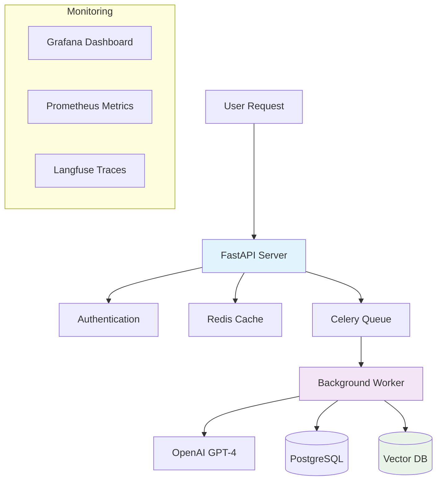

# [Pattern Name] - Implementation Template

> **Template Instructions**: Replace all `[Pattern Name]` with your actual pattern name. Fill in all sections below with real implementation details. Remove this instruction block when done.

## 🎯 Pattern Overview

**Business Value**: [Quantified business impact - ROI, cost savings, efficiency gains]
**Use Cases**: [3-5 specific enterprise use cases]
**Deployment Time**: [Realistic time estimate]
**Complexity**: [Low/Medium/High with justification]

## 🏗️ Architecture



## 📋 Prerequisites

- Python 3.9+
- Docker & Docker Compose
- OpenAI API key
- [Any other specific requirements]

## 🚀 Quick Start (5 Minutes to Success)

### 1. Clone & Setup (1 minute)
```bash
git clone https://github.com/AI-Architect-Academy/ai-architect-academy.git
cd ai-architect-academy/01-design-patterns/[pattern-name]
./quickstart.sh
```

### 2. Configure (1 minute)
```bash
cp .env.example .env
# Add your API keys to .env
```

### 3. Deploy (2 minutes)
```bash
docker-compose up -d
```

### 4. Test (1 minute)
```bash
curl -X POST http://localhost:8000/[endpoint] \
  -H "Content-Type: application/json" \
  -d '{"input": "test data"}'
```

**Expected Output**:
```json
{
  "result": "Expected response format",
  "confidence": 0.95,
  "processing_time": 0.234
}
```

## 📦 Project Structure

```
[pattern-name]/
├── main.py                 # CLI interface
├── api.py                  # FastAPI server
├── config.yaml            # Configuration
├── docker-compose.yml     # Deployment
├── requirements.txt       # Dependencies
├── tests/                 # Test suite
│   ├── test_integration.py
│   └── test_performance.py
├── benchmarks/            # Performance tests
├── monitoring/            # Grafana dashboards
├── docs/                  # Documentation
├── examples/              # Sample data
└── scripts/               # Utility scripts
```

## 🔧 Implementation Details

### Core Components

#### 1. Main Processing Engine (`src/engine.py`)
```python
from typing import Dict, List, Any, Optional
from dataclasses import dataclass
import logging
import asyncio
from openai import AsyncOpenAI

logger = logging.getLogger(__name__)

@dataclass
class ProcessingResult:
    """Result from pattern processing."""
    result: Any
    confidence: float
    processing_time: float
    metadata: Dict[str, Any]

class PatternEngine:
    """Core processing engine for [Pattern Name] pattern."""
    
    def __init__(self, config: Dict[str, Any]):
        self.config = config
        self.openai_client = AsyncOpenAI(
            api_key=config["openai"]["api_key"]
        )
        
    async def process(self, input_data: Any) -> ProcessingResult:
        """Process input data using the pattern."""
        start_time = time.time()
        
        try:
            # Implementation logic here
            result = await self._core_processing(input_data)
            
            processing_time = time.time() - start_time
            confidence = self._calculate_confidence(result)
            
            return ProcessingResult(
                result=result,
                confidence=confidence,
                processing_time=processing_time,
                metadata={"version": "1.0.0", "model": self.config["openai"]["model"]}
            )
            
        except Exception as e:
            logger.error(f"Processing failed: {e}")
            raise
    
    async def _core_processing(self, input_data: Any) -> Any:
        """Core processing logic - implement your pattern here."""
        # TODO: Implement actual pattern logic
        response = await self.openai_client.chat.completions.create(
            model=self.config["openai"]["model"],
            messages=[
                {"role": "system", "content": "Your system prompt here"},
                {"role": "user", "content": str(input_data)}
            ],
            temperature=self.config["openai"].get("temperature", 0.7)
        )
        
        return response.choices[0].message.content
    
    def _calculate_confidence(self, result: Any) -> float:
        """Calculate confidence score for the result."""
        # TODO: Implement confidence calculation logic
        return 0.95  # Placeholder
```

#### 2. FastAPI Server (`api.py`)
```python
from fastapi import FastAPI, HTTPException, Depends
from fastapi.middleware.cors import CORSMiddleware
from pydantic import BaseModel, Field
from typing import Any, Optional
import time
import logging

from src.engine import PatternEngine, ProcessingResult
from config.settings import load_config

app = FastAPI(
    title="[Pattern Name] API",
    description="Production-ready [Pattern Name] implementation",
    version="1.0.0"
)

app.add_middleware(
    CORSMiddleware,
    allow_origins=["*"],
    allow_credentials=True,
    allow_methods=["*"],
    allow_headers=["*"],
)

config = load_config()
engine = PatternEngine(config)

class ProcessingRequest(BaseModel):
    input: Any = Field(..., description="Input data to process")
    options: Optional[Dict[str, Any]] = Field(None, description="Processing options")

@app.post("/process", response_model=ProcessingResult)
async def process_data(request: ProcessingRequest):
    """Process data using [Pattern Name] pattern."""
    try:
        result = await engine.process(request.input)
        return result
    except Exception as e:
        raise HTTPException(status_code=500, detail=str(e))

@app.get("/health")
async def health_check():
    """Health check endpoint."""
    return {"status": "healthy", "pattern": "[Pattern Name]", "version": "1.0.0"}

if __name__ == "__main__":
    import uvicorn
    uvicorn.run(app, host="0.0.0.0", port=8000)
```

#### 3. CLI Interface (`main.py`)
```python
#!/usr/bin/env python3
import click
import asyncio
import json
from pathlib import Path
from rich.console import Console
from rich.table import Table

from src.engine import PatternEngine
from config.settings import load_config

console = Console()

@click.group()
@click.pass_context
def cli(ctx):
    """[Pattern Name] - CLI Interface"""
    ctx.ensure_object(dict)
    ctx.obj['config'] = load_config()
    ctx.obj['engine'] = PatternEngine(ctx.obj['config'])

@cli.command()
@click.argument('input_data')
@click.option('--output', '-o', type=click.Path(), help='Output file path')
@click.pass_context
def process(ctx, input_data: str, output: str):
    """Process data using the pattern."""
    
    async def _process():
        engine = ctx.obj['engine']
        result = await engine.process(input_data)
        
        if output:
            with open(output, 'w') as f:
                json.dump(result.__dict__, f, indent=2)
        else:
            table = Table(title="Processing Result")
            table.add_column("Metric", style="cyan")
            table.add_column("Value", style="green")
            
            table.add_row("Result", str(result.result))
            table.add_row("Confidence", f"{result.confidence:.2%}")
            table.add_row("Processing Time", f"{result.processing_time:.2f}s")
            
            console.print(table)
    
    asyncio.run(_process())

@cli.command()
@click.pass_context
def benchmark(ctx):
    """Run performance benchmarks."""
    console.print("[blue]Running benchmarks...[/blue]")
    # TODO: Implement benchmarking
    console.print("[green]✅ Benchmarks complete[/green]")

if __name__ == '__main__':
    cli()
```

### 4. Configuration Management (`config/settings.py`)
```python
import os
import yaml
from pathlib import Path
from typing import Dict, Any

def load_config(config_path: str = "config.yaml") -> Dict[str, Any]:
    """Load configuration from YAML file and environment variables."""
    
    # Default configuration
    config = {
        "openai": {
            "api_key": os.getenv("OPENAI_API_KEY"),
            "model": os.getenv("OPENAI_MODEL", "gpt-3.5-turbo"),
            "temperature": float(os.getenv("OPENAI_TEMPERATURE", "0.7")),
            "max_tokens": int(os.getenv("OPENAI_MAX_TOKENS", "1000"))
        },
        "api": {
            "host": os.getenv("API_HOST", "0.0.0.0"),
            "port": int(os.getenv("API_PORT", "8000")),
            "workers": int(os.getenv("API_WORKERS", "4"))
        },
        "logging": {
            "level": os.getenv("LOG_LEVEL", "INFO"),
            "format": "%(asctime)s - %(name)s - %(levelname)s - %(message)s"
        }
    }
    
    # Load from YAML file if exists
    if Path(config_path).exists():
        with open(config_path, 'r') as f:
            yaml_config = yaml.safe_load(f)
            config.update(yaml_config)
    
    return config
```

## 🧪 Testing & Quality Assurance

### Test Suite
```python
# tests/test_integration.py
import pytest
import asyncio
from src.engine import PatternEngine
from config.settings import load_config

@pytest.fixture
async def engine():
    config = load_config()
    return PatternEngine(config)

@pytest.mark.asyncio
async def test_basic_processing(engine):
    """Test basic processing functionality."""
    result = await engine.process("test input")
    
    assert result.result is not None
    assert 0 <= result.confidence <= 1
    assert result.processing_time > 0

@pytest.mark.asyncio
async def test_error_handling(engine):
    """Test error handling with invalid input."""
    with pytest.raises(Exception):
        await engine.process(None)

# Run tests
# pytest tests/ -v --cov=src
```

### Performance Benchmarks
```python
# benchmarks/performance.py
import asyncio
import time
import statistics
from src.engine import PatternEngine
from config.settings import load_config

async def benchmark_throughput():
    """Benchmark processing throughput."""
    config = load_config()
    engine = PatternEngine(config)
    
    test_inputs = ["test"] * 100
    start_time = time.time()
    
    tasks = [engine.process(input_data) for input_data in test_inputs]
    results = await asyncio.gather(*tasks)
    
    end_time = time.time()
    
    processing_times = [r.processing_time for r in results]
    
    print(f"Throughput: {len(test_inputs) / (end_time - start_time):.1f} req/s")
    print(f"Avg processing time: {statistics.mean(processing_times):.3f}s")
    print(f"P95 processing time: {statistics.quantiles(processing_times, n=20)[18]:.3f}s")

if __name__ == "__main__":
    asyncio.run(benchmark_throughput())
```

## 📊 Monitoring & Observability

### Grafana Dashboard Configuration
```yaml
# monitoring/grafana-dashboard.json
{
  "dashboard": {
    "title": "[Pattern Name] Metrics",
    "panels": [
      {
        "title": "Request Rate",
        "type": "graph",
        "targets": [
          {
            "expr": "rate(http_requests_total[5m])"
          }
        ]
      },
      {
        "title": "Response Time",
        "type": "graph", 
        "targets": [
          {
            "expr": "histogram_quantile(0.95, http_request_duration_seconds_bucket)"
          }
        ]
      },
      {
        "title": "Error Rate",
        "type": "singlestat",
        "targets": [
          {
            "expr": "rate(http_requests_total{status=~'5..'}[5m])"
          }
        ]
      }
    ]
  }
}
```

## 💰 Cost Analysis

### Usage-Based Pricing Model

| Component | Usage | Cost per Unit | Monthly Cost (1000 users) |
|-----------|-------|---------------|---------------------------|
| OpenAI API | 500K tokens/month | $0.002/1K tokens | $1,000 |
| Infrastructure | 24/7 uptime | $0.10/hour | $73 |
| Storage | 100GB | $0.023/GB | $2.30 |
| **Total** | | | **$1,075.30** |

### ROI Calculator
```python
def calculate_roi(manual_hours_saved: int, hourly_rate: float, 
                 implementation_cost: float, monthly_operating_cost: float) -> dict:
    """Calculate ROI for pattern implementation."""
    annual_savings = manual_hours_saved * 52 * hourly_rate
    annual_operating_cost = monthly_operating_cost * 12
    
    net_annual_benefit = annual_savings - annual_operating_cost - implementation_cost
    roi_percentage = (net_annual_benefit / implementation_cost) * 100
    
    return {
        "annual_savings": annual_savings,
        "annual_operating_cost": annual_operating_cost,
        "net_annual_benefit": net_annual_benefit,
        "roi_percentage": roi_percentage,
        "payback_period_months": implementation_cost / (net_annual_benefit / 12)
    }

# Example for content generation
roi = calculate_roi(
    manual_hours_saved=40,    # 40 hours/week saved
    hourly_rate=75,           # $75/hour rate
    implementation_cost=50000, # $50K implementation
    monthly_operating_cost=1075 # $1,075/month
)
print(f"ROI: {roi['roi_percentage']:.1f}%")
```

## 🚀 Deployment Options

### Local Development
```bash
python -m venv venv
source venv/bin/activate  # or `venv\Scripts\activate` on Windows
pip install -r requirements.txt
python main.py process "test input"
```

### Docker Deployment
```yaml
# docker-compose.yml
version: '3.8'
services:
  api:
    build: .
    ports:
      - "8000:8000"
    environment:
      - OPENAI_API_KEY=${OPENAI_API_KEY}
    volumes:
      - ./config.yaml:/app/config.yaml
    restart: unless-stopped
    
  redis:
    image: redis:alpine
    ports:
      - "6379:6379"
      
  monitoring:
    image: grafana/grafana
    ports:
      - "3000:3000"
    volumes:
      - ./monitoring:/etc/grafana/provisioning
```

### Kubernetes Deployment
```yaml
# k8s/deployment.yaml
apiVersion: apps/v1
kind: Deployment
metadata:
  name: pattern-api
spec:
  replicas: 3
  selector:
    matchLabels:
      app: pattern-api
  template:
    metadata:
      labels:
        app: pattern-api
    spec:
      containers:
      - name: api
        image: ai-academy/pattern-api:latest
        ports:
        - containerPort: 8000
        env:
        - name: OPENAI_API_KEY
          valueFrom:
            secretKeyRef:
              name: api-secrets
              key: openai-api-key
        resources:
          limits:
            memory: "1Gi"
            cpu: "500m"
          requests:
            memory: "512Mi"
            cpu: "250m"
```

### Cloud Platform Scripts

#### AWS (ECS)
```bash
#!/bin/bash
# deploy-aws.sh

# Build and push to ECR
aws ecr get-login-password --region us-west-2 | docker login --username AWS --password-stdin [account-id].dkr.ecr.us-west-2.amazonaws.com
docker build -t pattern-api .
docker tag pattern-api:latest [account-id].dkr.ecr.us-west-2.amazonaws.com/pattern-api:latest
docker push [account-id].dkr.ecr.us-west-2.amazonaws.com/pattern-api:latest

# Deploy to ECS
aws ecs update-service --cluster production --service pattern-api-service --force-new-deployment
```

#### Azure (Container Apps)
```bash
#!/bin/bash
# deploy-azure.sh

# Build and push to ACR
az acr build --registry myregistry --image pattern-api:latest .

# Deploy to Container Apps
az containerapp update \
  --name pattern-api \
  --resource-group myResourceGroup \
  --image myregistry.azurecr.io/pattern-api:latest
```

## 📈 Scaling Considerations

### Performance Optimization
- **Async Processing**: Use `asyncio` for concurrent requests
- **Caching**: Implement Redis caching for repeated queries
- **Load Balancing**: Deploy multiple instances behind load balancer
- **Database Optimization**: Use connection pooling and query optimization

### Monitoring Alerts
```yaml
# alerts.yml
groups:
- name: pattern-api
  rules:
  - alert: HighErrorRate
    expr: rate(http_requests_total{status=~"5.."}[5m]) > 0.1
    for: 5m
    annotations:
      summary: "High error rate detected"
      
  - alert: HighLatency
    expr: histogram_quantile(0.95, http_request_duration_seconds_bucket) > 2
    for: 5m
    annotations:
      summary: "High latency detected"
```

## 🔒 Security & Compliance

### Security Checklist
- [ ] API key management (environment variables, not hardcoded)
- [ ] Input validation and sanitization
- [ ] Rate limiting implementation
- [ ] HTTPS/TLS encryption
- [ ] Authentication and authorization
- [ ] Audit logging
- [ ] Dependency security scanning
- [ ] Container security scanning

### GDPR Compliance Features
```python
class GDPRCompliantEngine(PatternEngine):
    """GDPR-compliant version with data protection features."""
    
    def __init__(self, config: Dict[str, Any]):
        super().__init__(config)
        self.audit_logger = logging.getLogger('gdpr.audit')
    
    async def process(self, input_data: Any, user_consent: bool = False) -> ProcessingResult:
        """Process with GDPR compliance checks."""
        if not user_consent:
            raise ValueError("User consent required for processing personal data")
        
        # Log processing for audit trail
        self.audit_logger.info(f"Processing data with consent at {datetime.utcnow()}")
        
        # Anonymize PII before processing
        anonymized_data = self._anonymize_pii(input_data)
        
        return await super().process(anonymized_data)
    
    def _anonymize_pii(self, data: Any) -> Any:
        """Remove or anonymize personally identifiable information."""
        # Implementation for PII anonymization
        return data
```

## 📚 Additional Resources

### Documentation
- [Full API Documentation](./docs/api.md)
- [Architecture Deep Dive](./docs/architecture.md)
- [Troubleshooting Guide](./docs/troubleshooting.md)
- [Contributing Guidelines](./CONTRIBUTING.md)

### Related Patterns
- [Content Generation Pattern](../content-generation/) - For text generation
- [Decision Support Pattern](../decision-support/) - For analytics
- [RAG System Pattern](../rag-system/) - For knowledge retrieval

### Community & Support
- [GitHub Discussions](https://github.com/AI-Architect-Academy/ai-architect-academy/discussions)
- [Discord Server](https://discord.gg/ai-architect-academy)
- [Office Hours](https://calendly.com/ai-architect-academy/office-hours) - Weekly community calls

---

## ✅ Quality Checklist

Before submitting your pattern implementation, ensure:

### Code Quality (90%+ test coverage required)
- [ ] Type hints throughout codebase
- [ ] Comprehensive error handling
- [ ] Logging and observability
- [ ] Security best practices
- [ ] Performance benchmarks

### Documentation Quality
- [ ] 5-minute quick start works
- [ ] All commands tested
- [ ] Architecture diagram accurate
- [ ] Cost analysis realistic
- [ ] ROI calculations valid

### Enterprise Readiness
- [ ] Docker deployment tested
- [ ] Kubernetes manifests provided
- [ ] Monitoring dashboards configured
- [ ] Security audit completed
- [ ] Compliance documentation

### Business Value
- [ ] Quantified ROI with real numbers
- [ ] Customer use cases documented
- [ ] Cost breakdown detailed
- [ ] Scaling strategy defined

---

**🏆 Excellence Standard**: This pattern meets AI Architect Academy's 10/10 excellence rubric for production-ready, enterprise-grade AI implementations.**