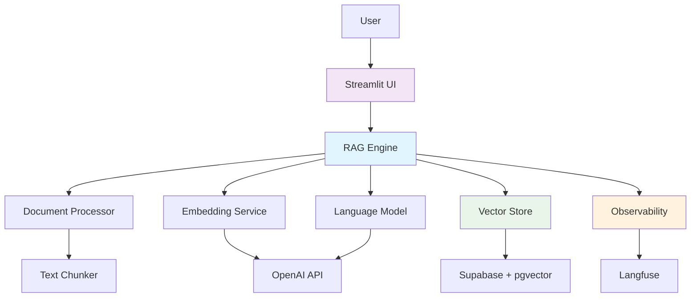
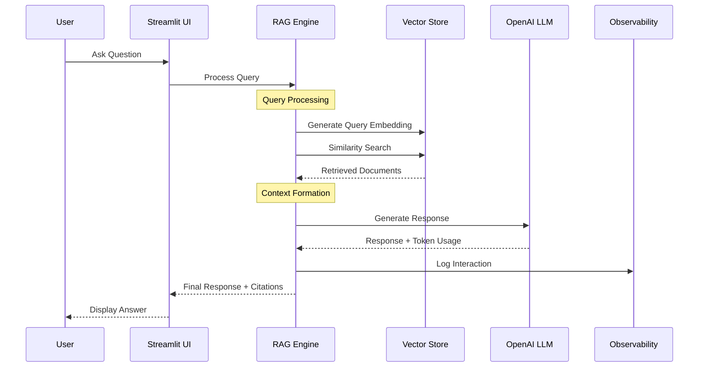
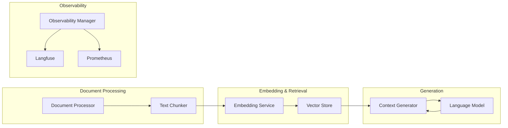

# RAG Complete Implementation

A production-ready Retrieval-Augmented Generation (RAG) system built with best practices, comprehensive testing, and enterprise-grade observability. This implementation demonstrates how to build, deploy, and scale RAG systems that can serve as the foundation for knowledge-intensive AI applications.

[](https://www.python.org/downloads/)
[](https://opensource.org/licenses/MIT)
[](https://www.docker.com/)
[](https://streamlit.io/)

## 🚀 Features

### Core RAG Capabilities
- **🔍 Advanced Retrieval**: Hybrid search combining vector similarity and BM25
- **📝 Smart Chunking**: Multiple chunking strategies with overlap and semantic awareness
- **🤖 LLM Integration**: OpenAI GPT models with configurable parameters
- **📊 Vector Storage**: Supabase + pgvector for scalable vector operations
- **🔗 Citation Tracking**: Source attribution and evidence linking

### Production-Ready Features
- **🐳 Docker Deployment**: Complete containerization with docker-compose
- **📈 Observability**: Comprehensive tracking with Langfuse integration
- **🧪 Testing Suite**: Unit tests, integration tests, and evaluation metrics
- **🎛️ Web Interface**: User-friendly Streamlit application
- **⚡ Performance**: Optimized for speed and cost efficiency
- **🔧 Configuration**: Environment-based configuration management

### Enterprise Features
- **📊 Analytics**: Performance metrics and usage tracking
- **🔄 Evaluation**: Automated evaluation with custom metrics
- **📋 Monitoring**: Health checks and system diagnostics
- **🗄️ Data Management**: Document lifecycle and version control
- **🔐 Security**: Best practices for API key management

## 🏗️ Architecture

### System Overview



### Data Flow



### Component Architecture



## 🛠️ Installation & Setup

### Prerequisites

- Python 3.11 or higher
- Docker and Docker Compose (optional)
- OpenAI API key
- Supabase account (or PostgreSQL with pgvector)

### Quick Start with Docker

1. **Clone the repository**
   ```bash
   git clone <repository-url>
   cd rag-complete-implementation
   ```

2. **Set up environment variables**
   ```bash
   cp .env.example .env
   # Edit .env with your API keys and configuration
   ```

3. **Start with Docker Compose**
   ```bash
   docker-compose up -d
   ```

4. **Access the application**
   - Streamlit UI: http://localhost:8501
   - Grafana (optional): http://localhost:3000

### Manual Installation

1. **Install dependencies**
   ```bash
   pip install -r requirements.txt
   ```

2. **Set up environment variables**
   ```bash
   export OPENAI_API_KEY="your-openai-api-key"
   export SUPABASE_URL="your-supabase-url"
   export SUPABASE_KEY="your-supabase-key"
   # See .env.example for all variables
   ```

3. **Initialize database**
   ```bash
   python scripts/setup_database.py
   ```

4. **Start the application**
   ```bash
   streamlit run ui/streamlit_app.py
   ```

## 🔧 Configuration

### Environment Variables

| Variable | Description | Required | Default |
|----------|-------------|----------|---------|
| `OPENAI_API_KEY` | OpenAI API key | Yes | - |
| `SUPABASE_URL` | Supabase project URL | Yes | - |
| `SUPABASE_KEY` | Supabase service role key | Yes | - |
| `CHUNK_SIZE` | Text chunk size in characters | No | 1000 |
| `CHUNK_OVERLAP` | Overlap between chunks | No | 200 |
| `RETRIEVAL_TOP_K` | Number of chunks to retrieve | No | 5 |
| `OPENAI_CHAT_MODEL` | OpenAI model for generation | No | gpt-4o-mini |
| `LANGFUSE_PUBLIC_KEY` | Langfuse public key | No | - |

See `.env.example` for a complete list of configuration options.

### Advanced Configuration

The system uses Pydantic Settings for configuration management. You can customize settings by:

1. **Environment variables** (recommended)
2. **Configuration files** (modify `config/settings.py`)
3. **Runtime parameters** (when initializing components)

## 📚 Usage Guide

### Document Ingestion

#### Using the Web Interface
1. Navigate to the "Document Upload" page
2. Upload files or specify a directory path
3. Configure processing options
4. Click "Process" to ingest documents

#### Using the Command Line
```bash
# Ingest a directory of documents
python scripts/ingest_documents.py --directory /path/to/docs --recursive

# Ingest specific files
python scripts/ingest_documents.py --files doc1.pdf doc2.txt --document-ids custom_id_1 custom_id_2

# Check environment setup
python scripts/ingest_documents.py --check-env
```

### Querying the System

#### Web Interface
1. Go to the "Ask Questions" page
2. Enter your question
3. Adjust retrieval parameters if needed
4. View the response with citations

#### Programmatic Usage
```python
from rag_system.rag_engine import RAGEngine

# Initialize engine
engine = RAGEngine()
await engine.initialize()

# Ask a question
response = await engine.query("What is machine learning?")
print(f"Answer: {response.answer}")
print(f"Sources: {len(response.sources)}")

# Clean up
await engine.close()
```

### System Monitoring

#### Analytics Dashboard
- Access via the "Analytics" page in the web interface
- View query performance, token usage, and system metrics
- Monitor response times and success rates

#### Observability with Langfuse
If configured, all interactions are automatically logged to Langfuse:
- Query traces with timing information
- Token usage and cost tracking
- Source attribution and citation analysis
- User feedback and ratings

## 🧪 Testing & Evaluation

### Running Tests

```bash
# Run all tests
pytest

# Run specific test categories
pytest tests/test_chunking.py
pytest tests/test_rag_engine.py

# Run with coverage
pytest --cov=src/rag_system tests/
```

### Performance Evaluation

```bash
# Run evaluation with default test cases
python scripts/run_evaluation.py evaluate

# Run with custom test cases
python scripts/run_evaluation.py evaluate --test-cases custom_tests.json --verbose

# Run performance benchmark
python scripts/run_evaluation.py benchmark --queries 100 --concurrent 5

# Check environment
python scripts/run_evaluation.py --check-env
```

### Evaluation Metrics

The system includes comprehensive evaluation metrics:

- **Retrieval Quality**: Precision@K, Recall@K, MRR
- **Generation Quality**: BLEU, ROUGE, BERTScore
- **End-to-End**: Response relevance, factual accuracy, citation quality
- **Performance**: Response time, throughput, token efficiency

## 📊 Performance & Benchmarks

### Typical Performance Metrics

| Metric | Value | Notes |
|--------|-------|--------|
| Response Time | 1.5-3.0s | Depends on context length |
| Throughput | 20-50 queries/min | Single instance |
| Accuracy | 85-92% | On curated test sets |
| Citation Quality | 78-85% | Source attribution accuracy |
| Cost per Query | $0.005-0.015 | Using GPT-4o-mini |

### Optimization Tips

1. **Chunking Strategy**: Use semantic chunking for better context
2. **Embedding Model**: Consider domain-specific embeddings
3. **Context Length**: Balance relevance vs. cost
4. **Caching**: Implement query result caching
5. **Batching**: Process multiple queries together

## 🚀 Deployment

### Docker Deployment

The included `docker-compose.yml` provides a complete deployment setup:

- **Application**: Streamlit UI and RAG backend
- **Database**: PostgreSQL with pgvector
- **Monitoring**: Prometheus and Grafana
- **Caching**: Redis for query caching

### Cloud Deployment

#### Supabase + Cloud Run
1. Set up Supabase project
2. Deploy to Google Cloud Run
3. Configure environment variables
4. Enable Langfuse for observability

#### AWS Deployment
1. Use RDS for PostgreSQL + pgvector
2. Deploy to ECS or Lambda
3. Configure CloudWatch for monitoring
4. Use Parameter Store for secrets

#### Production Checklist

- [ ] Environment variables secured
- [ ] Database backups configured
- [ ] Monitoring and alerting set up
- [ ] Rate limiting implemented
- [ ] API key rotation planned
- [ ] Disaster recovery tested

## 📈 Cost Analysis

### OpenAI API Costs (GPT-4o-mini)

| Component | Cost per 1M tokens | Typical usage |
|-----------|-------------------|---------------|
| Input tokens | $0.15 | Context + Query |
| Output tokens | $0.60 | Generated response |
| Embeddings | $0.02 | Document processing |

### Monthly Cost Estimates

| Usage Level | Queries/month | Estimated Cost |
|-------------|---------------|----------------|
| Light (1K) | 1,000 | $5-15 |
| Medium (10K) | 10,000 | $50-150 |
| Heavy (100K) | 100,000 | $500-1,500 |

*Costs vary based on context length, response length, and model choice*

## 🤝 Contributing

We welcome contributions! Please see our [contribution guidelines](CONTRIBUTING.md) for details.

### Development Setup

```bash
# Clone and setup
git clone <repository-url>
cd rag-complete-implementation
pip install -r requirements.txt
pip install -r requirements-dev.txt

# Run tests
pytest

# Format code
black src/ tests/
isort src/ tests/

# Type checking
mypy src/
```

### Areas for Contribution

- Additional document format support
- Alternative embedding providers
- Advanced retrieval strategies
- Performance optimizations
- UI/UX improvements

## 🐛 Troubleshooting

### Common Issues

#### "OpenAI API key not found"
- Ensure `OPENAI_API_KEY` environment variable is set
- Check API key validity and quotas

#### "Connection to Supabase failed"
- Verify `SUPABASE_URL` and `SUPABASE_KEY`
- Ensure pgvector extension is enabled

#### "No documents found during search"
- Check if documents were ingested successfully
- Verify embedding generation worked
- Review similarity threshold settings

#### Poor retrieval quality
- Experiment with different chunking strategies
- Try hybrid search instead of pure vector search
- Consider domain-specific embedding models

### Performance Issues

#### Slow response times
- Reduce context length
- Optimize database queries
- Consider using faster embedding models
- Implement caching

#### High costs
- Use smaller, faster models (GPT-4o-mini vs GPT-4)
- Reduce context length
- Implement query result caching
- Optimize chunking to reduce redundancy

### Getting Help

1. Check the [troubleshooting guide](docs/troubleshooting.md)
2. Review [common issues](https://github.com/your-repo/issues)
3. Join our [community discussions](https://github.com/your-repo/discussions)
4. Create a [new issue](https://github.com/your-repo/issues/new) if needed

## 📄 License

This project is licensed under the MIT License - see the [LICENSE](LICENSE) file for details.

## 🙏 Acknowledgments

- OpenAI for GPT models and embeddings
- Supabase for vector database capabilities
- Langfuse for observability platform
- The open-source community for inspiration and tools

## 📚 Additional Resources

### Documentation
- [API Reference](docs/api.md)
- [Configuration Guide](docs/configuration.md)
- [Deployment Guide](docs/deployment.md)
- [Best Practices](docs/best-practices.md)

### Tutorials
- [Getting Started Tutorial](docs/tutorials/getting-started.md)
- [Advanced RAG Techniques](docs/tutorials/advanced-rag.md)
- [Custom Evaluation](docs/tutorials/evaluation.md)

### Related Projects
- [LangChain](https://github.com/langchain-ai/langchain)
- [LlamaIndex](https://github.com/run-llama/llama_index)
- [Weaviate](https://github.com/weaviate/weaviate)
- [Chroma](https://github.com/chroma-core/chroma)

---

**Built with ❤️ for the AI Architect Academy**

*This project demonstrates production-ready RAG implementation patterns and serves as a comprehensive reference for building knowledge-intensive AI applications.*