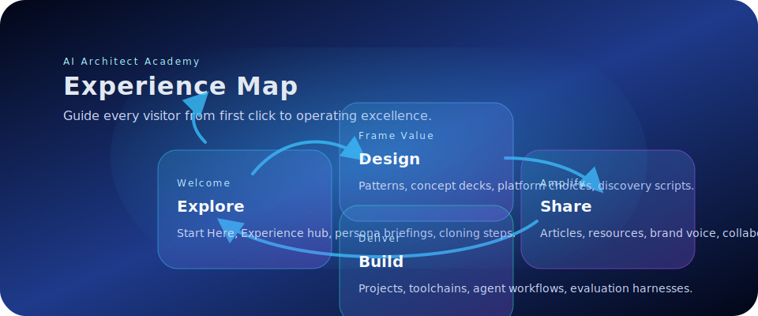
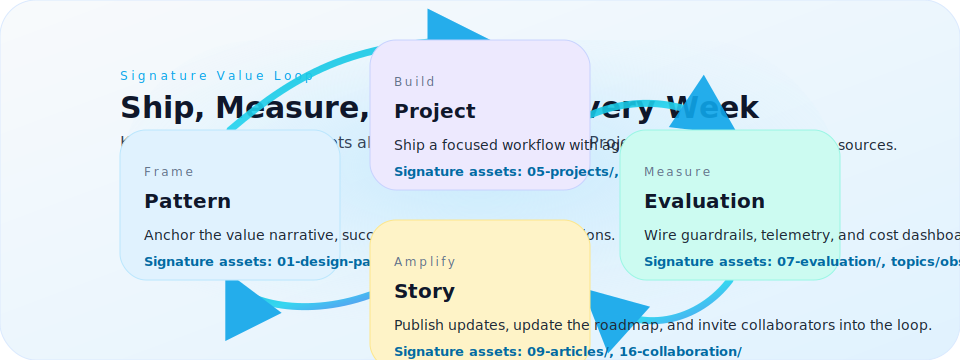

  
  
  

# AI Architect Academy — Command Center for Visionary Builders

Lead the conversations, ship the systems, and operate responsibly. This open playbook is your living hub for designing, building, and running AI products with confidence. Every page is built for AI architects, founding teams, creators, and advisors who need trusted patterns, deep resources, and a brand-ready story they can share with clients, partners, and their own communities.

  
  
  

## The Experience at a Glance
- **Explore the live atlas.** Browse the [GitHub Pages site](https://ai-architect-academy.github.io/ai-architect-academy/) with unified navigation, topic landing pages, and fast search.
- **Clone the full operating system.** Pull the repo to unlock scripts, prompt packs, workflows, and design assets for your team and AI assistants.
- **Tell a sharper story.** Use the [Brand Voice playbook](BRAND-VOICE.md) to stay on-message with executives, clients, and your audience.
- **Ship and scale.** Pair enterprise-ready patterns with hands-on projects, eval workflows, and governance checklists.
- **Level up the curriculum.** Follow the [Curriculum Architecture](02-learning-paths/curriculum-architecture.md) to move from the 100-hour sprint to executive bootcamps and agentic labs.

## Why Clone the Repository
- **Offline & private workspaces.** Serve the site locally (`scripts/serve.sh`) and pair with your favourite AI copilots using the curated prompt packs in `prompt-packs/`.
- **Pattern-first development.** Everything is structured for reuse: design blueprints (`01-design-patterns/`), project guides (`05-projects/`), workflows (`15-workflows/`), and collaboration rituals (`16-collaboration/`).
- **Integrated storytelling.** Use `09-articles/` for long-form thought leadership, `03-awesome/` for curated references, and `10-resources/` when you need trusted links fast.
- **Extend with ease.** Regenerate search data (`npm run build:index`), capture screenshots (`npm run screenshots`), and drop new visuals into `assets/` for instant publishing.

## Platform Architecture — What Lives Where
| Pillar | Directories & Pages | What You Gain |
| --- | --- | --- |
| **Vision & Roadmap** | [`00-roadmap/`](00-roadmap/), [`BRAND-VOICE.md`](BRAND-VOICE.md) | Narrative, positioning, experience strategy. |
| **Learning Paths** | [`START-HERE.md`](START-HERE.md), [`02-learning-paths/`](02-learning-paths/) | Beginner to AI CoE playbooks and accelerators. |
| **Patterns & Concepts** | [`01-design-patterns/`](01-design-patterns/), [`12-concepts/`](12-concepts/), [`docs/pattern.html`](docs/pattern.html) | Value framing, architectures, discovery questions, risks. |
| **Build Lab** | [`05-projects/`](05-projects/), [`06-toolchains/`](06-toolchains/), [`agentic-swarms/`](agentic-swarms/) | Opinionated builds, stacks, and agentic experiments. |
| **Operate & Govern** | [`07-evaluation/`](07-evaluation/), [`08-governance/`](08-governance/), [`15-workflows/`](15-workflows/) | Metrics, guardrails, observability, team rituals. |
| **Community & Amplification** | [`09-articles/`](09-articles/), [`14-ai-tools/`](14-ai-tools/), [`16-collaboration/`](16-collaboration/) | Content, tooling, and collaboration systems. |

## Signature Loops You Can Run This Week

- **Pattern → Project → Eval:** Pick a pattern, ship the smallest valuable build, and wire in evaluation harnesses on day one.
- **Concept → Platform Decision:** Use the concept decks and platform matrix to align your stack before writing code.
- **Learning Path → Portfolio:** Follow the 100-hour track, ship two case studies, and use the article templates to publish your wins.
- **Governance → Collaboration:** Stand up policy baselines, then drop the collaboration checklists into your team rituals.

## Start Your Journey (Choose the Lane that Fits)
- **Launchpad (100 hours).** Sprint through foundations, retrieval, observability, and storytelling with the refreshed [100-Hour Plan](02-learning-paths/100-hour-ai-architect.md).
- **Creators & Educators.** Run workshops, newsletters, and community drops using the [Creator Launch Sequence](02-learning-paths/beginner.md) plus the [Brand Voice playbook](BRAND-VOICE.md).
- **Professional Architects.** Join the six-week [Professional Studio](02-learning-paths/professional.md) to orchestrate multi-model systems with evaluation-first rigor.
- **Enterprise & AI CoE Leaders.** Facilitate alignment with the revamped [Bootcamp](02-learning-paths/bootcamp.md), governance toolkits, and collaboration rituals.
- **Agentic Innovators.** Layer in [Agentic Code Swarms](02-learning-paths/agentic-code-swarms.md), experiment with orchestrators, and publish learnings via the [Agentic SaaS Planner](05-projects/agentic-saas-planner.md).

## Operate with Confidence
- **Evaluation stack:** [Metrics](07-evaluation/metrics.md), [Eval harness](07-evaluation/eval-harness.md), and [promptfoo integrations](05-projects/evals-langfuse.md).
- **Guardrails & governance:** [Privacy & GDPR](08-governance/privacy-gdpr.md), [Model risk](08-governance/model-risk.md), and policy templates.
- **Tooling matrix:** [Stack reference](06-toolchains/stack-reference.md), [Cloud blueprints](docs/clouds.html), and [Platform comparisons](docs/platforms.html).
- **Curriculum cadence:** Revisit the [Curriculum Architecture](02-learning-paths/curriculum-architecture.md) quarterly to plug in updated benchmarks, model releases, and sector case studies.

## Create Momentum for Your Brand & Community
- Publish your progress using the [article outlines](09-articles/) and [content prompts](prompt-packs/).
- Share live demos via the [Projects catalog](docs/projects.html) and embed screenshots captured with `node scripts/capture-screenshots.mjs`.
- Use the [Collaborate](docs/collaborate.html) guide to co-create with AI teammates, clients, friends, or family exploring the space.

## Contribute & Extend
- Open an issue or PR with a clear “why it matters” note. Templates live under `04-templates/`.
- Keep the tone on-brand by checking [BRAND-VOICE.md](BRAND-VOICE.md).
- Update the search index after major content changes: `npm install` (first time) then `npm run build:index`.
- Capture new visuals: drop SVG/PNGs into `assets/` and `docs/assets/` to surface them across the repo and site.

---

**Live site:** https://ai-architect-academy.github.io/ai-architect-academy/ · **Clone & customize:** `git clone https://github.com/AI-Architect-Academy/ai-architect-academy.git`
