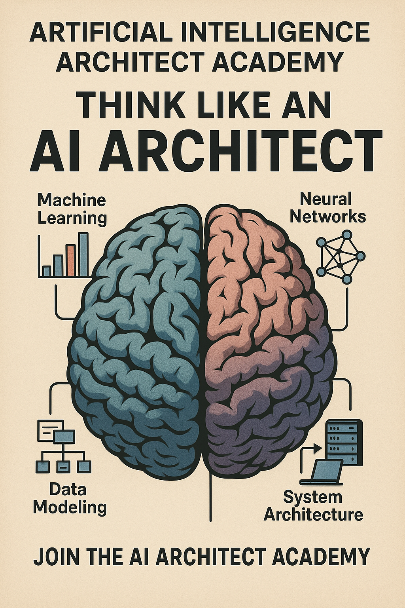

  
  
  

# AI Architect Academy — Command Center for Visionary Builders

Design, ship, and operate AI systems with confidence. This open playbook gives you the artefacts, visuals, and workflows to lead conversations, execute fast, and tell a world-class story.

  
  
  

  
  

## Why This Playbook Wins
- **Everything is cross-linked.** Jump between repo, GitHub Pages, and dashboard without losing context.
- **Production-calibre patterns.** Value framing, discovery questions, architecture diagrams, evaluation harnesses, and governance packs sit side-by-side.
- **Launch-ready visuals.** Hero art, poster layouts, and screenshot recipes so your decks, retros, and memos look polished.
- **Ops-first mindset.** Guardrails, observability, cost control, and escalation playbooks are baked into every track.
- **Living curriculum.** Weekly plans, retros, and logbooks keep teams aligned as the stack evolves.

## Run the Experience
- **Tour the live site:** [ai-architect-academy.github.io/ai-architect-academy](https://ai-architect-academy.github.io/ai-architect-academy/)
- **Explore persona journeys:** [`docs/experience.html`](docs/experience.html) shows how builders, leaders, and storytellers navigate.
- **Spin up locally:** `scripts/serve.sh` opens the site at `http://localhost:8080` for offline or private work.

## Launch Tracks
| Audience | Go-To Path | Weekly Rhythm | Anchor Assets |
| --- | --- | --- | --- |
| **Launchpad (100h)** | [`02-learning-paths/100-hour-ai-architect.md`](02-learning-paths/100-hour-ai-architect.md) | Retrieval, agents, governance, storytelling | RAG on Supabase · Eval Harness · Vector Benchmarks |
| **Creators & Educators** | [`02-learning-paths/beginner.md`](02-learning-paths/beginner.md) & [`02-learning-paths/professional.md`](02-learning-paths/professional.md) | Weekly demos, retros, publish cadence | `03-awesome/`, `09-articles/`, poster + hero imagery |
| **Enterprise & AI CoE** | [`02-learning-paths/bootcamp.md`](02-learning-paths/bootcamp.md) | Vision alignment, ops rituals, launch narratives | Patterns, Governance toolkit, Collaboration playbooks |
| **Advisors & Clients** | [`docs/experience.html`](docs/experience.html) | Curated walkthroughs and proposal templates | `04-templates/`, `16-collaboration/`, dashboard tour |

## Curriculum Builder (Teach & Scale)
- Run the [100-Hour Plan](02-learning-paths/100-hour-ai-architect.md) for day-by-day outputs and assessments.
- Layer the [Professional Path](02-learning-paths/professional.md) and [Bootcamp](02-learning-paths/bootcamp.md) to coach teams and exec sponsors.
- Use the hero visuals (`assets/ai-architect-campus.png`, `assets/ai-architect-professor.png`, `assets/ai-architect-education-poster.png`) to anchor workshops and enablement decks.
- Track progress with the [Self-Assessment](02-learning-paths/self-assessment.md) and [Learning Logbook](02-learning-paths/logbook.md).

## Tooling & Integrations
- **Vercel AI SDK playbook:** Follow [`06-toolchains/vercel-ai-sdk.md`](06-toolchains/vercel-ai-sdk.md) to ship compliant chat, RAG, and agent flows with streaming UX.
- **Stack reference:** [`06-toolchains/stack-reference.md`](06-toolchains/stack-reference.md) compares vector stores, rerankers, eval suites, and infra add-ons.
- **Projects to clone:** [`docs/projects.html`](docs/projects.html) filters 100+ builds with links directly into the repo.

## Operate with Confidence
- **Evaluation stack:** [Metrics](07-evaluation/metrics.md), [Eval harness](07-evaluation/eval-harness.md), and [promptfoo integrations](05-projects/evals-langfuse.md).
- **Guardrails & governance:** [Privacy & GDPR](08-governance/privacy-gdpr.md), [Model risk](08-governance/model-risk.md), and [Governance checklists](08-governance/checklists.md).
- **Observability & retros:** [Retrospective with AI](15-workflows/retrospective-with-ai.md), [AI Briefing](15-workflows/ai-briefing.md), [Escalation Guide](16-collaboration/escalation-guide.md).

## Dashboard & Agents
- Launch the **AI Architect Dashboard** (`dashboard/README.md`) for a Next.js control centre powered by the Vercel AI SDK, React Flow, and Langfuse-ready hooks.
- Wire your own assistants with [`dashboard/AGENT.md`](dashboard/AGENT.md): connect OpenRouter, OpenAI, Anthropic, or local models via Open WebUI/Big-AGI.
- Drop telemetry, embeddings, and eval outputs from the dashboard back into the repo’s playbooks to keep narrative and metrics in sync.

## Tell the Story
- Shape portfolio pieces with [`03-awesome/portfolio-examples.md`](03-awesome/portfolio-examples.md) and stage drafts under `09-articles/drafts/`.
- Capture screenshots via `node scripts/capture-screenshots.mjs` and showcase them in the [Projects catalog](docs/projects.html).
- Stay on-message with the [Brand Voice guide](BRAND-VOICE.md) and reuse decks/brief templates in `04-templates/`.

## Contribute & Extend
- Clone: `git clone https://github.com/frankxai/ai-architect-academy.git`
- Serve locally: `scripts/serve.sh` → `http://localhost:8080`
- Refresh search after major edits: `npm install` (first time) then `npm run build:index`
- Drop new visuals into `assets/` + `docs/assets/`
- Open issues/PRs with context and links; see `04-templates/` for proposal and retro formats.

**Live site:** https://ai-architect-academy.github.io/ai-architect-academy/ · **Clone & customise:** `git clone https://github.com/frankxai/ai-architect-academy.git`
