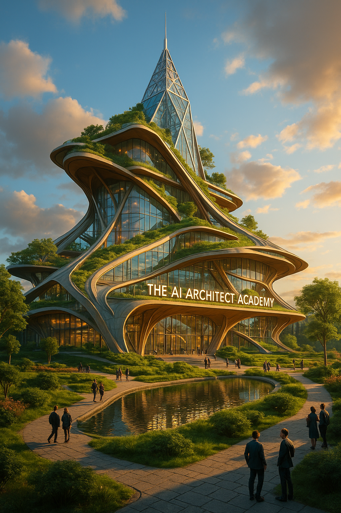
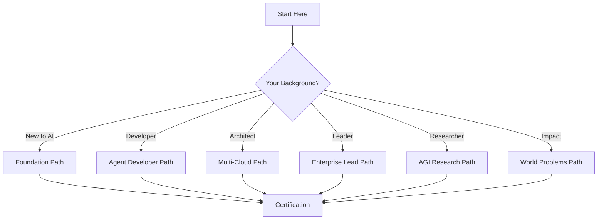

<p align="center">
  
</p>

<h1 align="center">AI Architect Academy</h1>

<p align="center">
  <strong>Transform Claude Code into your personal AI architecture learning environment.</strong><br/>
  Build production AI systems, master multi-cloud patterns, and become an expert AI architect.
</p>

<p align="center">
  <a href="#quick-start"></a>
  <a href="#skills-library"></a>
  <a href="#learning-paths"></a>
  <a href="https://github.com/frankxai/ai-architect-academy/stargazers"></a>
  <a href="LICENSE"></a>
</p>

<p align="center">
  <a href="#coding-agents-first">Why Coding Agents First</a> •
  <a href="#quick-start">Quick Start</a> •
  <a href="#skills-library">Skills</a> •
  <a href="#learning-paths">Paths</a> •
  <a href="#agent-teams">Agents</a> •
  <a href="#certification">Certification</a>
</p>

<p align="center">
  
</p>

---

## The Vision

> **Every lesson writes code. Every skill builds agents. Every project deploys to production.**

```
┌─────────────────────────────────────────────────────────────────────────────┐
│                        AI ARCHITECT ACADEMY V4                               │
│                     "Coding Agents First" Philosophy                         │
├─────────────────────────────────────────────────────────────────────────────┤
│                                                                              │
│   🎯 MISSION CONTROL                  🧠 SKILLS LIBRARY (80+)               │
│   ├─ CLAUDE.md activates skills       ├─ Agent Frameworks (12)              │
│   ├─ /commands for everything         ├─ Multi-Cloud AI (16)                │
│   ├─ Progress tracking                ├─ MCP & Integration (10)             │
│   └─ Auto-skill routing               ├─ RAG & Knowledge (8)                │
│                                        ├─ Enterprise & Security (12)         │
│   📚 LEARNING PATHS (13)              ├─ Evaluation & Testing (8)           │
│   ├─ AI Architect Foundation          └─ Production & DevOps (10+)          │
│   ├─ Agent Developer                                                         │
│   ├─ Multi-Cloud Architect           🔧 HANDS-ON PROJECTS (100+)            │
│   ├─ Enterprise AI Lead               ├─ Build Your First Agent             │
│   ├─ AGI Research Track               ├─ Multi-Agent RAG System             │
│   └─ World Problems AI                ├─ Enterprise AI Gateway              │
│                                        ├─ Cross-Cloud Deployment             │
│   🤖 AGENT TEAMS (60+)                └─ Production Agent Swarm             │
│   ├─ Cloud & Infrastructure                                                  │
│   ├─ AI/ML Engineering               🏆 CERTIFICATION                       │
│   ├─ Enterprise Architecture          ├─ Associate AI Architect             │
│   ├─ Delivery & Operations            ├─ Professional AI Architect          │
│   └─ AGI Research                     └─ Expert AI Architect                │
│                                                                              │
└─────────────────────────────────────────────────────────────────────────────┘
```

---

## Coding Agents First

Traditional learning: Read docs → Watch videos → Maybe build something

**AI Architect Academy**: Learn by building agents immediately

| Old Way | Academy Way |
|---------|-------------|
| Read about RAG systems | `/build-rag` - Build one in 10 minutes |
| Study orchestration theory | `/orchestrate` - Run multi-agent swarms |
| Watch MCP tutorials | `/mcp-server` - Create your own server |
| Read cloud docs | `/deploy-multicloud` - Deploy across 4 clouds |

**Every skill is immediately actionable with a slash command.**

---

## Quick Start

### 1. Clone the Academy

```bash
git clone https://github.com/frankxai/ai-architect-academy.git
cd ai-architect-academy
```

### 2. Start Claude Code

```bash
claude
```

### 3. Choose Your Path

```bash
# See all available commands
/academy

# Start building immediately
/design-solution "Customer support AI with RAG"

# Or follow a learning path
/learn foundation
```

### What's Available

| Command | Purpose |
|---------|---------|
| `/academy` | Full menu of options |
| `/skills` | Browse 80+ skills |
| `/learn <path>` | Start a learning path |
| `/project <name>` | Begin a hands-on project |
| `/certify` | Start certification assessment |

---

## Skills Library

### 80+ Production-Ready Skills

<details>
<summary><strong>🏗️ Agent Frameworks (12 skills)</strong></summary>

| Skill | Command | Description |
|-------|---------|-------------|
| Claude SDK | `/claude-sdk` | Claude Agent SDK with computer use and tools |
| Oracle ADK | `/oracle-adk` | Oracle Agent Development Kit for multi-agent apps |
| LangGraph Patterns | `/langgraph-patterns` | Production agentic workflows with state machines |
| OpenAI AgentKit | `/openai-agentkit` | OpenAI Agents SDK multi-agent systems |
| CrewAI Patterns | `/crewai` | Role-based multi-agent collaboration |
| AutoGen Patterns | `/autogen` | Microsoft AutoGen multi-agent |
| Dify Workflows | `/dify` | Visual workflow builder patterns |
| LangFlow Builder | `/langflow` | No-code agent pipelines |
| MetaGPT Company | `/metagpt` | AI software company simulation |
| n8n AI Agents | `/n8n-agents` | Automation + AI integration |
| RAGFlow Pipelines | `/ragflow` | RAG workflow systems |
| Agentic Orchestration | `/agentic-orchestration` | Multi-agent coordination and handoffs |

</details>

<details>
<summary><strong>☁️ Multi-Cloud AI (16 skills)</strong></summary>

| Skill | Command | Description |
|-------|---------|-------------|
| OCI Services Expert | `/oci-services-expert` | Oracle Cloud Infrastructure mastery |
| GenAI DAC Specialist | `/genai-dac-specialist` | Dedicated AI Clusters deployment |
| AWS Bedrock | `/aws-bedrock` | AWS Bedrock patterns |
| AWS SageMaker | `/sagemaker` | SageMaker ML ops |
| Azure OpenAI | `/azure-openai` | Azure OpenAI Service |
| Azure ML | `/azure-ml` | Azure Machine Learning |
| GCP Vertex AI | `/vertex-ai` | Google Vertex AI |
| GCP Gemini | `/gemini` | Google Gemini patterns |
| Multi-Cloud AI Architect | `/multi-cloud-ai-architect` | Cross-cloud integration |
| Terraform AI | `/terraform-ai` | IaC for AI infrastructure |
| Kubernetes AI | `/kubernetes-ai` | K8s for AI workloads |
| GPU Optimization | `/gpu` | GPU cluster management |
| NVIDIA NIM | `/nvidia-nim` | NVIDIA NIM inference |
| HuggingFace Deployment | `/hf-deploy` | HF model deployment |
| Ollama Local | `/ollama` | Local model deployment |
| vLLM Inference | `/vllm` | High-throughput inference |

</details>

<details>
<summary><strong>🔌 MCP & Integration (10 skills)</strong></summary>

| Skill | Command | Description |
|-------|---------|-------------|
| MCP Architecture | `/mcp-architecture` | MCP server design patterns |
| MCP 2025 Patterns | `/mcp-2025-patterns` | Latest MCP ecosystem best practices |
| MCP Server Builder | `/mcp-build` | Build custom MCP servers |
| MCP Security | `/mcp-secure` | MCP security hardening |
| Tool Use Patterns | `/tools` | Tool orchestration patterns |
| API Integration | `/api` | REST/GraphQL integration |
| Database Agents | `/db-agent` | DB-connected agents |
| Web Scraping Agents | `/scrape` | Browser automation |
| Slack/Discord Bots | `/chat-bot` | Chat platform agents |
| Email Agents | `/email-agent` | Email automation |

</details>

<details>
<summary><strong>📊 RAG & Knowledge (8 skills)</strong></summary>

| Skill | Command | Description |
|-------|---------|-------------|
| RAG Expert | `/rag-expert` | RAG system architecture |
| Vector Databases | `/vectors` | Pinecone, Weaviate, pgvector |
| Embedding Strategies | `/embeddings` | Embedding selection |
| Chunking Patterns | `/chunking` | Document chunking |
| Retrieval Strategies | `/retrieval` | Hybrid/semantic search |
| Knowledge Graphs | `/kg` | Graph-based knowledge |
| Document Processing | `/docs` | PDF, doc parsing |
| Citation Tracking | `/citations` | Source attribution |

</details>

<details>
<summary><strong>🔒 Enterprise & Security (12 skills)</strong></summary>

| Skill | Command | Description |
|-------|---------|-------------|
| AI Security Expert | `/ai-security-expert` | AI security patterns |
| Prompt Injection Defense | `/defend-injection` | Attack prevention |
| Guardrails Implementation | `/guardrails` | Safety guardrails |
| Enterprise AI Patterns | `/enterprise-ai-patterns` | Enterprise architecture |
| AI Gateway Pattern | `/gateway` | Multi-model gateway |
| FinOps AI | `/finops-ai` | AI cost optimization |
| Compliance Frameworks | `/compliance` | GDPR, SOC2, HIPAA |
| Audit Logging | `/audit` | AI audit trails |
| Model Governance | `/governance` | Model lifecycle |
| Responsible AI | `/responsible-ai` | Ethics and fairness |
| Data Privacy | `/privacy` | PII handling |
| Red Teaming | `/red-team` | AI red team testing |

</details>

<details>
<summary><strong>📈 Evaluation & Production (18 skills)</strong></summary>

| Skill | Command | Description |
|-------|---------|-------------|
| Eval Frameworks | `/evals` | LLM evaluation |
| LangFuse Integration | `/langfuse` | LangFuse observability |
| LangSmith Tracing | `/langsmith` | LangSmith debugging |
| Benchmark Design | `/benchmark` | Custom benchmarks |
| A/B Testing | `/ab-test` | Agent A/B tests |
| LLMOps Pipelines | `/llmops` | LLMOps practices |
| CI/CD Agents | `/ci-cd` | Agent deployment CI/CD |
| Monitoring & Alerting | `/monitor` | Production monitoring |
| Scaling Patterns | `/scale` | Auto-scaling agents |
| Caching Strategies | `/cache` | Response caching |

</details>

---

## Learning Paths

### Choose Your Journey



### 13 Learning Paths

| Path | Hours | Focus | Start Command |
|------|-------|-------|---------------|
| **Foundation** | 20h | Claude SDK, MCP basics, first agents | `/learn foundation` |
| **Agent Developer** | 40h | Multi-agent, RAG, tool use, testing | `/learn agents` |
| **Multi-Cloud Architect** | 40h | AWS, Azure, GCP, OCI patterns | `/learn multicloud` |
| **Enterprise Lead** | 30h | Security, governance, FinOps | `/learn enterprise` |
| **100-Hour Launchpad** | 100h | Full AI architect curriculum | `/learn launchpad` |
| **AGI Research** | 80-100h | Alignment, safety, world models | `/learn agi` |
| **Climate AI** | 100h | Carbon optimization, sustainability | `/learn climate` |
| **Health AI** | 120h | Drug discovery, diagnostics | `/learn health` |
| **Education AI** | 100h | Adaptive tutoring, accessibility | `/learn education` |
| **Economic AI** | 100h | Financial inclusion, supply chain | `/learn economic` |
| **Bootcamp** | 40h | Intensive enterprise training | `/learn bootcamp` |
| **Micro-Learning** | Variable | 45-minute modules | `/learn micro` |
| **Command Center** | 77h | Full certification program | `/learn command-center` |

---

## Agent Teams

### 60+ Specialized Agents

The Academy orchestrates specialized agent teams organized into departments:

#### Cloud & Infrastructure Department
- **OCI Architect Agent** — Enterprise cloud architecture
- **Terraform Orchestrator** — Infrastructure automation
- **Kubernetes Specialist** — Container orchestration
- **Cost Optimizer Agent** — FinOps and budget management

#### AI/ML Engineering Department
- **RAG Builder Agent** — Production RAG systems
- **Agent Orchestrator** — Multi-agent coordination
- **Model Evaluator Agent** — LLM evaluation and benchmarking
- **Prompt Engineer Agent** — Prompt optimization

#### Enterprise Architecture Department
- **Solution Architect Agent** — End-to-end solution design
- **Integration Specialist** — System integration patterns
- **Security Architect Agent** — AI security and compliance
- **Data Architect Agent** — Data pipeline design

#### AGI Research Department (New!)
- **AGI Researcher Agent** — Architecture capability assessment
- **Alignment Checker Agent** — AI alignment evaluation
- **World Model Builder Agent** — Domain-specific world models
- **Safety Auditor Agent** — Comprehensive safety audits

---

## Certification

### Prove Your Skills

```
┌─────────────────────────────────────────────────────────────────┐
│                    CERTIFICATION LADDER                          │
├─────────────────────────────────────────────────────────────────┤
│                                                                  │
│   ┌─────────────────────────────────────────────────────────┐   │
│   │  🥇 EXPERT AI ARCHITECT (80h)                            │   │
│   │  • All paths completed + capstone                        │   │
│   │  • Production multi-cloud agent system                   │   │
│   │  • Red team security review passed                       │   │
│   └─────────────────────────────────────────────────────────┘   │
│                          ▲                                       │
│   ┌─────────────────────────────────────────────────────────┐   │
│   │  🥈 PROFESSIONAL AI ARCHITECT (50h)                      │   │
│   │  • Foundation + Multi-Cloud + Agents                     │   │
│   │  • 5 projects deployed                                   │   │
│   │  • Multi-cloud deployment demonstrated                   │   │
│   └─────────────────────────────────────────────────────────┘   │
│                          ▲                                       │
│   ┌─────────────────────────────────────────────────────────┐   │
│   │  🥉 ASSOCIATE AI ARCHITECT (20h)                         │   │
│   │  • Foundation + OCI GenAI                                │   │
│   │  • 2 projects completed                                  │   │
│   │  • Skills assessment passed                              │   │
│   └─────────────────────────────────────────────────────────┘   │
│                                                                  │
└─────────────────────────────────────────────────────────────────┘
```

```bash
# Check your progress
/certify status

# Take assessment
/certify assess associate

# Submit capstone
/certify submit expert --project ./my-capstone
```

---

## Synthesized Intelligence

This academy incorporates patterns from the world's best AI repositories:

| Repository | Stars | What We Synthesized |
|------------|-------|---------------------|
| [LangChain](https://github.com/langchain-ai/langchain) | 200K+ | Modular architecture, composable chains |
| [AutoGPT](https://github.com/Significant-Gravitas/AutoGPT) | 167K | Autonomous agent patterns |
| [n8n](https://github.com/n8n-io/n8n) | 150K+ | Automation + AI integration |
| [LangFlow](https://github.com/logspace-ai/langflow) | 140K | Visual builder patterns |
| [Dify](https://github.com/langgenius/dify) | 114K+ | Production-ready workflows |
| [RAGFlow](https://github.com/infiniflow/ragflow) | 70K+ | RAG pipeline patterns |
| [MetaGPT](https://github.com/geekan/MetaGPT) | 45K+ | Software company simulation |
| [CrewAI](https://github.com/crewAIInc/crewAI) | 20K+ | Role-based multi-agent |
| [awesome-ai-agents](https://github.com/e2b-dev/awesome-ai-agents) | 10K+ | Curated agent catalog |

---

## AI Architect Command Center

Transform Claude Code into your expert AI Architecture assistant.

### Quick Start
```bash
cd claude-ai-architect/
claude
/design-solution "Customer support AI with RAG"
```

### Components

| Component | Description |
|-----------|-------------|
| **22 Expert Skills** | OCI GenAI, multi-cloud, agents, security, FinOps |
| **Knowledge Base** | Deep documentation on DACs, RAG, multi-cloud |
| **Templates** | D2 diagrams, Terraform modules, discovery questions |
| **MCP Servers** | Custom OCI and Terraform operations |

### Key Commands

| Command | Purpose |
|---------|---------|
| `/design-solution` | End-to-end AI solution design |
| `/deploy-genai` | Deploy OCI GenAI DAC |
| `/build-rag` | Build RAG system |
| `/draw-architecture` | Generate D2 diagrams |
| `/security-review` | Security assessment |
| `/optimize-costs` | Cost optimization |

[Explore the Command Center →](claude-ai-architect/README.md)

---

## Design Patterns

Production-ready patterns for enterprise AI:

| Pattern | Description | Link |
|---------|-------------|------|
| **Multi-Agent Orchestration** | Coordinate multiple specialized agents | [View →](01-design-patterns/multi-agent-orchestration-pattern.md) |
| **AI Gateway** | Centralized gateway for multi-provider AI | [View →](01-design-patterns/ai-gateway-pattern.md) |
| **RAG Production** | Production RAG with hybrid search | [View →](01-design-patterns/rag-production-pattern.md) |
| **LLMOps** | Prompt management, monitoring, governance | [View →](01-design-patterns/llm-ops-pattern.md) |

[See all 20+ patterns →](01-design-patterns/)

---

## Architecture Diagrams

Beautiful, version-controlled diagrams using D2 (Terrastruct). **6 production-ready architectures:**

### Production RAG System
<p align="center">
  
</p>

### Multi-Agent Orchestration
<p align="center">
  
</p>

### Multi-Cloud AI Gateway
<p align="center">
  
</p>

### LangGraph State Machine Patterns
<p align="center">
  
</p>

### MCP (Model Context Protocol) Architecture
<p align="center">
  
</p>

### Claude Agent SDK Patterns
<p align="center">
  
</p>

**Diagrams as Code:** All diagrams are defined in `diagrams/d2/` and auto-rendered via GitHub Actions.

```bash
# Render locally
d2 diagrams/d2/rag-production.d2 output.svg --theme 200
```

[See all diagrams →](diagrams/)

---

## Run the Experience

| Platform | URL |
|----------|-----|
| **GitHub Pages** | [ai-architect-academy.github.io](https://ai-architect-academy.github.io/ai-architect-academy/) |
| **Dashboard** | [ai-architect-academy.vercel.app](https://ai-architect-academy.vercel.app) |
| **Local** | `scripts/serve.sh` → `http://localhost:8080` |

---

## Repository Structure

```
ai-architect-academy/
├── claude-ai-architect/     # AI Architect Command Center
│   ├── skills/              # 22+ expert skills
│   ├── knowledge-base/      # OCI GenAI, multi-cloud docs
│   └── templates/           # D2 diagrams, Terraform modules
├── diagrams/                # Diagrams as Code
│   ├── d2/                  # D2 source files (beautiful architecture)
│   └── python/              # Python Diagrams (official cloud icons)
├── assets/diagrams/         # Pre-rendered SVG/PNG diagrams
├── 00-getting-started/      # Onboarding guides
├── 01-design-patterns/      # 20+ architecture patterns
├── 02-learning-paths/       # 13 learning paths
│   ├── agi-research/        # AGI research curriculum
│   └── world-problems/      # Climate, Health, Education, Economic AI
├── 03-awesome/              # Curated resources
├── 04-templates/            # Discovery, strategy, product templates
├── 05-projects/             # 100+ hands-on projects
├── 06-agent-workflows/      # Agent orchestration patterns
├── 07-evaluation/           # Testing and evaluation
├── 08-governance/           # AI governance and compliance
├── academy-platform/        # Next.js web platform
└── academy-dashboard/       # React dashboard
```

---

## Contributing

We welcome contributions!

- **Add Skills**: Create new expert skills
- **Build Projects**: Add hands-on challenges
- **Improve Docs**: Enhance explanations
- **Share Patterns**: Document production patterns

```bash
git clone https://github.com/frankxai/ai-architect-academy.git
cd ai-architect-academy
# See CONTRIBUTING.md for guidelines
```

---

## License

MIT License - see [LICENSE](LICENSE) for details.

---

<p align="center">
  <strong>Ready to become an AI Architect?</strong><br/>
  <code>git clone https://github.com/frankxai/ai-architect-academy.git && cd ai-architect-academy && claude</code>
</p>

<p align="center">
  <sub>Built with Claude Code • Synthesized from top GitHub repositories • Coding Agents First</sub>
</p>
