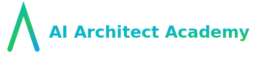

<p align="center"></p>

[](https://github.com/AI-Architect-Academy/ai-architect-academy/stargazers) [](https://github.com/AI-Architect-Academy/ai-architect-academy/pulls) [](https://ai-architect-academy.github.io/ai-architect-academy/)

# AI Architect Academy — Open Playbook for Builders

Become the architect who can design, ship, and operate AI systems that matter. This repo is a high‑signal, living guide: patterns, projects, and the best open resources — curated and connected so you can move fast with confidence.

— Live site: https://ai-architect-academy.github.io/ai-architect-academy/

## Why This Playbook
- Patterns: Enterprise‑ready designs with value, risks, BoM, and architecture guidance
- Projects: Real builds for RAG, agents, evals, observability, and MLOps
- Learning Paths: Beginner, Professional, and 100‑hour accelerators
- Toolchains: Reference stacks and trade‑offs across platforms and vendors
- Governance: Privacy, risk, compliance, and operational guardrails

## Screenshots
Homepage and Projects from the GitHub Pages site.


## Your Learning Journey
- Orient: Read Start‑Here and pick a path (100‑Hour, Beginner, Pro, Bootcamp)
- Ground: Learn Enterprise Patterns (value, architecture, discovery, BoM)
- Build: Ship hands‑on projects (RAG, Agents, Evals, Observability)
- Operate: Add SLOs, guardrails, governance, and cost controls
- Specialize: Choose an industry pattern and publish a portfolio PoC

[Start Here](START-HERE.md) · [100‑Hour Plan](02-learning-paths/100-hour-ai-architect.md) · [Agentic Code Swarms](agentic-swarms/README.md) · [Patterns](01-design-patterns/README.md) · [Projects](05-projects/rag-on-supabase.md)

## Agentic Code Swarms — Quickstart

```bash
cd agentic-swarms
python3 -m venv .venv && source .venv/bin/activate
pip install -r requirements.txt
python examples/hello_swarm.py --goal "Create a tiny function to add two numbers"
# Optional UI (requires open port):
streamlit run ui/streamlit_app.py --server.port 8501
```

## What’s Inside
- 00-roadmap: goals, milestones
- 01-design-patterns: enterprise patterns (with templates)
- 02-learning-paths: structured curricula
- 03-awesome: curated open‑source lists
- 04-templates: documents and guides
- 05-projects: hands‑on builds
- 06-toolchains: stacks and reference implementations
- 07-evaluation: metrics, eval harness, guardrails
- 08-governance: privacy, risk, compliance
- 09-articles: deep dives and essays
- 10-resources: videos, repos, papers
- data/seed: JSON indices consumed by site/tools

## Operate with Confidence
- Evaluation & Guardrails: [Metrics](07-evaluation/metrics.md) · [Harness](07-evaluation/eval-harness.md)
- Governance: [Privacy/GDPR](08-governance/privacy-gdpr.md) · [Model Risk](08-governance/model-risk.md)
- Toolchains: [Stack Reference](06-toolchains/stack-reference.md)

## Structure: Where This Is Going
- Public Playbook: keep it focused, fast, and searchable (this repo + Pages)
- Companion Dashboard (blueprint): a Next.js + API + Postgres/pgvector setup for local experimentation and demos
- Internal Docs (ops/vision): move sensitive operations/vision content to a private repo, link selectively from the Playbook

If you’d like, we can wire a minimal “AI Architects Dashboard” that reads this repo’s `docs/data` and demonstrates RAG/Q&A locally.

## Contributing
PRs welcome — see `CONTRIBUTING.md`. Please keep sources open, cite authors, and prefer permissive licenses.

## Star & Share
If this helps you, please star the repo and share it so others can learn faster.

