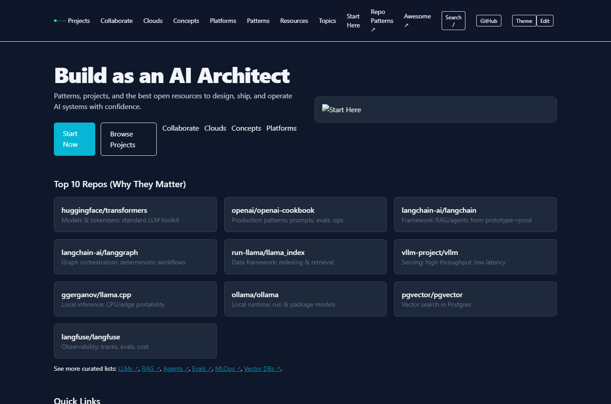

<p align="center"></p>

<p align="center">
  <a href="https://github.com/AI-Architect-Academy/ai-architect-academy/stargazers"></a>
  <a href="https://github.com/AI-Architect-Academy/ai-architect-academy/pulls"></a>
  <a href="https://ai-architect-academy.github.io/ai-architect-academy/"></a>
</p>

# AI Architect Academy - Open Playbook for Builders

Become the architect who can design, ship, and operate AI systems that matter. This repo is a high-signal, living guide: patterns, projects, and the best open resources, curated and connected so you can move fast with confidence.

- Live site: https://ai-architect-academy.github.io/ai-architect-academy/
- GitHub Pages source: `/docs`

<p align="center"></p>

## Why This Playbook
- Patterns: enterprise-ready designs with value, risks, bill of materials, and architecture guidance
- Projects: real builds for RAG, agents, evals, observability, and MLOps
- Learning paths: beginner, professional, and 100-hour accelerators
- Toolchains: reference stacks and trade-offs across platforms and vendors
- Governance: privacy, risk, compliance, and operational guardrails

## TL;DR - Get Value Fast
- Pick a goal (RAG, agents, evals) and open the matching project
- Use a pattern to shape value, architecture, BoM, and risks
- Ship the smallest useful version with evals and observability from day one

Quick links: [Start Here](START-HERE.md) - [RAG on Supabase](05-projects/rag-on-supabase.md) - [Design Patterns](01-design-patterns/README.md) - [Live Catalog](https://ai-architect-academy.github.io/ai-architect-academy/)

## Your Learning Journey
- Orient: read Start Here and pick a path (100-hour, Beginner, Pro, Bootcamp)
- Ground: learn enterprise patterns (value, architecture, discovery, BoM)
- Build: ship hands-on projects (RAG, agents, evals, observability)
- Operate: add SLOs, guardrails, governance, and cost controls
- Specialize: choose an industry pattern and publish a portfolio proof of concept

## Agentic Code Swarms - Quickstart
```bash
cd agentic-swarms
python3 -m venv .venv && source .venv/bin/activate
pip install -r requirements.txt
python examples/hello_swarm.py --goal "Create a tiny function to add two numbers"
```

[Agentic Code Swarms docs](agentic-swarms/README.md) - [Agentic SaaS Planner](05-projects/agentic-saas-planner.md) - [Agentic workflows](15-workflows/agentic-swarms.md)

## Screenshots
Homepage and Projects from the GitHub Pages site.




## What You Get
- Practical patterns: value framing, solution architecture, discovery questions, BoM, risks
- Battle-tested projects: RAG, agents, evals, observability, vector search
- Curated resources: the best repos, papers, talks, and tools with no fluff
- Operate in production: cost and latency SLOs, guardrails, governance, and monitoring

## Starter Stack (Opinionated)
- Data and vectors: Postgres with pgvector or Qdrant
- Framework: LangChain (RAG or agents) or LlamaIndex (data-centric)
- Reranking: bge-reranker or Cohere Rerank for quality boosts
- Observability: Langfuse for traces, evals, and costs
- Evals: promptfoo (CI-friendly) plus RAGAS for RAG quality
- Guardrails: policy filtering and prompt-injection defenses

## Fast Paths
- RAG (citations, abstention, caching): [Guide](05-projects/rag-on-supabase.md)
- Evals (faithfulness, coverage): [Guide](05-projects/evals-langfuse.md)
- Vector search benchmarks: [Guide](05-projects/vector-search-pgvector.md)

## Quick Start
1. Read the short [Start Here](START-HERE.md)
2. Pick the [100-hour plan](02-learning-paths/100-hour-ai-architect.md) or a focused project
3. Ship value: choose a pattern plus project, then instrument with evals and observability

## Top Repos Every AI Architect Should Know
| Repo | What | Why it matters |
|---|---|---|
| [huggingface/transformers](https://github.com/huggingface/transformers) | Models and tokenizers | Standard toolkit for LLM and NLP foundations |
| [openai/openai-cookbook](https://github.com/openai/openai-cookbook) | Production patterns | Pragmatic examples for prompts, evals, ops |
| [langchain-ai/langchain](https://github.com/langchain-ai/langchain) | LLM app framework | Fast path from prototype to production RAG and agents |
| [langchain-ai/langgraph](https://github.com/langchain-ai/langgraph) | Graph orchestration | Deterministic, stateful agent and RAG workflows |
| [run-llama/llama_index](https://github.com/run-llama/llama_index) | Data framework | Indexing and retrieval patterns that scale |
| [vllm-project/vllm](https://github.com/vllm-project/vllm) | Model serving | High-throughput, low-latency serving |
| [ggerganov/llama.cpp](https://github.com/ggerganov/llama.cpp) | Local inference | Portable CPU and edge inference for dev and privacy |
| [ollama/ollama](https://github.com/ollama/ollama) | Local models runtime | Simplifies running and packaging local models |
| [pgvector/pgvector](https://github.com/pgvector/pgvector) | Vector search in Postgres | Keep vectors in Postgres with simple operations |
| [qdrant/qdrant](https://github.com/qdrant/qdrant) | Vector database | Open source, production-ready, HNSW, filters |
| [weaviate/weaviate](https://github.com/weaviate/weaviate) | Vector database | Hybrid search plus modules and enterprise features |
| [milvus-io/milvus](https://github.com/milvus-io/milvus) | Vector database | Distributed vector search at scale |
| [langfuse/langfuse](https://github.com/langfuse/langfuse) | Observability | Traces, evals, and costs for LLM operations |
| [Arize-ai/phoenix](https://github.com/Arize-ai/phoenix) | Observability | Deep model and LLM analysis plus evaluation |
| [promptfoo/promptfoo](https://github.com/promptfoo/promptfoo) | Prompt evals in CI | Keep quality from regressing as you ship |
| [microsoft/autogen](https://github.com/microsoft/autogen) | Multi-agent framework | Agent teams with tool usage |
| [joaomdmoura/crewai](https://github.com/joaomdmoura/crewai) | Agent workflows | Practical agent orchestration |
| [eugeneyan/applied-ml](https://github.com/eugeneyan/applied-ml) | Applied ML reading | Real-world lessons, papers, case studies |
| [papers-we-love/papers-we-love](https://github.com/papers-we-love/papers-we-love) | Classic papers | Systems and CS foundations that last |
| [sindresorhus/awesome](https://github.com/sindresorhus/awesome) | Meta index | Find quality "awesome" lists across topics |

See curated topic lists for [Awesome LLMs](03-awesome/awesome-llms.md), [RAG](03-awesome/awesome-rag.md), [Agents](03-awesome/awesome-agents.md), [Evals](03-awesome/awesome-evals.md), [MLOps](03-awesome/awesome-mlops.md), [Vector DBs](03-awesome/awesome-vector-dbs.md), and [Meta Aggregators](03-awesome/awesome-aggregators.md).

## Projects (Ship Value Fast)
- 100 Projects catalog: [100 Projects](05-projects/100-projects.md)
- RAG on Supabase plus OpenAI: [Guide](05-projects/rag-on-supabase.md)
- Vector search benchmarks: [Guide](05-projects/vector-search-pgvector.md)
- Evals with Langfuse: [Guide](05-projects/evals-langfuse.md)
- Agentic SaaS Planner: [Guide](05-projects/agentic-saas-planner.md)

## Enterprise Patterns (Design by Value)
Each pattern covers value framing, solution architecture, discovery questions, bill of materials, and risks.
- [Content Generation](01-design-patterns/content-generation.md)
- [Decision Support](01-design-patterns/decision-support.md)
- [Model Lifecycle Management](01-design-patterns/model-lifecycle-management.md)
- [Insurance Rate Modeling](01-design-patterns/insurance-rate-modeling.md)

Explore all patterns: [Design Pattern Library](01-design-patterns/README.md)

## Operate with Confidence
- Evaluation and guardrails: [Metrics](07-evaluation/metrics.md) and [Harness](07-evaluation/eval-harness.md)
- Governance: [Privacy and GDPR](08-governance/privacy-gdpr.md) and [Model Risk](08-governance/model-risk.md)
- Toolchains: [Stack Reference](06-toolchains/stack-reference.md)

## Structure - Where This Is Going
- Public playbook: keep it focused, fast, and searchable (this repo plus Pages)
- Companion dashboard: Next.js plus API and Postgres or pgvector for local experimentation and demos
- Internal docs: move operations or vision content to a private repo, link selectively from the playbook

## Live Catalog (GitHub Pages)
- Visit: https://ai-architect-academy.github.io/ai-architect-academy/
- Source: `/docs`

### Site Features
- Site-wide search overlay (press `/`)
- Static search index generated from repo content
- Dark mode persistence
- Featured repos, featured projects, and quick topic links

### Maintainer Tips
- Regenerate the search index: `node scripts/build-search-index.mjs`
- Capture fresh screenshots: `node scripts/capture-screenshots.mjs`
- Serve locally: `scripts/serve.sh` -> http://localhost:8080

## Who This Is For
- Builders shipping real features under time and budget constraints
- Tech leads aligning value, architecture, and operations
- Learners who prefer pragmatic, high-signal guidance over fluff

## How to Use This Repo
- Start with [Start Here](START-HERE.md) for orientation and path selection
- Pick a project and ship an MVP with evals plus observability
- Read the matching pattern to refine value, design, and risks
- Use topic pages (RAG, agents, evals, observability, guardrails) for quick wins

## Local Use and Collaboration
- Serve Pages locally: `scripts/serve.sh` -> http://localhost:8080
- Pair with AI tools: see `14-ai-tools/` (Aider, Continue, Claude Code, Gemini, Codex CLI)
- Use prompt packs in `prompt-packs/` for code review, tests, refactors, docs
- Follow `15-workflows/` for pairing, PR review, and maintenance with AI

## Collaborate with AI
- Read: `16-collaboration/working-with-ai.md` and `16-collaboration/prompting-guide.md`
- Use prompt packs and workflows with Aider, Continue, or Claude Code
- Diagram with `assets/collaborate.svg`

## Contributing
- PRs welcome. Add links with a one-line "why it matters" summary when possible.
- Use templates for patterns and projects; keep quality high.
- File issues or proposals if you see gaps in patterns, projects, or toolchains.

## Star and Share
If this playbook helps you, please star the repo and share it so others can learn faster.

