<p align="center">
  
</p>

<h1 align="center">AI Architect Academy</h1>

<p align="center">
  <strong>Transform Claude Code into your personal AI architecture learning environment.</strong><br/>
  Build production AI systems, master multi-cloud patterns, and become an expert AI architect.
</p>

<p align="center">
  <a href="#quick-start"></a>
  <a href="#skills-library"></a>
  <a href="#learning-paths"></a>
  <a href="https://github.com/AI-Architect-Academy/ai-architect-academy/stargazers"></a>
  <a href="#architecture-gallery"></a>
  <a href="LICENSE"></a>
</p>

<p align="center">
  <a href="#architecture-gallery">Architecture Gallery</a> •
  <a href="#quick-start">Quick Start</a> •
  <a href="#skills-library">Skills</a> •
  <a href="#learning-paths">Paths</a> •
  <a href="#certification">Certification</a>
</p>

---

## Architecture Gallery

> **Visual-first learning.** Every concept has a diagram. Every diagram is code.

<table>
<tr>
<td width="50%">

### 🔍 Production RAG System
<a href="assets/diagrams/rag-production.svg">
  
</a>
<sub>Enterprise-grade retrieval augmented generation</sub>

</td>
<td width="50%">

### 🤖 Multi-Agent Orchestration
<a href="assets/diagrams/multi-agent-orchestration.svg">
  
</a>
<sub>Supervisor pattern with specialist agents</sub>

</td>
</tr>
<tr>
<td width="50%">

### ☁️ Multi-Cloud AI Gateway
<a href="assets/diagrams/ai-gateway.svg">
  
</a>
<sub>Intelligent routing across AWS, Azure, GCP, OCI</sub>

</td>
<td width="50%">

### 🔀 LangGraph State Machines
<a href="assets/diagrams/langgraph-patterns.svg">
  
</a>
<sub>Agentic workflows with conditional routing</sub>

</td>
</tr>
<tr>
<td width="50%">

### 🔌 MCP Architecture
<a href="assets/diagrams/mcp-architecture.svg">
  
</a>
<sub>Model Context Protocol server patterns</sub>

</td>
<td width="50%">

### 🧠 Claude Agent SDK
<a href="assets/diagrams/claude-sdk-patterns.svg">
  
</a>
<sub>Agentic loop with tools and safety controls</sub>

</td>
</tr>
</table>

<p align="center">
  <a href="interactive-diagrams/"><strong>🎮 Explore Interactive Diagrams →</strong></a>
  &nbsp;&nbsp;|&nbsp;&nbsp;
  <a href="diagrams/"><strong>📐 Diagrams as Code →</strong></a>
</p>

---

## The Philosophy

<table>
<tr>
<td width="60%">

### Every lesson writes code. Every skill builds agents. Every project deploys to production.

**Traditional learning:** Read docs → Watch videos → Maybe build something

**AI Architect Academy:** Build agents immediately with slash commands

| Instead of... | Do this |
|---------------|---------|
| Reading about RAG | `/build-rag` - Build one now |
| Studying orchestration | `/orchestrate` - Run agent swarms |
| Watching MCP tutorials | `/mcp-server` - Create your own |
| Reading cloud docs | `/deploy-multicloud` - Deploy live |

</td>
<td width="40%" align="center">

```
   🎯 CODING AGENTS FIRST

   ┌─────────────────┐
   │   80+ Skills    │
   │   13 Paths      │
   │   100+ Projects │
   │   6 Diagrams    │
   └────────┬────────┘
            │
            ▼
   ┌─────────────────┐
   │  /slash-command │
   │  → Build Now    │
   └─────────────────┘
```

</td>
</tr>
</table>

---

## Quick Start

```bash
# 1. Clone
git clone https://github.com/AI-Architect-Academy/ai-architect-academy.git
cd ai-architect-academy

# 2. Start Claude Code
claude

# 3. Build something
/design-solution "Customer support AI with RAG"
```

<table>
<tr>
<td>

### Available Commands

| Command | Purpose |
|---------|---------|
| `/academy` | Full menu |
| `/skills` | Browse 80+ skills |
| `/learn <path>` | Start learning path |
| `/project <name>` | Hands-on project |
| `/certify` | Certification |

</td>
<td>

### First Steps

```bash
# See everything available
/academy

# Start with fundamentals
/learn foundation

# Or jump straight to building
/build-rag
```

</td>
</tr>
</table>

---

## Skills Library

### 80+ Production-Ready Skills

<table>
<tr>
<td width="33%">

**🏗️ Agent Frameworks**
- Claude SDK
- Oracle ADK
- LangGraph
- OpenAI AgentKit
- CrewAI
- AutoGen

</td>
<td width="33%">

**☁️ Multi-Cloud AI**
- OCI Services
- AWS Bedrock
- Azure OpenAI
- GCP Vertex AI
- Terraform
- Kubernetes

</td>
<td width="33%">

**🔌 MCP & Integration**
- MCP Architecture
- MCP 2025 Patterns
- Tool Use
- API Integration
- Database Agents

</td>
</tr>
<tr>
<td width="33%">

**📊 RAG & Knowledge**
- RAG Expert
- Vector Databases
- Embeddings
- Chunking
- Knowledge Graphs

</td>
<td width="33%">

**🔒 Enterprise Security**
- AI Security
- Guardrails
- Compliance
- Responsible AI
- Red Teaming

</td>
<td width="33%">

**📈 Evaluation & Ops**
- LangFuse
- LangSmith
- Benchmarks
- Monitoring
- CI/CD

</td>
</tr>
</table>

<details>
<summary><strong>📋 View Full Skills List (80+)</strong></summary>

<details>
<summary><strong>🏗️ Agent Frameworks (12 skills)</strong></summary>

| Skill | Command | Description |
|-------|---------|-------------|
| Claude SDK | `/claude-sdk` | Claude Agent SDK with computer use and tools |
| Oracle ADK | `/oracle-adk` | Oracle Agent Development Kit for multi-agent apps |
| LangGraph Patterns | `/langgraph-patterns` | Production agentic workflows with state machines |
| OpenAI AgentKit | `/openai-agentkit` | OpenAI Agents SDK multi-agent systems |
| CrewAI Patterns | `/crewai` | Role-based multi-agent collaboration |
| AutoGen Patterns | `/autogen` | Microsoft AutoGen multi-agent |
| Dify Workflows | `/dify` | Visual workflow builder patterns |
| LangFlow Builder | `/langflow` | No-code agent pipelines |
| MetaGPT Company | `/metagpt` | AI software company simulation |
| n8n AI Agents | `/n8n-agents` | Automation + AI integration |
| RAGFlow Pipelines | `/ragflow` | RAG workflow systems |
| Agentic Orchestration | `/agentic-orchestration` | Multi-agent coordination and handoffs |

</details>

<details>
<summary><strong>☁️ Multi-Cloud AI (16 skills)</strong></summary>

| Skill | Command | Description |
|-------|---------|-------------|
| OCI Services Expert | `/oci-services-expert` | Oracle Cloud Infrastructure mastery |
| GenAI DAC Specialist | `/genai-dac-specialist` | Dedicated AI Clusters deployment |
| AWS Bedrock | `/aws-bedrock` | AWS Bedrock patterns |
| AWS SageMaker | `/sagemaker` | SageMaker ML ops |
| Azure OpenAI | `/azure-openai` | Azure OpenAI Service |
| Azure ML | `/azure-ml` | Azure Machine Learning |
| GCP Vertex AI | `/vertex-ai` | Google Vertex AI |
| GCP Gemini | `/gemini` | Google Gemini patterns |
| Multi-Cloud AI Architect | `/multi-cloud-ai-architect` | Cross-cloud integration |
| Terraform AI | `/terraform-ai` | IaC for AI infrastructure |
| Kubernetes AI | `/kubernetes-ai` | K8s for AI workloads |
| GPU Optimization | `/gpu` | GPU cluster management |
| NVIDIA NIM | `/nvidia-nim` | NVIDIA NIM inference |
| HuggingFace Deployment | `/hf-deploy` | HF model deployment |
| Ollama Local | `/ollama` | Local model deployment |
| vLLM Inference | `/vllm` | High-throughput inference |

</details>

<details>
<summary><strong>🔌 MCP & Integration (10 skills)</strong></summary>

| Skill | Command | Description |
|-------|---------|-------------|
| MCP Architecture | `/mcp-architecture` | MCP server design patterns |
| MCP 2025 Patterns | `/mcp-2025-patterns` | Latest MCP ecosystem best practices |
| MCP Server Builder | `/mcp-build` | Build custom MCP servers |
| MCP Security | `/mcp-secure` | MCP security hardening |
| Tool Use Patterns | `/tools` | Tool orchestration patterns |
| API Integration | `/api` | REST/GraphQL integration |
| Database Agents | `/db-agent` | DB-connected agents |
| Web Scraping Agents | `/scrape` | Browser automation |
| Slack/Discord Bots | `/chat-bot` | Chat platform agents |
| Email Agents | `/email-agent` | Email automation |

</details>

<details>
<summary><strong>📊 RAG & Knowledge (8 skills)</strong></summary>

| Skill | Command | Description |
|-------|---------|-------------|
| RAG Expert | `/rag-expert` | RAG system architecture |
| Vector Databases | `/vectors` | Pinecone, Weaviate, pgvector |
| Embedding Strategies | `/embeddings` | Embedding selection |
| Chunking Patterns | `/chunking` | Document chunking |
| Retrieval Strategies | `/retrieval` | Hybrid/semantic search |
| Knowledge Graphs | `/kg` | Graph-based knowledge |
| Document Processing | `/docs` | PDF, doc parsing |
| Citation Tracking | `/citations` | Source attribution |

</details>

<details>
<summary><strong>🔒 Enterprise & Security (12 skills)</strong></summary>

| Skill | Command | Description |
|-------|---------|-------------|
| AI Security Expert | `/ai-security-expert` | AI security patterns |
| Prompt Injection Defense | `/defend-injection` | Attack prevention |
| Guardrails Implementation | `/guardrails` | Safety guardrails |
| Enterprise AI Patterns | `/enterprise-ai-patterns` | Enterprise architecture |
| AI Gateway Pattern | `/gateway` | Multi-model gateway |
| FinOps AI | `/finops-ai` | AI cost optimization |
| Compliance Frameworks | `/compliance` | GDPR, SOC2, HIPAA |
| Audit Logging | `/audit` | AI audit trails |
| Model Governance | `/governance` | Model lifecycle |
| Responsible AI | `/responsible-ai` | Ethics and fairness |
| Data Privacy | `/privacy` | PII handling |
| Red Teaming | `/red-team` | AI red team testing |

</details>

<details>
<summary><strong>📈 Evaluation & Production (18 skills)</strong></summary>

| Skill | Command | Description |
|-------|---------|-------------|
| Eval Frameworks | `/evals` | LLM evaluation |
| LangFuse Integration | `/langfuse` | LangFuse observability |
| LangSmith Tracing | `/langsmith` | LangSmith debugging |
| Benchmark Design | `/benchmark` | Custom benchmarks |
| A/B Testing | `/ab-test` | Agent A/B tests |
| LLMOps Pipelines | `/llmops` | LLMOps practices |
| CI/CD Agents | `/ci-cd` | Agent deployment CI/CD |
| Monitoring & Alerting | `/monitor` | Production monitoring |
| Scaling Patterns | `/scale` | Auto-scaling agents |
| Caching Strategies | `/cache` | Response caching |

</details>

</details>

---

## Learning Paths

### Choose Your Journey

```mermaid
graph LR
    A[🚀 Start] --> B{Background?}
    B -->|New to AI| C[Foundation]
    B -->|Developer| D[Agent Dev]
    B -->|Architect| E[Multi-Cloud]
    B -->|Leader| F[Enterprise]
    C --> G[🏆 Certified]
    D --> G
    E --> G
    F --> G
```



<table>
<tr>
<td width="50%">

### Core Paths

| Path | Hours | Start |
|------|-------|-------|
| **Foundation** | 20h | `/learn foundation` |
| **Agent Developer** | 40h | `/learn agents` |
| **Multi-Cloud** | 40h | `/learn multicloud` |
| **Enterprise Lead** | 30h | `/learn enterprise` |
| **100-Hour Launchpad** | 100h | `/learn launchpad` |

</td>
<td width="50%">

### Specialty Paths

| Path | Hours | Start |
|------|-------|-------|
| **AGI Research** | 80h | `/learn agi` |
| **Climate AI** | 100h | `/learn climate` |
| **Health AI** | 120h | `/learn health` |
| **Education AI** | 100h | `/learn education` |
| **Bootcamp** | 40h | `/learn bootcamp` |

</td>
</tr>
</table>

---

## Certification

<table>
<tr>
<td align="center" width="33%">

### 🥉 Associate
**20 hours**

Foundation + OCI GenAI
2 projects completed

```bash
/certify assess associate
```

</td>
<td align="center" width="33%">

### 🥈 Professional
**50 hours**

Foundation + Multi-Cloud + Agents
5 projects deployed

```bash
/certify assess professional
```

</td>
<td align="center" width="33%">

### 🥇 Expert
**80 hours**

All paths + Capstone
Red team review passed

```bash
/certify submit expert
```

</td>
</tr>
</table>

---

## Interactive Diagrams

Want to explore architectures interactively? Drag, zoom, and rearrange nodes.

```bash
cd interactive-diagrams
npm install && npm run dev
```

[](https://vercel.com/new/clone?repository-url=https://github.com/AI-Architect-Academy/ai-architect-academy/tree/main/interactive-diagrams)

---

## Synthesized Intelligence

Patterns from the world's best AI repositories:

| Repository | Stars | What We Learned |
|------------|-------|-----------------|
| [LangChain](https://github.com/langchain-ai/langchain) | 200K+ | Modular chains |
| [AutoGPT](https://github.com/Significant-Gravitas/AutoGPT) | 167K | Autonomous patterns |
| [n8n](https://github.com/n8n-io/n8n) | 150K+ | Automation + AI |
| [Dify](https://github.com/langgenius/dify) | 114K+ | Production workflows |
| [RAGFlow](https://github.com/infiniflow/ragflow) | 70K+ | RAG pipelines |
| [CrewAI](https://github.com/crewAIInc/crewAI) | 20K+ | Multi-agent roles |

---

## Repository Structure

```
ai-architect-academy/
├── 📐 diagrams/                # Diagrams as Code (D2, Python)
├── 🖼️ assets/diagrams/         # Pre-rendered SVG diagrams
├── 🎮 interactive-diagrams/    # React Flow interactive version
├── 🎯 claude-ai-architect/     # AI Architect Command Center
│   ├── skills/                 # 22+ expert skills
│   └── knowledge-base/         # Deep documentation
├── 📚 01-design-patterns/      # 20+ architecture patterns
├── 🛤️ 02-learning-paths/       # 13 learning paths
├── 🔧 05-projects/             # 100+ hands-on projects
└── 🔒 08-governance/           # AI governance & compliance
```

---

## Contributing

We welcome contributions! Add skills, build projects, improve docs, share patterns.

```bash
git clone https://github.com/AI-Architect-Academy/ai-architect-academy.git
# See CONTRIBUTING.md
```

---

<p align="center">
  <strong>Ready to become an AI Architect?</strong>
</p>

```bash
git clone https://github.com/AI-Architect-Academy/ai-architect-academy.git && cd ai-architect-academy && claude
```

<p align="center">
  <sub>Built with Claude Code • Synthesized from top GitHub repos • Coding Agents First</sub>
</p>
