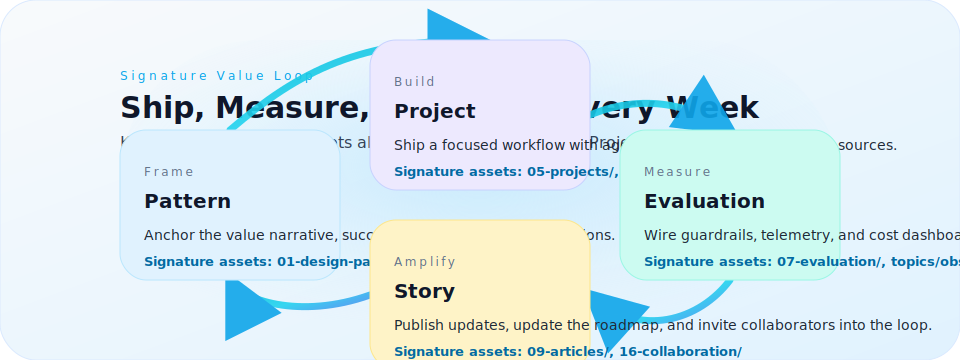

#+title: AI Architect Academy — Command Center for Visionary Builders
#+options: toc:nil
#+startup: overview

#+html: 

#+html: 

#+html: 
#+html: 

Lead the conversations, ship the systems, and operate responsibly. This open playbook is your living hub for designing, building, and amplifying AI products with confidence. Every section is tuned for AI architects, founding teams, creators, and advisors who need trusted patterns, deep resources, and a brand-ready narrative to share with their community.

#+html: 

#+html:   
#+html:   
#+html:   
#+html: 

#+html: 

* Experience Promise
- *Precision guidance.* Persona journeys and cloning checklists live side-by-side so nobody wonders "where do I click next?"
- *Pattern-first delivery.* Value framing, technical architecture, toolchains, and evaluation harnesses are wired into one flow.
- *Shareable story.* Articles, resources, and brand voice prompts make it effortless to show progress to leaders, clients, or your audience.

* Why Clone the Repository
- *Operate offline with your agents.* Serve the site locally (~scripts/serve.sh~), mirror it to internal portals, and let your AI copilots traverse the same structure they see on GitHub Pages.
- *Reusable architecture system.* Patterns (~01-design-patterns/~), projects (~05-projects/~), toolchains (~06-toolchains/~), workflows (~15-workflows/~), and collaboration rituals (~16-collaboration/~) are modular on purpose.
- *SEO-ready storytelling.* The [[file:BRAND-VOICE.md][Brand Voice Playbook]] plus article outlines (~09-articles/~) and resources (~10-resources/~) help you publish updates that rank and resonate.
- *Automation-friendly metadata.* Search indexes (~docs/data/search-index.json~), sitemap (~docs/sitemap.xml~), and consistent folder naming keep AI agents oriented.

* Platform Architecture — What Lives Where
| Pillar | Directories & Pages | What You Gain |
| --- | --- | --- |
| *Vision & Roadmap* | [[file:00-roadmap/][00-roadmap/]], [[file:BRAND-VOICE.md][BRAND-VOICE.md]] | Narrative, positioning, launch sequencing, voice rules. |
| *Learning Paths* | [[file:START-HERE.md][START-HERE.md]], [[file:02-learning-paths/][02-learning-paths/]] | Persona programs, 100-hour plans, guided missions. |
| *Patterns & Concepts* | [[file:01-design-patterns/][01-design-patterns/]], [[file:12-concepts/][12-concepts/]], [[file:docs/pattern.html][docs/pattern.html]] | Value framing, architectures, discovery scripts, risk notes. |
| *Build Lab* | [[file:05-projects/][05-projects/]], [[file:06-toolchains/][06-toolchains/]], [[file:agentic-swarms/][agentic-swarms/]] | Opinionated builds, stacks, agent experiments, automation flows. |
| *Operate & Govern* | [[file:07-evaluation/][07-evaluation/]], [[file:08-governance/][08-governance/]], [[file:15-workflows/][15-workflows/]] | Metrics, guardrails, observability, rituals, escalation paths. |
| *Community & Amplification* | [[file:09-articles/][09-articles/]], [[file:10-resources/][10-resources/]], [[file:16-collaboration/][16-collaboration/]] | Content systems, resource hubs, collaboration playbooks. |

* AI Agent Field Guide
Equip your Codex-style co-pilot or internal agent to explore this repo without friction.

| Task | Files & Signals | Notes for Automation |
| --- | --- | --- |
| *Bootstrap context* | ~README.md~, ~START-HERE.md~, ~docs/experience.html~ | Parse hero statements and CTA links to offer humans a quick synopsis. |
| *Map taxonomy* | Directory prefixes (="00-" → strategy, "01-" → patterns, …=), ~docs/sitemap.xml~ | Use prefixes to build navigation trees or generate answer cards. |
| *Surface references* | ~docs/data/search-index.json~, ~03-awesome/~, ~10-resources/~ | Provide citation-ready links with summaries for exec briefs. |
| *Recommend next steps* | ~02-learning-paths/~, ~05-projects/~, ~07-evaluation/~ | Match persona intent to pathways, then suggest projects + eval packs. |
| *Keep tone aligned* | ~BRAND-VOICE.md~, ~09-articles/~ templates | Inject brand cues ("clarity, expert warmth, action-ready") into replies. |
| *Refresh search* | ~package.json~ (=build:index= script), ~scripts/~ utilities | After edits, run ~npm run build:index~ so the agent has fresh metadata. |

#+begin_quote
📡 *Tip:* When deploying an internal agent, mirror ~docs/data/search-index.json~ into your vector store. Pair embeddings with the metadata fields (=title=, =category=, =path=) for precise retrieval.
#+end_quote

* Signature Loops You Can Run This Week
#+html: 
- *Pattern → Project → Eval:* Pick a pattern, ship the smallest valuable build, wire in evaluation harnesses on day one.
- *Concept → Platform Decision:* Use concept decks and the platform matrix to align your stack before coding.
- *Learning Path → Portfolio:* Follow the 100-hour track, ship two case studies, and convert them into spotlight articles.
- *Governance → Collaboration:* Stand up policy baselines, then drop the collaboration checklists into team rituals.

* Start Your Journey (Choose the Lane that Fits)
- *Launchpad (100 hours).* Sprint from orientation to shipped assets with the [[file:02-learning-paths/100-hour-ai-architect.md][100-Hour Plan]].
- *Creators & Educators.* Pace long-form content and workshops via the [[file:02-learning-paths/beginner.md][Beginner]] and [[file:02-learning-paths/professional.md][Professional]] tracks.
- *Enterprise & AI CoE Leaders.* Run the [[file:02-learning-paths/bootcamp.md][Bootcamp]] to align architecture, governance, and adoption.
- *Agentic Innovators.* Experiment with [[file:agentic-swarms/README.md][Agentic Code Swarms]] and the [[file:05-projects/agentic-saas-planner.md][Agentic SaaS Planner]].

* Operate with Confidence
- *Evaluation stack:* [[file:07-evaluation/metrics.md][Metrics]], [[file:07-evaluation/eval-harness.md][Eval harness]], and [[file:05-projects/evals-langfuse.md][promptfoo integrations]].
- *Guardrails & governance:* [[file:08-governance/privacy-gdpr.md][Privacy & GDPR]], [[file:08-governance/model-risk.md][Model risk]], and policy checklists.
- *Tooling matrix:* [[file:06-toolchains/stack-reference.md][Stack reference]], [[file:docs/clouds.html][Cloud blueprints]], and [[file:docs/platforms.html][Platform comparisons]].

* Create Momentum for Your Brand & Community
- Publish progress using the [[file:09-articles/][article outlines]] and [[file:prompt-packs/][content prompts]].
- Share live demos via the [[file:docs/projects.html][Projects catalog]] and embed screenshots captured with ~node scripts/capture-screenshots.mjs~.
- Use the [[file:docs/collaborate.html][Collaborate guide]] to co-create with AI teammates, clients, friends, or family exploring the space.

* Clone & Personalise the Repo
1. ~git clone https://github.com/AI-Architect-Academy/ai-architect-academy.git~
2. ~scripts/serve.sh~ to explore the site locally at http://localhost:8080
3. Update or add SVGs/PNGs under =assets/= and =docs/assets/=
4. Run ~npm install~ once, then ~npm run build:index~ whenever you add new content so search stays sharp.
5. Tailor prompts, templates, and workflows inside =prompt-packs/= and =15-workflows/= for your team or AI agents.

---

*Live site:* https://ai-architect-academy.github.io/ai-architect-academy/ · *Clone & customise:* ~git clone https://github.com/AI-Architect-Academy/ai-architect-academy.git~
