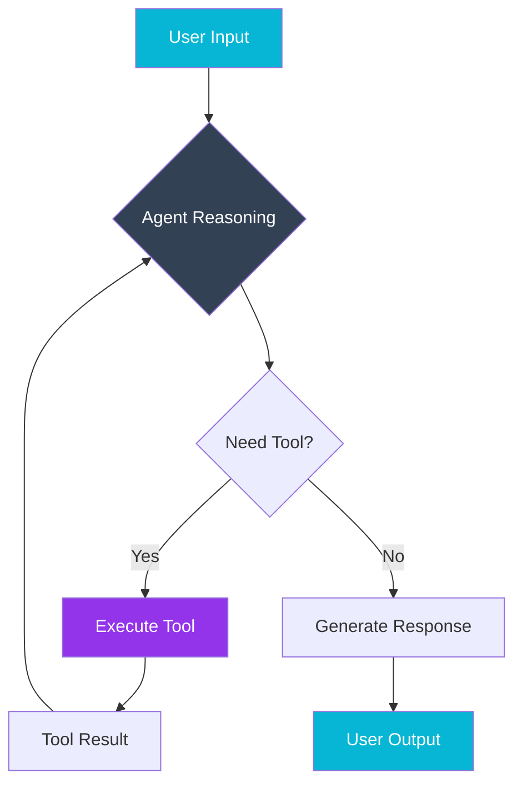
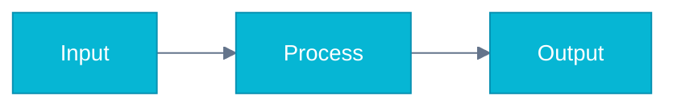

# AI Architect Academy - Visualization Strategy

> **Goal:** Create the most visually stunning AI architecture learning resource on GitHub using a multi-layer approach.

## The Problem with Current Approaches

| Approach | Limitation |
|----------|------------|
| **ASCII/Mermaid only** | Functional but boring, limited visual appeal |
| **AI images only** | Beautiful but not editable, can't show real icons |
| **Static PNGs** | Hard to maintain, no version control benefit |

## Solution: Four-Layer Visualization System

```
┌─────────────────────────────────────────────────────────────────────┐
│                    VISUALIZATION LAYERS                              │
├─────────────────────────────────────────────────────────────────────┤
│                                                                      │
│  Layer 1: QUICK DOCS (GitHub Native)                                │
│  ├─ Mermaid: flowcharts, sequences, class diagrams                  │
│  ├─ ASCII: terminal-friendly, universal                             │
│  └─ Use Case: READMEs, inline docs, quick sketches                  │
│                                                                      │
│  Layer 2: BEAUTIFUL ARCHITECTURE (Pre-rendered SVG/PNG)             │
│  ├─ D2 (Terrastruct): stunning architecture diagrams                │
│  ├─ Python Diagrams: official cloud icons (AWS, Azure, GCP, OCI)    │
│  └─ Use Case: architecture patterns, system designs                 │
│                                                                      │
│  Layer 3: AI-GENERATED VISUALS (Nano Banana)                        │
│  ├─ Hero images with brand colors                                   │
│  ├─ Conceptual illustrations                                        │
│  ├─ Infographics and educational graphics                           │
│  └─ Use Case: landing pages, course covers, social media            │
│                                                                      │
│  Layer 4: INTERACTIVE (Vercel/Web Deployment)                       │
│  ├─ kloud_diagramming: D3.js interactive diagrams                   │
│  ├─ React Flow: node-based editors                                  │
│  ├─ Excalidraw embeds: collaborative whiteboarding                  │
│  └─ Use Case: dashboard, learning platform, live demos              │
│                                                                      │
└─────────────────────────────────────────────────────────────────────┘
```

---

## Layer 1: GitHub-Native Diagrams (Mermaid)

**When to use:** Quick documentation, inline in markdown, version-controlled diagrams

**Rendering:** GitHub renders automatically - no build step needed!

### Example: Agent Architecture Flow



### Mermaid Theming for Brand Alignment



---

## Layer 2: Beautiful Architecture Diagrams

### Option A: D2 (Terrastruct) - Recommended

**Why D2:**
- TALA layout engine produces professionally beautiful diagrams
- Native dark/light theme support
- SVG/PNG export
- Extensive icon support
- Version control friendly (text-based)

**Installation:**
```bash
# macOS
brew install d2

# Linux/WSL
curl -fsSL https://d2lang.com/install.sh | sh -s --

# Windows (via scoop)
scoop install d2
```

**Example: RAG Architecture (d2 syntax)**

```d2
# RAG System Architecture
direction: right

title: {
  label: Production RAG System
  near: top-center
  shape: text
  style: {
    font-size: 24
    bold: true
  }
}

# Data Ingestion
docs: Documents {
  icon: https://icons.terrastruct.com/essentials%2F257-file-code.svg
  shape: cylinder
}

chunker: Chunking Service {
  icon: https://icons.terrastruct.com/tech%2F046-api.svg
}

embedder: Embedding Model {
  icon: https://icons.terrastruct.com/aws%2FMachine%20Learning%2FAmazon-SageMaker.svg
  style.fill: "#06b6d4"
}

# Storage
vectordb: Vector Database {
  icon: https://icons.terrastruct.com/aws%2FDatabase%2FAmazon-Aurora.svg
  shape: cylinder
  style.fill: "#334155"
}

# Query Path
query: User Query {
  icon: https://icons.terrastruct.com/essentials%2F087-user.svg
}

retriever: Semantic Search {
  icon: https://icons.terrastruct.com/essentials%2F001-search.svg
}

reranker: Cross-Encoder Reranker {
  icon: https://icons.terrastruct.com/tech%2F025-neural.svg
  style.fill: "#9333ea"
}

llm: Claude / GPT {
  icon: https://icons.terrastruct.com/tech%2F024-cpu.svg
  style.fill: "#06b6d4"
}

response: Response {
  icon: https://icons.terrastruct.com/essentials%2F015-chat.svg
}

# Connections
docs -> chunker -> embedder -> vectordb
query -> retriever
retriever -> vectordb
vectordb -> reranker -> llm -> response
```

**Render Command:**
```bash
d2 rag-architecture.d2 rag-architecture.svg --theme 200
```

### Option B: Python Diagrams (mingrammer)

**Why Python Diagrams:**
- 1100+ official cloud icons (AWS, Azure, GCP, K8s, etc.)
- Programmatic generation
- Great for CI/CD pipelines
- Cluster/grouping support

**Installation:**
```bash
pip install diagrams
# Also needs Graphviz
brew install graphviz  # macOS
apt install graphviz   # Ubuntu
```

**Example: Multi-Cloud AI Gateway**

```python
from diagrams import Diagram, Cluster, Edge
from diagrams.aws.compute import Lambda
from diagrams.aws.ml import Sagemaker
from diagrams.azure.ml import MachineLearningServiceWorkspaces
from diagrams.gcp.ml import AIPlatform
from diagrams.onprem.client import User
from diagrams.generic.network import Router

with Diagram("Multi-Cloud AI Gateway", show=False, direction="LR",
             graph_attr={"bgcolor": "white", "pad": "0.5"}):

    user = User("Client")

    with Cluster("AI Gateway"):
        router = Router("Intelligent Router")

    with Cluster("AWS"):
        bedrock = Lambda("Bedrock")
        sagemaker = Sagemaker("SageMaker")

    with Cluster("Azure"):
        azure_ai = MachineLearningServiceWorkspaces("Azure OpenAI")

    with Cluster("GCP"):
        vertex = AIPlatform("Vertex AI")

    user >> router
    router >> Edge(label="Claude") >> bedrock
    router >> Edge(label="GPT-4") >> azure_ai
    router >> Edge(label="Gemini") >> vertex
    router >> Edge(label="Llama") >> sagemaker
```

### Build Pipeline for Pre-rendered Diagrams

```yaml
# .github/workflows/render-diagrams.yml
name: Render Diagrams

on:
  push:
    paths:
      - 'diagrams/**/*.d2'
      - 'diagrams/**/*.py'

jobs:
  render:
    runs-on: ubuntu-latest
    steps:
      - uses: actions/checkout@v4

      - name: Install D2
        run: curl -fsSL https://d2lang.com/install.sh | sh

      - name: Install Python Diagrams
        run: |
          pip install diagrams
          sudo apt-get install graphviz

      - name: Render D2 diagrams
        run: |
          for f in diagrams/*.d2; do
            d2 "$f" "assets/diagrams/$(basename ${f%.d2}).svg" --theme 200
          done

      - name: Render Python diagrams
        run: |
          for f in diagrams/*.py; do
            python "$f"
          done
          mv *.png assets/diagrams/

      - name: Commit rendered diagrams
        uses: stefanzweifel/git-auto-commit-action@v5
        with:
          commit_message: "chore: render diagrams"
          file_pattern: "assets/diagrams/*"
```

---

## Layer 3: AI-Generated Visuals (Nano Banana)

**Already configured!** Use for:
- Hero images with brand colors (#06b6d4, #334155, #9333ea)
- Conceptual illustrations
- Infographics
- Course module covers
- Social media graphics

### Enhanced Prompt Engineering for Technical Diagrams

```
// For Architecture Diagrams
"Professional isometric cloud architecture diagram,
AWS/Azure/GCP official icon style,
clean white background,
data flow arrows with labels,
components: [list your components],
cyan (#06b6d4) accent lighting,
slate (#334155) infrastructure blocks,
high resolution, technical documentation quality,
no text except component labels"

// For Conceptual Illustrations
"Abstract visualization of [concept],
neural network aesthetic,
flowing data particles,
cyan and purple gradient lighting,
depth of field,
modern tech corporate style,
suitable for hero banner 1920x1080"
```

### Generating Diagrams with Real Cloud Icons

For AI to use real icons, provide explicit references:

```
"Architecture diagram in the style of AWS architecture diagrams,
using official AWS orange color scheme,
include: EC2 instances, S3 buckets, Lambda functions, API Gateway,
isometric 3D view,
clean lines and professional labeling"
```

---

## Layer 4: Interactive Web Diagrams

For frankx.ai/ai-architecture and the Vercel dashboard:

### kloud_diagramming (TypeScript)

```typescript
import { Diagram, Cluster, Node, Edge } from 'kloud-diagramming';
import { AWS, Azure, GCP } from 'kloud-diagramming/icons';

const diagram = new Diagram('Multi-Cloud RAG', {
  direction: 'LR',
  theme: 'light'
});

// AWS Cluster
const awsCluster = diagram.addCluster('AWS', { provider: 'aws' });
const bedrock = awsCluster.addNode(AWS.MachineLearning.Bedrock);
const s3 = awsCluster.addNode(AWS.Storage.S3);

// Azure Cluster
const azureCluster = diagram.addCluster('Azure', { provider: 'azure' });
const openai = azureCluster.addNode(Azure.AI.OpenAI);

// Connections with D3 interactivity
diagram.connect(s3, bedrock, { label: 'Documents' });
diagram.connect(bedrock, openai, { label: 'Fallback' });

// Render to React component
export default diagram.toReact();
```

### React Flow for Node Editors

```tsx
import ReactFlow, { Background, Controls } from 'reactflow';
import 'reactflow/dist/style.css';

const initialNodes = [
  {
    id: '1',
    type: 'input',
    data: { label: 'User Query' },
    position: { x: 0, y: 100 },
    style: { background: '#06b6d4', color: 'white' }
  },
  {
    id: '2',
    data: { label: 'Vector Search' },
    position: { x: 200, y: 100 },
    style: { background: '#334155', color: 'white' }
  },
  // ... more nodes
];

export function ArchitectureDiagram() {
  return (
    <ReactFlow
      nodes={initialNodes}
      edges={edges}
      fitView
    >
      <Background />
      <Controls />
    </ReactFlow>
  );
}
```

---

## Implementation Plan

### Phase 1: GitHub Repository (Immediate)

| Location | Diagram Type | Tool |
|----------|--------------|------|
| README.md | Architecture overview | Mermaid (native) |
| 01-design-patterns/*.md | Pattern diagrams | Pre-rendered D2 → SVG |
| Learning paths | Flow diagrams | Mermaid (themed) |
| assets/diagrams/ | Cloud architectures | Python Diagrams |

### Phase 2: Pre-rendered Assets

```
diagrams/
├── d2/
│   ├── rag-architecture.d2
│   ├── multi-agent-flow.d2
│   ├── ai-gateway.d2
│   └── cloud-comparison.d2
├── python/
│   ├── aws-rag.py
│   ├── azure-openai.py
│   ├── gcp-vertex.py
│   └── multi-cloud-gateway.py
└── rendered/  (auto-generated)
    ├── rag-architecture.svg
    ├── aws-rag.png
    └── ...
```

### Phase 3: AI-Generated Hero Images

Use Nano Banana for:
- `/assets/heroes/` - Module cover images
- `/assets/illustrations/` - Conceptual art
- `/assets/social/` - LinkedIn/Twitter graphics

### Phase 4: Interactive Dashboard

For frankx.ai/ai-architecture:
- React Flow for live architecture building
- kloud_diagramming for interactive cloud diagrams
- Excalidraw embeds for collaborative sessions

---

## Icon Sources

### Official Cloud Icons

| Provider | Source | Format |
|----------|--------|--------|
| AWS | [AWS Architecture Icons](https://aws.amazon.com/architecture/icons/) | SVG, PNG |
| Azure | [Azure Icons](https://learn.microsoft.com/en-us/azure/architecture/icons/) | SVG |
| GCP | [Google Cloud Icons](https://cloud.google.com/icons) | SVG |
| OCI | [Oracle Cloud Icons](https://docs.oracle.com/en-us/iaas/Content/General/Reference/graphicsfordiagrams.htm) | SVG, PNG |

### Tech Icons

| Source | Icons | URL |
|--------|-------|-----|
| Simple Icons | 2800+ brands | https://simpleicons.org/ |
| Devicon | Dev tools | https://devicon.dev/ |
| Iconify | 200,000+ icons | https://iconify.design/ |
| Terrastruct Icons | D2 compatible | https://icons.terrastruct.com/ |

---

## Quick Reference: When to Use What

| Scenario | Tool | Why |
|----------|------|-----|
| Quick README diagram | Mermaid | GitHub native, no build |
| Cloud architecture | Python Diagrams | Official icons |
| Beautiful system design | D2 | Best aesthetics |
| Hero/cover image | Nano Banana | AI-generated, brand colors |
| Interactive demo | React Flow | Web-based, editable |
| Collaborative sketch | Excalidraw | Real-time, hand-drawn |

---

## Sample Workflow

```bash
# 1. Create D2 diagram
cat > diagrams/d2/rag-system.d2 << 'EOF'
# Your D2 code here
EOF

# 2. Render locally
d2 diagrams/d2/rag-system.d2 assets/diagrams/rag-system.svg --theme 200

# 3. Reference in markdown
# 

# 4. Commit both source and rendered
git add diagrams/ assets/diagrams/
git commit -m "feat: add RAG system architecture diagram"
```

---

## Tools Installation Summary

```bash
# D2 (macOS)
brew install d2

# D2 (Linux/WSL)
curl -fsSL https://d2lang.com/install.sh | sh -s --

# Python Diagrams
pip install diagrams
brew install graphviz  # or apt install graphviz

# Kroki (universal API - optional)
docker run -d -p 8000:8000 yuzutech/kroki
```

---

## Conclusion

The AI Architect Academy visualization strategy combines:

1. **Mermaid** for GitHub-native quick diagrams
2. **D2** for beautiful architecture diagrams (pre-rendered SVG)
3. **Python Diagrams** for official cloud icons
4. **Nano Banana** for AI-generated hero images
5. **Interactive tools** for the web platform

This creates a repository that's both **functional on GitHub** and **stunning when deployed**.

---

*Document created: Jan 2026*
